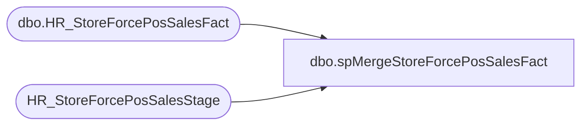

# dbo.spMergeStoreForcePosSalesFact

**Database:** DWStaging  
**Server:** papamart  

## Architecture Diagram



## Table Dependencies

| Referenced Table |
|---|
| dbo.HR_StoreForcePosSalesFact |
| HR_StoreForcePosSalesStage |

## Stored Procedure Code

```sql
CREATE proc [dbo].[spMergeStoreForcePosSalesFact]

as

--=================================================================================================
--	Dan Tweedie	2019-04-03	Created proc, data is captured from all store pos, merged to fact table
--=================================================================================================

set nocount on


merge into dw.dbo.HR_StoreForcePosSalesFact as target 
using HR_StoreForcePosSalesStage as source
on 
	(
		target.StoreCode=source.StoreCode
		and
		target.Date=source.Date
		and 
		target.Slot=source.Slot
	)
when matched 
	and
		(
			isnull(target.SaleTrans,0)<>isnull(source.SaleTrans,0)
			OR
			isnull(target.SaleValue,0)<>isnull(source.SaleValue,0)
			OR
			isnull(target.SaleUnits,0)<>isnull(source.SaleUnits,0)
			OR
			isnull(target.RefundTrans,0)<>isnull(source.RefundTrans,0)
			OR
			isnull(target.RefundValue,0)<>isnull(source.RefundValue,0)
			OR
			isnull(target.RefundUnits,0)<>isnull(source.RefundUnits,0)
			OR
			isnull(target.PartySaleValue,0)<>isnull(source.PartySaleValue,0)
			OR
			isnull(target.PartyTrans,0)<>isnull(source.PartyTrans,0)
			OR
			isnull(target.PartyBookings,0)<>isnull(source.PartyBookings,0)
			OR
			isnull(target.PartyCount,0)<>isnull(source.PartyCount,0)
			OR
			isnull(target.StufferTrans,0)<>isnull(source.StufferTrans,0)
			OR
			isnull(target.SkinsTrans,0)<>isnull(source.SkinsTrans,0)
			OR
			isnull(target.StuffersUnits,0)<>isnull(source.StuffersUnits,0)
			OR
			isnull(target.SkinsUnits,0)<>isnull(source.SkinsUnits,0)
			OR
			isnull(target.BackpackTrans,0)<>isnull(source.BackpackTrans,0)
			OR
			isnull(target.BackpackUnits,0)<>isnull(source.BackpackUnits,0)
			OR
			isnull(target.BonusClubTrans,0)<>isnull(source.BonusClubTrans,0)
			OR
			isnull(target.GiftCardValue,0)<>isnull(source.GiftCardValue,0)
			OR
			isnull(target.GiftCardUnits,0)<>isnull(source.GiftCardUnits,0)
			OR
			isnull(target.EnterpriseSellingValue,0)<>isnull(source.EnterpriseSellingValue,0)
			OR
			isnull(target.EnterpriseSellingTrans,0)<>isnull(source.EnterpriseSellingTrans,0)
			OR
			isnull(target.EnterpriseSellingUnits,0)<>isnull(source.EnterpriseSellingUnits,0)
			or
			isnull(target.StoreIDRaw, 0)<>isnull(source.StoreCodeRaw,0)
			OR
			isnull(target.DateRaw, '3030-12-31')<>isnull(source.TransactionDateRaw,'3030-12-31')
			or
			isnull(target.ShipFromStoreSales,0)<>isnull(source.ShipFromStoreSales,0)
			or
			isnull(target.ShipFromStoreTransactions,0)<>isnull(source.ShipFromStoreTransactions,0)
			or
			isnull(target.ShipFromStoreUnits,0)<>isnull(source.ShipFromStoreUnits,0)
			or
			isnull(target.PickupFromStoreSales,0)<>isnull(source.PickupFromStoreSales,0)
			or
			isnull(target.PickupFromStoreTransactions,0)<>isnull(source.PickupFromStoreTransactions,0)
			or
			isnull(target.PickupFromStoreUnits,0)<>isnull(source.PickupFromStoreUnits,0)	
			or
			isnull(target.CurbsideSales,0)<>isnull(source.CurbsideSales,0)	
			or
			isnull(target.CurbsideTransactions,0)<>isnull(source.CurbsideTransactions,0)	
			or
			isnull(target.CurbsideUnits,0)<>isnull(source.CurbsideUnits,0)
			or 	
			isnull(target.GiftCardBonusSales,0)<>isnull(source.GiftCardBonusSales,0)
			or
			isnull(target.GiftCardBonusUnits,0)<>isnull(source.GiftCardBonusUnits,0)
			or
			isnull(target.GiftCardBonusQualifying,0)<>isnull(source.GiftCardBonusQualifying,0)
			or
			isnull(target.MobileCaptureCount,0)<>isnull(source.MobileCaptureCount,0)
			or
			isnull(target.MobileEmailOptInCount,0)<>isnull(source.MobileEmailOptInCount,0)
		)
	then update
		set
			target.SaleTrans=source.SaleTrans,
			target.SaleValue=source.SaleValue,
			target.SaleUnits=source.SaleUnits,
			target.RefundTrans=source.RefundTrans,
			target.RefundValue=source.RefundValue,
			target.RefundUnits=source.RefundUnits,
			target.PartySaleValue=source.PartySaleValue,
			target.PartyTrans=source.PartyTrans,
			target.PartyBookings=source.PartyBookings,
			target.PartyCount=source.PartyCount,
			target.StufferTrans=source.StufferTrans,
			target.SkinsTrans=source.SkinsTrans,
			target.StuffersUnits=source.StuffersUnits,
			target.SkinsUnits=source.SkinsUnits,
			target.BackpackTrans=source.BackpackTrans,
			target.BackpackUnits=source.BackpackUnits,
			target.BonusClubTrans=source.BonusClubTrans,
			target.GiftCardValue=source.GiftCardValue,
			target.GiftCardUnits=source.GiftCardUnits,
			target.EnterpriseSellingValue=source.EnterpriseSellingValue,
			target.EnterpriseSellingTrans=source.EnterpriseSellingTrans,
			target.EnterpriseSellingUnits=source.EnterpriseSellingUnits,
			target.StoreIDRaw=source.StoreCodeRaw,
			target.DateRaw=source.TransactionDateRaw,
			target.ShipFromStoreSales=source.ShipFromStoreSales,	
			target.ShipFromStoreTransactions=source.ShipFromStoreTransactions,	
			target.ShipFromStoreUnits=source.ShipFromStoreUnits,	
			target.PickupFromStoreSales=source.PickupFromStoreSales,	
			target.PickupFromStoreTransactions=source.PickupFromStoreTransactions,	
			target.PickupFromStoreUnits=source.PickupFromStoreUnits,	
			target.CurbsideSales=source.CurbsideSales,	
			target.CurbsideTransactions=source.CurbsideTransactions,	
			target.CurbsideUnits=source.CurbsideUnits,
			target.GiftCardBonusSales=source.GiftCardBonusSales,
			target.GiftCardBonusUnits=source.GiftCardBonusUnits,
			target.GiftCardBonusQualifying=source.GiftCardBonusQualifying,
			target.MobileCaptureCount=source.MobileCaptureCount,
			target.MobileEmailOptInCount=source.MobileEmailOptInCount,
			target.UpdateDate=getdate()
	when not matched by target
		then insert
			(
				StoreCode,
				Date,
				Slot,
				SaleTrans,
				SaleValue,
				SaleUnits,
				RefundTrans,
				RefundValue,
				RefundUnits,
				PartySaleValue,
				PartyTrans,
				PartyBookings,
				PartyCount,
				StufferTrans,
				SkinsTrans,
				StuffersUnits,
				SkinsUnits,
				BackpackTrans,
				BackpackUnits,
				BonusClubTrans,
				GiftCardValue,
				GiftCardUnits,
				EnterpriseSellingValue,
				EnterpriseSellingTrans,
				EnterpriseSellingUnits,
				ShipFromStoreSales,	
				ShipFromStoreTransactions,	
				ShipFromStoreUnits,	
				PickupFromStoreSales,	
				PickupFromStoreTransactions,	
				PickupFromStoreUnits,	
				CurbsideSales,	
				CurbsideTransactions,	
				CurbsideUnits,
				GiftCardBonusSales,
				GiftCardBonusUnits,
				GiftCardBonusQualifying,
				MobileCaptureCount,
				MobileEmailOptInCount,
				StoreIDRaw,
				DateRaw,
				InsertDate
			)
		values
			(
				source.StoreCode,
				source.Date,
				source.Slot,
				source.SaleTrans,
				source.SaleValue,
				source.SaleUnits,
				source.RefundTrans,
				source.RefundValue,
				source.RefundUnits,
				source.PartySaleValue,
				source.PartyTrans,
				source.PartyBookings,
				source.PartyCount,
				source.StufferTrans,
				source.SkinsTrans,
				source.StuffersUnits,
				source.SkinsUnits,
				source.BackpackTrans,
				source.BackpackUnits,
				source.BonusClubTrans,
				source.GiftCardValue,
				source.GiftCardUnits,
				source.EnterpriseSellingValue,
				source.EnterpriseSellingTrans,
				source.EnterpriseSellingUnits,
				source.ShipFromStoreSales,	
				source.ShipFromStoreTransactions,	
				source.ShipFromStoreUnits,	
				source.PickupFromStoreSales,	
				source.PickupFromStoreTransactions,	
				source.PickupFromStoreUnits,	
				source.CurbsideSales,	
				source.CurbsideTransactions,	
				source.CurbsideUnits,
				source.GiftCardBonusSales,
				source.GiftCardBonusUnits,
				source.GiftCardBonusQualifying,
				source.MobileCaptureCount,
				source.MobileEmailOptInCount,
				source.StoreCodeRaw,
				source.TransactionDateRaw,
				getdate()
			)


;
```

