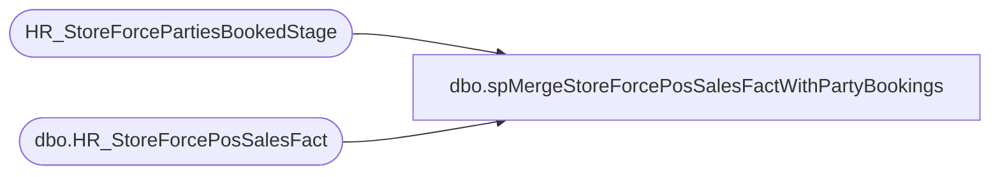

# dbo.spMergeStoreForcePosSalesFactWithPartyBookings

**Database:** DWStaging  
**Server:** papamart  

## Architecture Diagram



## Table Dependencies

| Referenced Table |
|---|
| HR_StoreForcePartiesBookedStage |
| dbo.HR_StoreForcePosSalesFact |

## Stored Procedure Code

```sql
CREATE proc [dbo].[spMergeStoreForcePosSalesFactWithPartyBookings]

as

set nocount on
--================================================================================================================================
--	Dan Tweedie	2019-04-03	Created proc, data is captured from all store pos, merged to fact table, parties booked merged after
--================================================================================================================================

merge into dw.dbo.HR_StoreForcePosSalesFact as target
using 
	(
		select 
			StoreID as StoreCode,
			PartyBookDate as date, 
			Slot, 
			0 as SaleTrans,
			0 as SaleValue,
			0 as SaleUnits,
			0 as RefundTrans,
			0 as RefundValue,
			0 as RefundUnits,
			0 as PartySaleValue,
			0 as PartyTrans,
			PartiesBooked as PartyBookings,
			0 as PartyCount,
			0 as StufferTrans,
			0 as SkinsTrans,
			0 as StuffersUnits,
			0 as SkinsUnits,
			0 as BackpackTrans,
			0 as BackpackUnits,
			0 as BonusClubTrans,
			0 as GiftCardValue,
			0 as GiftCardUnits,
			0 as EnterpriseSellingValue,
			0 as EnterpriseSellingTrans,
			0 as EnterpriseSellingUnits,
			StoreIDRaw,
			PartyBookDateRaw
		from HR_StoreForcePartiesBookedStage
	) as source
on 
	(
		target.StoreCode=source.StoreCode
		and
		target.Date=source.date
		and 
		target.Slot=source.Slot
	)
when matched 
	and 
		(
			isnull(target.PartyBookings,0)<>isnull(source.PartyBookings,0)
		)
	then update
		set
			target.PartyBookings=source.PartyBookings,
			target.UpdateDate=getdate()
when not matched by target
	then insert 
		(
				StoreCode,
				Date,
				Slot,
				SaleTrans,
				SaleValue,
				SaleUnits,
				RefundTrans,
				RefundValue,
				RefundUnits,
				PartySaleValue,
				PartyTrans,
				PartyBookings,
				PartyCount,
				StufferTrans,
				SkinsTrans,
				StuffersUnits,
				SkinsUnits,
				BackpackTrans,
				BackpackUnits,
				BonusClubTrans,
				GiftCardValue,
				GiftCardUnits,
				EnterpriseSellingValue,
				EnterpriseSellingTrans,
				EnterpriseSellingUnits,
				StoreIDRaw,
				DateRaw,
				InsertDate
		)
	values 
		(
			source.StoreCode,
			source.Date,
			source.Slot,
			source.SaleTrans,
			source.SaleValue,
			source.SaleUnits,
			source.RefundTrans,
			source.RefundValue,
			source.RefundUnits,
			source.PartySaleValue,
			source.PartyTrans,
			source.PartyBookings,
			source.PartyCount,
			source.StufferTrans,
			source.SkinsTrans,
			source.StuffersUnits,
			source.SkinsUnits,
			source.BackpackTrans,
			source.BackpackUnits,
			source.BonusClubTrans,
			source.GiftCardValue,
			source.GiftCardUnits,
			source.EnterpriseSellingValue,
			source.EnterpriseSellingTrans,
			source.EnterpriseSellingUnits,
			source.StoreIDRaw,
			source.PartyBookDateRaw,
			getdate()
		)
	;
```

