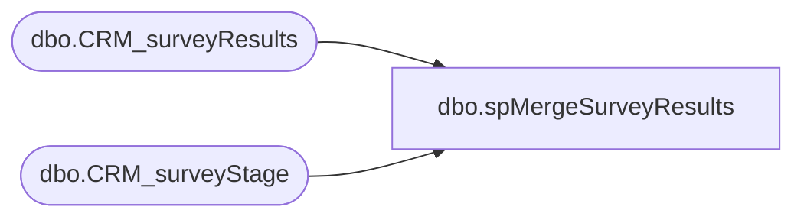

# dbo.spMergeSurveyResults

**Database:** DWStaging  
**Server:** papamart  

## Architecture Diagram



## Table Dependencies

| Referenced Table |
|---|
| dbo.CRM_surveyResults |
| dbo.CRM_surveyStage |

## Stored Procedure Code

```sql
CREATE proc [dbo].[spMergeSurveyResults]

as 

-------------------------------------------------------------------------------------------------------
-- Ian Wallace  2021-03-30  created for new survey process
-------------------------------------------------------------------------------------------------------

set nocount on

merge into DW.dbo.CRM_surveyResults  as target
using DWStaging.dbo.CRM_surveyStage as source 
on 
	(
		target.[recID]=source.[recID]
	)
When Matched and
	(
	isnull(target.[Q35],'x')<>isnull(source.[Q35],'x')
	OR
	isnull(target.[Q34],'x')<>isnull(source.[Q34],'x')
	OR
	isnull(target.[Q34S],'x')<>isnull(source.[Q34S],'x')
	OR
	isnull(target.[Q7],'x')<>isnull(source.[Q7],'x')
	OR
	isnull(target.[Q91],'x')<>isnull(source.[Q91],'x')
	OR
	isnull(target.[Q11_1],'x')<>isnull(source.[Q11_1],'x')
	OR
	isnull(target.[Q11_2],'x')<>isnull(source.[Q11_2],'x')
	OR
	isnull(target.[Q11_3],'x')<>isnull(source.[Q11_3],'x')
	OR
	isnull(target.[Q11_4],'x')<>isnull(source.[Q11_4],'x')
	OR
	isnull(target.[Q11_5],'x')<>isnull(source.[Q11_5],'x')
	OR
	isnull(target.[Q11_6],'x')<>isnull(source.[Q11_6],'x')
	OR
	isnull(target.[Q11_7],'x')<>isnull(source.[Q11_7],'x')
	OR
	isnull(target.[Q11_8],'x')<>isnull(source.[Q11_8],'x')
	OR
	isnull(target.[Q11_9],'x')<>isnull(source.[Q11_9],'x')
	OR
	isnull(target.[Q11_10],'x')<>isnull(source.[Q11_10],'x')
	OR
	isnull(target.[Q11_11],'x')<>isnull(source.[Q11_11],'x')
	OR
	isnull(target.[Q11_12],'x')<>isnull(source.[Q11_12],'x')
	OR
	isnull(target.[Q80_1],'x')<>isnull(source.[Q80_1],'x')
	OR
	isnull(target.[Q80_2],'x')<>isnull(source.[Q80_2],'x')
	OR
	isnull(target.[Q80_3],'x')<>isnull(source.[Q80_3],'x')
	OR
	isnull(target.[Q80_4],'x')<>isnull(source.[Q80_4],'x')
	OR
	isnull(target.[Q80_5],'x')<>isnull(source.[Q80_5],'x')
	OR
	isnull(target.[Q80_6],'x')<>isnull(source.[Q80_6],'x')
	OR
	isnull(target.[Q80_7],'x')<>isnull(source.[Q80_7],'x')
	OR
	isnull(target.[Q80_8],'x')<>isnull(source.[Q80_8],'x')
	OR
	isnull(target.[Q112] ,'x')<>isnull(source.[Q112],'x')
	OR
	isnull(target.[Q99_1],'x')<>isnull(source.[Q99_1],'x')
	OR
	isnull(target.[Q99_2],'x')<>isnull(source.[Q99_2],'x')
	OR
	isnull(target.[Q99_3],'x')<>isnull(source.[Q99_3],'x')
	OR
	isnull(target.[Q99_4],'x')<>isnull(source.[Q99_4],'x')
	OR
	isnull(target.[Q99_5],'x')<>isnull(source.[Q99_5],'x')
	OR
	isnull(target.[Q99_6] ,'x')<>isnull(source.[Q99_6],'x')
	OR
	isnull(target.[Q99_7],'x')<>isnull(source.[Q99_7],'x')
	OR
	isnull(target.[Q99_8],'x')<>isnull(source.[Q99_8],'x')
	OR
	isnull(target.[Q99_9],'x')<>isnull(source.[Q99_9],'x')
	OR
	isnull(target.[Q99_10],'x')<>isnull(source.[Q99_10],'x')
	OR
	isnull(target.[Q99_11],'x')<>isnull(source.[Q99_11],'x')
	OR
	isnull(target.[Q110],'x')<>isnull(source.[Q110],'x')
	OR
	isnull(target.[Q118],'x')<>isnull(source.[Q118],'x')
	OR
	isnull(target.[Q116_1],'x')<>isnull(source.[Q116_1],'x')
	OR
	isnull(target.[Q116_2],'x')<>isnull(source.[Q116_2],'x')
	OR
	isnull(target.[Q116_3],'x')<>isnull(source.[Q116_3],'x')
	OR
	isnull(target.[Q116_4] ,'x')<>isnull(source.[Q116_4],'x')
	OR
	isnull(target.[Q116_5],'x')<>isnull(source.[Q116_5],'x')
	OR
	isnull(target.[Q116_6] ,'x')<>isnull(source.[Q116_6],'x')
	OR
	isnull(target.[Q117_7],'x')<>isnull(source.[Q117_7],'x')
	OR
	isnull(target.[Q116_8],'x')<>isnull(source.[Q116_8],'x')
	OR
	isnull(target.[Q116_9],'x')<>isnull(source.[Q116_9],'x')
	OR
	isnull(target.[Q116_10],'x')<>isnull(source.[Q116_10],'x')
	OR
	isnull(target.[Q116S],'x')<>isnull(source.[Q116S],'x')
	OR
	isnull(target.[Q108],'x')<>isnull(source.[Q108],'x')
	OR
	isnull(target.[Q111_1],'x')<>isnull(source.[Q111_1],'x')
	OR
	isnull(target.[Q111_2],'x')<>isnull(source.[Q111_2],'x')
	OR
	isnull(target.[Q111_3],'x')<>isnull(source.[Q111_3],'x')
	OR
	isnull(target.[Q105],'x')<>isnull(source.[Q105],'x')
	OR
	isnull(target.[Q115],'x')<>isnull(source.[Q115],'x')
	OR
	isnull(target.[Q82_1],'x')<>isnull(source.[Q82_1],'x')
	OR
	isnull(target.[Q82_2],'x')<>isnull(source.[Q82_2],'x')
	OR
	isnull(target.[Q82_3],'x')<>isnull(source.[Q82_3],'x')
	OR
	isnull(target.[Q82_4],'x')<>isnull(source.[Q82_4],'x')
	OR
	isnull(target.[Q82_5],'x')<>isnull(source.[Q82_5],'x')
	OR
	isnull(target.[Q82_6],'x')<>isnull(source.[Q82_6],'x')
	OR
	isnull(target.[Q82_7],'x')<>isnull(source.[Q82_7],'x')
	OR
	isnull(target.[Q82_8],'x')<>isnull(source.[Q82_8],'x')
	OR
	isnull(target.[Q82_9],'x')<>isnull(source.[Q82_9],'x')
	OR
	isnull(target.[Q82_10],'x')<>isnull(source.[Q82_10],'x')
	OR
	isnull(target.[Q82_11],'x')<>isnull(source.[Q82_11],'x')
	OR
	isnull(target.[Q82S],'x')<>isnull(source.[Q82S],'x')
	OR
	isnull(target.[Q95],'x')<>isnull(source.[Q95],'x')
	OR
	isnull(target.[Q36],'x')<>isnull(source.[Q36],'x')
	OR
	isnull(target.[Q59],'x')<>isnull(source.[Q59],'x')
	OR
	isnull(target.[Q94],'x')<>isnull(source.[Q94],'x')
	OR
	isnull(target.[Q103],'x')<>isnull(source.[Q103],'x')
	OR
	isnull(target.[Q71A1],'x')<>isnull(source.[Q71A1],'x')
	OR
	isnull(target.[Q71A2],'x')<>isnull(source.[Q71A2],'x')
	OR
	isnull(target.[Q71A3],'x')<>isnull(source.[Q71A3],'x')
	OR
	isnull(target.[Q71A4],'x')<>isnull(source.[Q71A4],'x')
	OR
	isnull(target.[Q71A5] ,'x')<>isnull(source.[Q71A5],'x')
	OR
	isnull(target.[Q71A6],'x')<>isnull(source.[Q71A6],'x')
	OR
	isnull(target.[Q71A7],'x')<>isnull(source.[Q71A7],'x')
	OR
	isnull(target.[Q81A1],'x')<>isnull(source.[Q81A1],'x')
	OR
	isnull(target.[Q81A2],'x')<>isnull(source.[Q81A2],'x')
	OR
	isnull(target.[Q121],'x')<>isnull(source.[Q121],'x')
	OR
	isnull(target.[Q20],'x')<>isnull(source.[Q20],'x')
	OR
	isnull(target.[Q21],'x')<>isnull(source.[Q21],'x')
	OR
	isnull(target.[Q75],'x')<>isnull(source.[Q75],'x')
	OR
	isnull(target.[Q78],'x')<>isnull(source.[Q78],'x')
	OR
	isnull(target.[Q77],'x')<>isnull(source.[Q77],'x')
	OR
	isnull(target.[Q120_1],'x')<>isnull(source.[Q120_1],'x')
	OR
	isnull(target.[Q120_2],'x')<>isnull(source.[Q120_2],'x')
	OR
	isnull(target.[Q120_3],'x')<>isnull(source.[Q120_3],'x')
	OR
	isnull(target.[Q120_4],'x')<>isnull(source.[Q120_4],'x')
	OR
	isnull(target.[Q120_5],'x')<>isnull(source.[Q120_5],'x')
	OR
	isnull(target.[Q120_6],'x')<>isnull(source.[Q120_6],'x')
	OR
	isnull(target.[Q120_7],'x')<>isnull(source.[Q120_7],'x')
	OR
	isnull(target.[Q120_8],'x')<>isnull(source.[Q120_8],'x')
	OR
	isnull(target.[Q120_9],'x')<>isnull(source.[Q120_9],'x')
	OR
	isnull(target.[Q120_10],'x')<>isnull(source.[Q120_10],'x')
	OR
	isnull(target.[Q120_11],'x')<>isnull(source.[Q120_11],'x')
	OR
	isnull(target.[Q120S],'x')<>isnull(source.[Q120S],'x')
	OR
	isnull(target.[Q76],'x')<>isnull(source.[Q76],'x')
	OR
	isnull(target.[Q22],'x')<>isnull(source.[Q22],'x')
	OR
	isnull(target.[Q100],'x')<>isnull(source.[Q100],'x')
	OR
	isnull(target.[Q30],'x')<>isnull(source.[Q30],'x')
	OR
	isnull(target.[Q85],'x')<>isnull(source.[Q85],'x')
	OR
	isnull(target.[Q109],'x')<>isnull(source.[Q109],'x')
	OR
	isnull(target.[Q29],'x')<>isnull(source.[Q29],'x')
	OR
	isnull(target.[Q32],'x')<>isnull(source.[Q32],'x')
	OR
	isnull(target.[Q33],'x')<>isnull(source.[Q33],'x')
	OR
	isnull(target.[CampaignName],'x')<>isnull(source.[CampaignName],'x')
	OR
	isnull(target.[CampaignType],'x')<>isnull(source.[CampaignType],'x')
	OR
	--isnull(target.[Started],'x')<>isnull(source.[Started],'x')
    isnull(target.[Started],'3030-12-31') <> isnull(source.[Started],'3030-12-31')
	OR
	--isnull(target.[Completed],'x')<>isnull(source.[Completed],'x')
	isnull(target.[Completed],'3030-12-31') <> isnull(source.[Completed],'3030-12-31')
	OR
	--isnull(target.[BranchedOut],'x')<>isnull(source.[BranchedOut],'x')
	isnull(target.[BranchedOut],'3030-12-31') <> isnull(source.[BranchedOut],'3030-12-31')
	OR
	isnull(target.[OverQuota],'x')<>isnull(source.[OverQuota],'x')
	OR
	--isnull(target.[LastModified],'x')<>isnull(source.[LastModified],'x')
	isnull(target.[LastModified],'3030-12-31') <> isnull(source.[LastModified],'3030-12-31')
	OR
	isnull(target.[CampaignStatus],'x')<>isnull(source.[CampaignStatus],'x')
	OR
	isnull(target.[Culture],'x')<>isnull(source.[Culture],'x')
	OR
	isnull(target.[LastPage],'x')<>isnull(source.[LastPage],'x')
	OR
	isnull(target.[ResponseSource],'x')<>isnull(source.[ResponseSource],'x')
	OR
	isnull(target.[SourceType],'x')<>isnull(source.[SourceType],'x')
	OR
	isnull(target.[TaskID],'x')<>isnull(source.[TaskID],'x')
	OR
	isnull(target.[Occurrence],'x')<>isnull(source.[Occurrence],'x')
	OR
	isnull(target.[ReferringURL],'x')<>isnull(source.[ReferringURL],'x')
	OR
	isnull(target.[WebBrowsersUserAgent],'x')<>isnull(source.[WebBrowsersUserAgent],'x')
	OR
	isnull(target.[RespondentsIPAddress],'x')<>isnull(source.[RespondentsIPAddress],'x')
	OR
	isnull(target.[RespondentsHostname],'x')<>isnull(source.[RespondentsHostname],'x')
	OR
	isnull(target.[BrowserFamily],'x')<>isnull(source.[BrowserFamily],'x')
	OR
	isnull(target.[BrowserVersion],'x')<>isnull(source.[BrowserVersion],'x')
	OR
	isnull(target.[OperatingSystemFamily],'x')<>isnull(source.[OperatingSystemFamily],'x')
	OR
	isnull(target.[OperatingSystemName],'x')<>isnull(source.[OperatingSystemName],'x')
	OR
	isnull(target.[DeviceType],'x')<>isnull(source.[DeviceType],'x')
	OR
	isnull(target.[City],'x')<>isnull(source.[City],'x')
	OR
	isnull(target.[State_Province],'x')<>isnull(source.[State_Province],'x')
	OR
	isnull(target.[ZIP_Postal_Code],'x')<>isnull(source.[ZIP_Postal_Code],'x')
	OR
	isnull(target.[Country],'x')<>isnull(source.[Country],'x')
	OR
	isnull(target.[Latitude],'x')<>isnull(source.[Latitude],'x')
	OR
	isnull(target.[Longitude],'x')<>isnull(source.[Longitude],'x')
	OR
	isnull(target.[ParticipantURL],'x')<>isnull(source.[ParticipantURL],'x')
	)
Then Update
	set 
	target.[Q35]=source.[Q35],
	target.[Q34]=source.[Q34],
	target.[Q34S]=source.[Q34S],
	target.[Q7]=source.[Q7],
	target.[Q91]=source.[Q91],
	target.[Q11_1]=source.[Q11_1],
	target.[Q11_2]=source.[Q11_2],
	target.[Q11_3]=source.[Q11_3],
	target.[Q11_4]=source.[Q11_4],
	target.[Q11_5]=source.[Q11_5],
	target.[Q11_6]=source.[Q11_6],
	target.[Q11_7]=source.[Q11_7],
	target.[Q11_8]=source.[Q11_8],
	target.[Q11_9]=source.[Q11_9],
	target.[Q11_10]=source.[Q11_10],
	target.[Q11_11]=source.[Q11_11],
	target.[Q11_12]=source.[Q11_12],
	target.[Q80_1]=source.[Q80_1],
	target.[Q80_2]=source.[Q80_2],
	target.[Q80_3]=source.[Q80_3],
	target.[Q80_4]=source.[Q80_4],
	target.[Q80_5]=source.[Q80_5],
	target.[Q80_6]=source.[Q80_6],
	target.[Q80_7]=source.[Q80_7],
	target.[Q80_8]=source.[Q80_8],
	target.[Q112] =source.[Q112],
	target.[Q99_1]=source.[Q99_1],
	target.[Q99_2]=source.[Q99_2],
	target.[Q99_3]=source.[Q99_3],
	target.[Q99_4]=source.[Q99_4],
	target.[Q99_5]=source.[Q99_5],
	target.[Q99_6] =source.[Q99_6],
	target.[Q99_7]=source.[Q99_7],
	target.[Q99_8]=source.[Q99_8],
	target.[Q99_9]=source.[Q99_9],
	target.[Q99_10]=source.[Q99_10],
	target.[Q99_11]=source.[Q99_11],
	target.[Q110]=source.[Q110],
	target.[Q118]=source.[Q118],
	target.[Q116_1]=source.[Q116_1],
	target.[Q116_2]=source.[Q116_2],
	target.[Q116_3]=source.[Q116_3],
	target.[Q116_4] =source.[Q116_4],
	target.[Q116_5]=source.[Q116_5],
	target.[Q116_6] =source.[Q116_6],
	target.[Q117_7]=source.[Q117_7],
	target.[Q116_8]=source.[Q116_8],
	target.[Q116_9]=source.[Q116_9],
	target.[Q116_10]=source.[Q116_10],
	target.[Q116S]=source.[Q116S],
	target.[Q108]=source.[Q108],
	target.[Q111_1]=source.[Q111_1],
	target.[Q111_2]=source.[Q111_2],
	target.[Q111_3]=source.[Q111_3],
	target.[Q105]=source.[Q105],
	target.[Q115]=source.[Q115],
	target.[Q82_1]=source.[Q82_1],
	target.[Q82_2]=source.[Q82_2],
	target.[Q82_3]=source.[Q82_3],
	target.[Q82_4]=source.[Q82_4],
	target.[Q82_5]=source.[Q82_5],
	target.[Q82_6]=source.[Q82_6],
	target.[Q82_7]=source.[Q82_7],
	target.[Q82_8]=source.[Q82_8],
	target.[Q82_9]=source.[Q82_9],
	target.[Q82_10]=source.[Q82_10],
	target.[Q82_11]=source.[Q82_11],
	target.[Q82S]=source.[Q82S],
	target.[Q95]=source.[Q95],
	target.[Q36]=source.[Q36],
	target.[Q59]=source.[Q59],
	target.[Q94]=source.[Q94],
	target.[Q103]=source.[Q103],
	target.[Q71A1]=source.[Q71A1],
	target.[Q71A2]=source.[Q71A2],
	target.[Q71A3]=source.[Q71A3],
	target.[Q71A4]=source.[Q71A4],
	target.[Q71A5] =source.[Q71A5],
	target.[Q71A6]=source.[Q71A6],
	target.[Q71A7]=source.[Q71A7],
	target.[Q81A1]=source.[Q81A1],
	target.[Q81A2]=source.[Q81A2],
	target.[Q121]=source.[Q121],
	target.[Q20]=source.[Q20],
	target.[Q21]=source.[Q21],
	target.[Q75]=source.[Q75],
	target.[Q78]=source.[Q78],
	target.[Q77]=source.[Q77],
	target.[Q120_1]=source.[Q120_1],
	target.[Q120_2]=source.[Q120_2],
	target.[Q120_3]=source.[Q120_3],
	target.[Q120_4]=source.[Q120_4],
	target.[Q120_5]=source.[Q120_5],
	target.[Q120_6]=source.[Q120_6],
	target.[Q120_7]=source.[Q120_7],
	target.[Q120_8]=source.[Q120_8],
	target.[Q120_9]=source.[Q120_9],
	target.[Q120_10]=source.[Q120_10],
	target.[Q120_11]=source.[Q120_11],
	target.[Q120S]=source.[Q120S],
	target.[Q76]=source.[Q76],
	target.[Q22]=source.[Q22],
	target.[Q100]=source.[Q100],
	target.[Q30]=source.[Q30],
	target.[Q85]=source.[Q85],
	target.[Q109]=source.[Q109],
	target.[Q29]=source.[Q29],
	target.[Q32]=source.[Q32],
	target.[Q33]=source.[Q33],
	target.[CampaignName]=source.[CampaignName],
	target.[CampaignType]=source.[CampaignType],
	target.[Started]=source.[Started],
	target.[Completed]=source.[Completed],
	target.[BranchedOut]=source.[BranchedOut],
	target.[OverQuota]=source.[OverQuota],
	target.[LastModified]=source.[LastModified],
	target.[CampaignStatus]=source.[CampaignStatus],
	target.[Culture]=source.[Culture],
	target.[LastPage]=source.[LastPage],
	target.[SourceType]=source.[SourceType],
	target.[TaskID]=source.[TaskID],
	target.[Occurrence]=source.[Occurrence],
	target.[ReferringURL]=source.[ReferringURL],
	target.[WebBrowsersUserAgent]=source.[WebBrowsersUserAgent],
	target.[RespondentsHostname]=source.[RespondentsHostname],
	target.[BrowserFamily]=source.[BrowserFamily],
	target.[BrowserVersion]=source.[BrowserVersion],
	target.[OperatingSystemFamily]=source.[OperatingSystemFamily],
	target.[OperatingSystemName]=source.[OperatingSystemName],
	target.[DeviceType]=source.[DeviceType],
	target.[City]=source.[City],
	target.[State_Province]=source.[State_Province],
	target.[ZIP_Postal_Code]=source.[ZIP_Postal_Code],
	target.[Country]=source.[Country],
	target.[Latitude]=source.[Latitude],
	target.[Longitude]=source.[Longitude],
	target.[ParticipantURL]=source.[ParticipantURL],
	target.UpdateDate=getdate()

When Not Matched by target
Then Insert
	(
	   [recID]
      ,[Q35]
      ,[Q34]
      ,[Q34S]
      ,[Q7]
      ,[Q91]
      ,[Q11_1]
      ,[Q11_2]
      ,[Q11_3]
      ,[Q11_4]
      ,[Q11_5]
      ,[Q11_6]
      ,[Q11_7]
      ,[Q11_8]
      ,[Q11_9]
      ,[Q11_10]
      ,[Q11_11]
      ,[Q11_12]
      ,[Q80_1]
      ,[Q80_2]
      ,[Q80_3]
      ,[Q80_4]
      ,[Q80_5]
      ,[Q80_6]
      ,[Q80_7]
      ,[Q80_8]
      ,[Q112]
      ,[Q99_1]
      ,[Q99_2]
      ,[Q99_3]
      ,[Q99_4]
      ,[Q99_5]
      ,[Q99_6]
      ,[Q99_7]
      ,[Q99_8]
      ,[Q99_9]
      ,[Q99_10]
      ,[Q99_11]
      ,[Q110]
      ,[Q118]
      ,[Q116_1]
      ,[Q116_2]
      ,[Q116_3]
      ,[Q116_4]
      ,[Q116_5]
      ,[Q116_6]
      ,[Q117_7]
      ,[Q116_8]
      ,[Q116_9]
      ,[Q116_10]
      ,[Q116S]
      ,[Q108]
      ,[Q111_1]
      ,[Q111_2]
      ,[Q111_3]
      ,[Q105]
      ,[Q115]
      ,[Q82_1]
      ,[Q82_2]
      ,[Q82_3]
      ,[Q82_4]
      ,[Q82_5]
      ,[Q82_6]
      ,[Q82_7]
      ,[Q82_8]
      ,[Q82_9]
      ,[Q82_10]
      ,[Q82_11]
      ,[Q82S]
      ,[Q95]
      ,[Q36]
      ,[Q59]
      ,[Q94]
      ,[Q103]
      ,[Q71A1]
      ,[Q71A2]
      ,[Q71A3]
      ,[Q71A4]
      ,[Q71A5]
      ,[Q71A6]
      ,[Q71A7]
      ,[Q81A1]
      ,[Q81A2]
      ,[Q121]
      ,[Q20]
      ,[Q21]
      ,[Q75]
      ,[Q78]
      ,[Q77]
      ,[Q120_1]
      ,[Q120_2]
      ,[Q120_3]
      ,[Q120_4]
      ,[Q120_5]
      ,[Q120_6]
      ,[Q120_7]
      ,[Q120_8]
      ,[Q120_9]
      ,[Q120_10]
      ,[Q120_11]
      ,[Q120S]
      ,[Q76]
      ,[Q22]
      ,[Q100]
      ,[Q30]
      ,[Q85]
      ,[Q109]
      ,[Q29]
      ,[Q32]
      ,[Q33]
      ,[CampaignName]
      ,[CampaignType]
      ,[Started]
      ,[Completed]
      ,[BranchedOut]
      ,[OverQuota]
      ,[LastModified]
      ,[CampaignStatus]
      ,[Culture]
      ,[LastPage]
      ,[ResponseSource]
      ,[SourceType]
      ,[TaskID]
      ,[Occurrence]
      ,[ReferringURL]
      ,[WebBrowsersUserAgent]
      ,[RespondentsIPAddress]
      ,[RespondentsHostname]
      ,[BrowserFamily]
      ,[BrowserVersion]
      ,[OperatingSystemFamily]
      ,[OperatingSystemName]
      ,[DeviceType]
      ,[City]
      ,[State_Province]
      ,[ZIP_Postal_Code]
      ,[Country]
      ,[Latitude]
      ,[Longitude]
      ,[ParticipantURL]
      ,[InsertDate]
      ,[UpdateDate]
	)
Values
	(
	source.[recID]
      ,source.[Q35]
      ,source.[Q34]
      ,source.[Q34S]
      ,source.[Q7]
      ,source.[Q91]
      ,source.[Q11_1]
      ,source.[Q11_2]
      ,source.[Q11_3]
      ,source.[Q11_4]
      ,source.[Q11_5]
      ,source.[Q11_6]
      ,source.[Q11_7]
      ,source.[Q11_8]
      ,source.[Q11_9]
      ,source.[Q11_10]
      ,source.[Q11_11]
      ,source.[Q11_12]
      ,source.[Q80_1]
      ,source.[Q80_2]
      ,source.[Q80_3]
      ,source.[Q80_4]
      ,source.[Q80_5]
      ,source.[Q80_6]
      ,source.[Q80_7]
      ,source.[Q80_8]
      ,source.[Q112]
      ,source.[Q99_1]
      ,source.[Q99_2]
      ,source.[Q99_3]
      ,source.[Q99_4]
      ,source.[Q99_5]
      ,source.[Q99_6]
      ,source.[Q99_7]
      ,source.[Q99_8]
      ,source.[Q99_9]
      ,source.[Q99_10]
      ,source.[Q99_11]
      ,source.[Q110]
      ,source.[Q118]
      ,source.[Q116_1]
      ,source.[Q116_2]
      ,source.[Q116_3]
      ,source.[Q116_4]
      ,source.[Q116_5]
      ,source.[Q116_6]
      ,source.[Q117_7]
      ,source.[Q116_8]
      ,source.[Q116_9]
      ,source.[Q116_10]
      ,source.[Q116S]
      ,source.[Q108]
      ,source.[Q111_1]
      ,source.[Q111_2]
      ,source.[Q111_3]
      ,source.[Q105]
      ,source.[Q115]
      ,source.[Q82_1]
      ,source.[Q82_2]
      ,source.[Q82_3]
      ,source.[Q82_4]
      ,source.[Q82_5]
      ,source.[Q82_6]
      ,source.[Q82_7]
      ,source.[Q82_8]
      ,source.[Q82_9]
      ,source.[Q82_10]
      ,source.[Q82_11]
      ,source.[Q82S]
      ,source.[Q95]
      ,source.[Q36]
      ,source.[Q59]
      ,source.[Q94]
      ,source.[Q103]
      ,source.[Q71A1]
      ,source.[Q71A2]
      ,source.[Q71A3]
      ,source.[Q71A4]
      ,source.[Q71A5]
      ,source.[Q71A6]
      ,source.[Q71A7]
      ,source.[Q81A1]
      ,source.[Q81A2]
      ,source.[Q121]
      ,source.[Q20]
      ,source.[Q21]
      ,source.[Q75]
      ,source.[Q78]
      ,source.[Q77]
      ,source.[Q120_1]
      ,source.[Q120_2]
      ,source.[Q120_3]
      ,source.[Q120_4]
      ,source.[Q120_5]
      ,source.[Q120_6]
      ,source.[Q120_7]
      ,source.[Q120_8]
      ,source.[Q120_9]
      ,source.[Q120_10]
      ,source.[Q120_11]
      ,source.[Q120S]
      ,source.[Q76]
      ,source.[Q22]
      ,source.[Q100]
      ,source.[Q30]
      ,source.[Q85]
      ,source.[Q109]
      ,source.[Q29]
      ,source.[Q32]
      ,source.[Q33]
      ,source.[CampaignName]
      ,source.[CampaignType]
      ,source.[Started]
      ,source.[Completed]
      ,source.[BranchedOut]
      ,source.[OverQuota]
      ,source.[LastModified]
      ,source.[CampaignStatus]
      ,source.[Culture]
      ,source.[LastPage]
      ,source.[ResponseSource]
      ,source.[SourceType]
      ,source.[TaskID]
      ,source.[Occurrence]
      ,source.[ReferringURL]
      ,source.[WebBrowsersUserAgent]
      ,source.[RespondentsIPAddress]
      ,source.[RespondentsHostname]
      ,source.[BrowserFamily]
      ,source.[BrowserVersion]
      ,source.[OperatingSystemFamily]
      ,source.[OperatingSystemName]
      ,source.[DeviceType]
      ,source.[City]
      ,source.[State_Province]
      ,source.[ZIP_Postal_Code]
      ,source.[Country]
      ,source.[Latitude]
      ,source.[Longitude]
      ,source.[ParticipantURL]
      ,getdate()
	  ,NULL
	)
;
```

