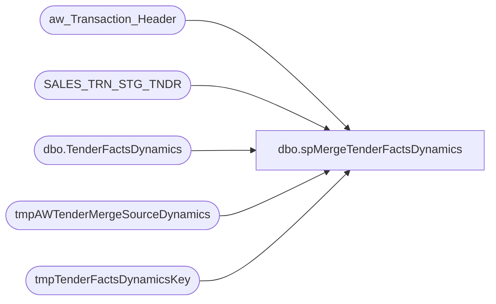

# dbo.spMergeTenderFactsDynamics

**Database:** DWStaging  
**Server:** papamart  

## Architecture Diagram



## Table Dependencies

| Referenced Table |
|---|
| aw_Transaction_Header |
| SALES_TRN_STG_TNDR |
| dbo.TenderFactsDynamics |
| tmpAWTenderMergeSourceDynamics |
| tmpTenderFactsDynamicsKey |

## Stored Procedure Code

```sql
CREATE proc [dbo].[spMergeTenderFactsDynamics] 

as

set nocount on

--==========================================================================================================================================
-- Dan Tweedie 2022-02-03	Created proc to merge inserts/updates/deletes into TenderFactsDynamics
--==========================================================================================================================================
--DELETE OLDER THAN 60 DAYS
-- Remarked out on 4/3/2023 Due to Ongoing Testing 
--delete tf
--from dw.dbo.TenderFactsDynamics tf
--join dw.dbo.date_dim dd on tf.date_key=dd.date_key
--where datediff(dd, dd.actual_date, getdate()) >60
----


--Stage the Merge Source Data
IF (Object_ID('dwstaging..tmpAWTenderMergeSourceDynamics') IS NOT NULL) DROP TABLE tmpAWTenderMergeSourceDynamics
SELECT
	CAST(STST.Transaction_ID AS int) AS Transaction_ID,
	STST.tender_key,
	MAX(ath.store_key) AS store_key,
	MAX(ath.date_key) AS date_key,
	SUM(STST.Gross_Line_Amount) AS tender_amt,
	COUNT(*) AS tender_count
into tmpAWTenderMergeSourceDynamics
FROM
	SALES_TRN_STG_TNDR STST WITH (NOLOCK)
	INNER JOIN aw_Transaction_Header ath WITH (NOLOCK)
		ON STST.Transaction_ID = ath.Transaction_ID
GROUP BY	STST.Transaction_ID,
			STST.tender_key
	
---=========================
-- BEGIN DELETE PROCEDURE --
---=========================
--stage the TenderFactsDynamics_key for transactions in DW that are within the same date range as the merge source, but transactions are not in the merge source
--these transactions will be deleted from TenderFactsDynamics
IF (Object_ID('dwstaging..tmpTenderFactsDynamicsKey') IS NOT NULL) DROP TABLE tmpTenderFactsDynamicsKey;
with MinDate as
	(
		select --:
			min(date_key) MinDate,
			max(date_key) MaxDate
		from tmpAWTenderMergeSourceDynamics
	)
select tdf.TenderFactsDynamics_key 
into tmpTenderFactsDynamicsKey
from MinDate md 
join dw.dbo.TenderFactsDynamics tdf with (nolock) on tdf.date_key between md.MinDate and md.MaxDate
left join tmpAWTenderMergeSourceDynamics ms on
	tdf.transaction_id=ms.transaction_id
	and
	tdf.tender_key=ms.tender_key
where ms.transaction_id is null
group by tdf.TenderFactsDynamics_key

--if there are transaction in TenderFactsDynamics which are not in the stage data, but are for the same date range, delete from TenderFactsDynamics
if (select count(*) from tmpTenderFactsDynamicsKey) > 0
begin
	delete tdf
	from dw.dbo.TenderFactsDynamics tdf
	join tmpTenderFactsDynamicsKey tdfk on tdf.TenderFactsDynamics_key=tdfk.TenderFactsDynamics_key
end


---=========================
-- END DELETE PROCEDURE --
---=========================
;
---======================================
-- BEGIN MERGE FOR INSERTS AND UPDATES --
---======================================
merge into dw.dbo.TenderFactsDynamics as target
using tmpAWTenderMergeSourceDynamics as source
on
	target.transaction_id=source.transaction_id
	and
	target.tender_key=source.tender_key
when matched 
	and 
	(
		isnull(target.store_key,0)<>isnull(source.store_key,0) or					
		isnull(target.date_key,0)<>isnull(source.date_key,0) or
		isnull(target.tender_amt,0)<>isnull(source.tender_amt,0) or
		isnull(target.tender_count,0)<>isnull(source.tender_count,0)
	)
then update
	set
		target.store_key=source.store_key,					
		target.date_key=source.date_key,
		target.tender_amt=source.tender_amt,
		target.tender_count=source.tender_count,
		target.updt_dt=getdate()
when not matched by target
then insert
	(
		transaction_id,
		tender_key,
		store_key,
		date_key,
		tender_amt,
		tender_count,
		ins_dt
	)
values
	(
		source.transaction_id,
		source.tender_key,
		source.store_key,
		source.date_key,
		source.tender_amt,
		source.tender_count,
		getdate()
	)
;
---======================================
-- END MERGE FOR INSERTS AND UPDATES --
---======================================


IF (Object_ID('dwstaging..tmpAWTenderMergeSourceDynamics') IS NOT NULL) DROP TABLE tmpAWTenderMergeSourceDynamics
IF (Object_ID('dwstaging..TenderFactsDynamics_key') IS NOT NULL) DROP TABLE TenderFactsDynamics_key;
```

