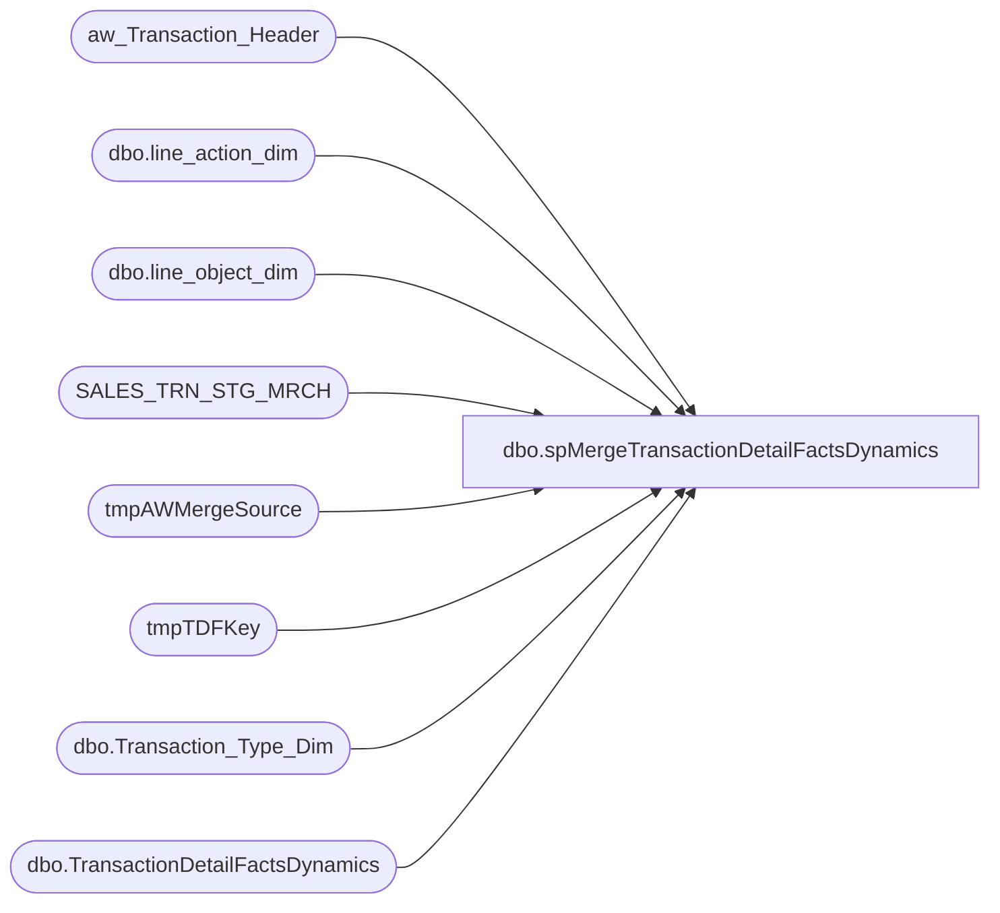

# dbo.spMergeTransactionDetailFactsDynamics

**Database:** DWStaging  
**Server:** papamart  

## Architecture Diagram



## Table Dependencies

| Referenced Table |
|---|
| aw_Transaction_Header |
| dbo.line_action_dim |
| dbo.line_object_dim |
| SALES_TRN_STG_MRCH |
| tmpAWMergeSource |
| tmpTDFKey |
| dbo.Transaction_Type_Dim |
| dbo.TransactionDetailFactsDynamics |

## Stored Procedure Code

```sql
CREATE proc [dbo].[spMergeTransactionDetailFactsDynamics] 

as

set nocount on

--==========================================================================================================================================
-- Dan Tweedie 2020-07-01	Created proc to merge inserts/updates/deletes into TransactionDetailFactsDynamics
--==========================================================================================================================================
--DELETE OLDER THAN 60 DAYS
-- Temp remark out on 11/8/2022 - Tim C 
--delete tf
--from dw.dbo.TransactionDetailFactsDynamics tf
--join dw.dbo.date_dim dd on tf.date_key=dd.date_key
--where datediff(dd, dd.actual_date, getdate()) >60
--


--Stage the Merge Source Data
IF (Object_ID('dwstaging..tmpAWMergeSource') IS NOT NULL) DROP TABLE tmpAWMergeSource
SELECT --:48 -- 3,546,176 rows
	ath.Transaction_ID,
	STSM.Line_Sequence AS transaction_line_seq,
	ath.store_key,
	ath.date_key,
	ath.time_key,
	STSM.product_key,
	ISNULL(lod.line_object_key, -1) AS line_object_key,
	CAST((STSM.Gross_Line_Amount - STSM.Vat_Tax_Amt) AS decimal(8,2)) AS unit_gross_amount,
	CAST(STSM.POS_Discount_Amount AS decimal(8,2)) AS unit_disc_amount,
	CAST(STSM.Vat_Tax_Amt AS decimal(8,2)) AS vat_tax_amount,
	cast(STSM.units as int) AS units,
	ath.currency_key AS currency_key,
	CAST(ath.Register_No AS int) AS register_num,
	UPPER(ath.party_y_n) AS party_y_n,
	ISNULL(ttd.transaction_key, 0) AS transaction_type_key,
	ath.Transaction_No,
	STSM.reference_no AS reference_no,
	STSM.Upsell_Discount_Allocated as upsell_disc_allocated,
	ath.cashier_no as cashier_id,
	ISNULL(STSM.ext_Cost,0) AS ext_Cost,
	la.line_action_key as line_action_key
into tmpAWMergeSource
FROM
	SALES_TRN_STG_MRCH STSM WITH (NOLOCK)
	INNER JOIN aw_Transaction_Header ath WITH (NOLOCK)
		ON STSM.Transaction_ID = ath.Transaction_ID
	LEFT JOIN dw.dbo.line_object_dim lod WITH (NOLOCK)
		ON STSM.Line_Object = lod.Line_Object
	LEFT JOIN dw.dbo.Transaction_Type_Dim ttd WITH (NOLOCK)
		ON ath.transaction_type = ttd.transaction_type
					LEFT JOIN dw.dbo.line_action_dim la WITH (NOLOCK)
		ON STSM.Line_Action = la.Line_Action
	
---=========================
-- BEGIN DELETE PROCEDURE --
---=========================
--stage the tdf_key for transactions in DW that are within the same date range as the merge source, but transactions are not in the merge source
--these transactions will be deleted from TransactionDetailFactsDynamics
IF (Object_ID('dwstaging..tmpTDFKey') IS NOT NULL) DROP TABLE tmpTDFKey;
with MinDate as
	(
		select --:
			min(date_key) MinDate,
			max(date_key) MaxDate
		from tmpAWMergeSource
	)
select tdf.tdf_key --:08 -- 0 rows -- this is good, but it is possible that transactions are removed from sales audit so we will removed from dw..
into tmpTDFKey
from MinDate md 
join dw.dbo.TransactionDetailFactsDynamics tdf with (nolock) on tdf.date_key between md.MinDate and md.MaxDate
left join tmpAWMergeSource ms on
	tdf.transaction_id=ms.transaction_id
	and
	tdf.transaction_line_seq=ms.transaction_line_seq
where ms.transaction_id is null
group by tdf.tdf_key

--if there are transaction in TransactionDetailFactsDynamics which are not in the stage data, but are for the same date range, delete from TransactionDetailFactsDynamics
if (select count(*) from tmpTDFKey) > 0
begin
	delete tdf
	from dw.dbo.TransactionDetailFactsDynamics tdf
	join tmpTDFKey tdfk on tdf.tdf_key=tdfk.tdf_key
end
---=========================
-- END DELETE PROCEDURE --
---=========================
;
---======================================
-- BEGIN MERGE FOR INSERTS AND UPDATES --
---======================================
merge into dw.dbo.TransactionDetailFactsDynamics as target
using tmpAWMergeSource as source
on
	target.transaction_id=source.transaction_id
	and
	target.transaction_line_seq=source.transaction_line_seq
when matched 
	and 
	(
		isnull(target.store_key,0)<>isnull(source.store_key,0) or					
		isnull(target.date_key,0)<>isnull(source.date_key,0) or
		isnull(target.time_key,0)<>isnull(source.time_key,0) or
		isnull(target.product_key,0)<>isnull(source.product_key,0) or
		isnull(target.line_object_key,0)<>isnull(source.line_object_key,0) or
		isnull(target.unit_gross_amount,0)<>isnull(source.unit_gross_amount,0) or
		isnull(target.unit_disc_amount,0)<>isnull(source.unit_disc_amount,0) or
		isnull(target.vat_tax_amount,0)<>isnull(source.vat_tax_amount,0) or
		isnull(target.units,0)<>isnull(source.units,0) or
		isnull(target.currency_key,0)<>isnull(source.currency_key,0) or
		isnull(target.register_num,0)<>isnull(source.register_num,0) or
		isnull(target.party_y_n,0)<>isnull(source.party_y_n,0) or
		isnull(target.transaction_type_key,0)<>isnull(source.transaction_type_key,0) or
		isnull(target.transaction_no,0)<>isnull(source.transaction_no,0) or
		isnull(target.reference_no,0)<>isnull(source.reference_no,0) or
		isnull(target.upsell_disc_allocated,0)<>isnull(source.upsell_disc_allocated,0) or
		isnull(target.cashier_id,0)<>isnull(source.cashier_id,0) or
		isnull(target.ext_cost,0)<>isnull(source.ext_cost,0) or
		isnull(target.line_action_key,0)<>isnull(source.line_action_key,0)
	)
then update
	set
		target.store_key=source.store_key,					
		target.date_key=source.date_key,
		target.time_key=source.time_key,
		target.product_key=source.product_key,
		target.line_object_key=source.line_object_key,
		target.unit_gross_amount=source.unit_gross_amount,
		target.unit_disc_amount=source.unit_disc_amount,
		target.vat_tax_amount=source.vat_tax_amount,
		target.units=source.units,
		target.currency_key=source.currency_key,
		target.register_num=source.register_num,
		target.party_y_n=source.party_y_n,
		target.transaction_type_key=source.transaction_type_key,
		target.transaction_no=source.transaction_no,
		target.reference_no=source.reference_no,
		target.upsell_disc_allocated=source.upsell_disc_allocated,
		target.cashier_id=source.cashier_id,
		target.ext_cost=source.ext_cost,
		target.line_action_key=source.line_action_key,
		target.updt_dt=getdate()
when not matched by target
then insert
	(
		transaction_id,
		transaction_line_seq,
		store_key,
		date_key,
		time_key,
		product_key,
		line_object_key,
		unit_gross_amount,
		unit_disc_amount,
		vat_tax_amount,
		units,
		currency_key,
		register_num,
		party_y_n,
		transaction_type_key,
		transaction_no,
		reference_no,
		upsell_disc_allocated,
		cashier_id,
		ext_cost,
		line_action_key,
		ins_dt
	)
values
	(
		source.transaction_id,
		source.transaction_line_seq,
		source.store_key,
		source.date_key,
		source.time_key,
		source.product_key,
		source.line_object_key,
		source.unit_gross_amount,
		source.unit_disc_amount,
		source.vat_tax_amount,
		source.units,
		source.currency_key,
		source.register_num,
		source.party_y_n,
		source.transaction_type_key,
		source.transaction_no,
		source.reference_no,
		source.upsell_disc_allocated,
		source.cashier_id,
		source.ext_cost,
		source.line_action_key,
		getdate()
	)
;
---======================================
-- END MERGE FOR INSERTS AND UPDATES --
---======================================


IF (Object_ID('dwstaging..tmpAWMergeSource') IS NOT NULL) DROP TABLE tmpAWMergeSource
IF (Object_ID('dwstaging..tmpTDFKey') IS NOT NULL) DROP TABLE tmpTDFKey;
```

