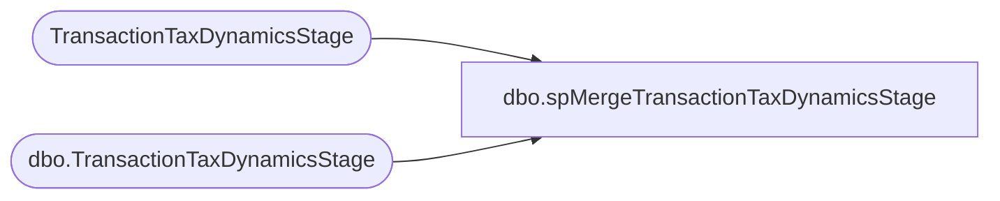

# dbo.spMergeTransactionTaxDynamicsStage

**Database:** DWStaging  
**Server:** papamart  

## Architecture Diagram



## Table Dependencies

| Referenced Table |
|---|
| TransactionTaxDynamicsStage |
| dbo.TransactionTaxDynamicsStage |

## Stored Procedure Code

```sql
CREATE proc [dbo].[spMergeTransactionTaxDynamicsStage] 

as

set nocount on 

--if the same transaction and line are staged, delete from target
;
merge into DW.dbo.TransactionTaxDynamicsStage as target
using TransactionTaxDynamicsStage as source
on target.transaction_id=source.transaction_id
and target.line_id=source.line_id
when matched 
	then delete
;

--if a different transaction and line are staged, insert, then delete older than 90 days
;
merge into DW.dbo.TransactionTaxDynamicsStage as target
using TransactionTaxDynamicsStage as source
on target.transaction_id=source.transaction_id
and target.line_id=source.line_id
when not matched by target
then insert
	(
		transaction_id,	
		line_sequence,	
		line_object,	
		line_action,	
		gross_line_amount,	
		pos_discount_amount,	
		taxable_amount,	
		nontaxable_amount,	
		combined_rate,	
		tax_amount_expected,
		tax_level,
		line_id,
		InsertDate
	)
values
	(
		source.transaction_id,	
		source.line_sequence,	
		source.line_object,	
		source.line_action,	
		source.gross_line_amount,	
		source.pos_discount_amount,	
		source.taxable_amount,	
		source.nontaxable_amount,	
		source.combined_rate,	
		source.tax_amount_expected,
		source.tax_level,
		source.line_id,
		getdate()
	)
when not matched by source
and datediff(dd, target.InsertDate, getdate()) >=90
then delete;
;


--merge into DW.dbo.TransactionTaxDynamicsStage as target 
--using TransactionTaxDynamicsStage as source
--on target.transaction_id=source.transaction_id
--and target.line_sequence=source.line_sequence
--and target.line_object=source.line_object
--and target.line_action=source.line_action
--and target.tax_level=source.tax_level
--and target.line_id=source.line_id
--when matched and
--	--target.line_object<>source.line_object or
--	--target.line_action<>source.line_action or
--	target.gross_line_amount<>source.gross_line_amount or
--	target.pos_discount_amount<>source.pos_discount_amount or
--	target.taxable_amount<>source.taxable_amount or
--	target.nontaxable_amount<>source.nontaxable_amount or
--	target.combined_rate<>source.combined_rate or
--	target.tax_amount_expected<>source.tax_amount_expected 
--then update
--set 
--	--target.line_object=source.line_object,	
--	--target.line_action=source.line_action,	
--	target.gross_line_amount=source.gross_line_amount,	
--	target.pos_discount_amount=source.pos_discount_amount,	
--	target.taxable_amount=source.taxable_amount,	
--	target.nontaxable_amount=source.nontaxable_amount,	
--	target.combined_rate=source.combined_rate,	
--	target.tax_amount_expected=source.tax_amount_expected,
--	target.UpdateDate=getdate()
--when not matched by target
--then insert
--	(
--		transaction_id,	
--		line_sequence,	
--		line_object,	
--		line_action,	
--		gross_line_amount,	
--		pos_discount_amount,	
--		taxable_amount,	
--		nontaxable_amount,	
--		combined_rate,	
--		tax_amount_expected,
--		tax_level,
--		line_id,
--		InsertDate
--	)
--values
--	(
--		source.transaction_id,	
--		source.line_sequence,	
--		source.line_object,	
--		source.line_action,	
--		source.gross_line_amount,	
--		source.pos_discount_amount,	
--		source.taxable_amount,	
--		source.nontaxable_amount,	
--		source.combined_rate,	
--		source.tax_amount_expected,
--		source.tax_level,
--		source.line_id,
--		getdate()
--	)
--when not matched by source
--and datediff(dd, target.InsertDate, getdate()) >=90
--then delete;
```

