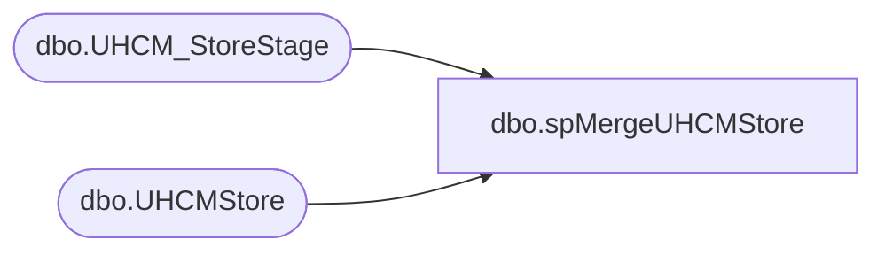

# dbo.spMergeUHCMStore

**Database:** DWStaging  
**Server:** papamart  

## Architecture Diagram



## Table Dependencies

| Referenced Table |
|---|
| dbo.UHCM_StoreStage |
| dbo.UHCMStore |

## Stored Procedure Code

```sql
create proc [dbo].[spMergeUHCMStore]

as 

-------------------------------------------------------------------------------------------------------
-- Kelly Farrar	2019-02-20	Created Proc for merging Store data from files exported from new UHCM system
-------------------------------------------------------------------------------------------------------

set nocount on

merge into DW.dbo.UHCMStore as target
using DWStaging.dbo.UHCM_StoreStage as source 
on 
	(
		target.[StoreNumber]=source.[Location]
	)
When Matched and
	(

		isnull(target.[LocationName],'x')<>isnull(source.[LocationName],'x')
		OR
		isnull(target.[Phone Number],'x')<>isnull(source.[PhoneNumber],'x')
		OR
		isnull(target.[Address],'x')<>isnull(source.[Address],'x')
		OR
		isnull(target.[City],'x')<>isnull(source.[City],'x')
		OR
		isnull(target.[State ],'x')<>isnull(source.[State ],'x')
		OR
		isnull(target.[Zip],'x')<>isnull(source.[Zip],'x')
		OR
		isnull(target.[Country],'x')<>isnull(source.[Country],'x')
		OR
		isnull(target.[FaxNumber],'x')<>isnull(source.[FaxNumber],'x')
	)
Then Update
	set 
	target.[LocationName]=source.[LocationName],
		target.[Phone Number]=source.[PhoneNumber],
		target.[Address]=source.[Address],
		target.[City]=source.[City],
		target.[State ]=source.[State ],
		target.[Zip]=source.[Zip],
		target.[Country]=source.[Country],
		target.[FaxNumber]=source.[FaxNumber],
		target.UpdateDate=getdate()
When Not Matched by target
Then Insert
	(
	   [StoreNumber],
	[LocationName],
    [Phone Number],
    [Address],
    [City],
    [State ],
    [Zip],
    [Country],
    [FaxNumber],
	[InsertDate]
	)
Values
	(
		source.[Location],
		source.[LocationName],
		source.[PhoneNumber],
		source.[Address],
		source.[City],
		source.[State ],
		source.[Zip],
		source.[Country],
		source.[FaxNumber],
		getdate()
	)
;
```

