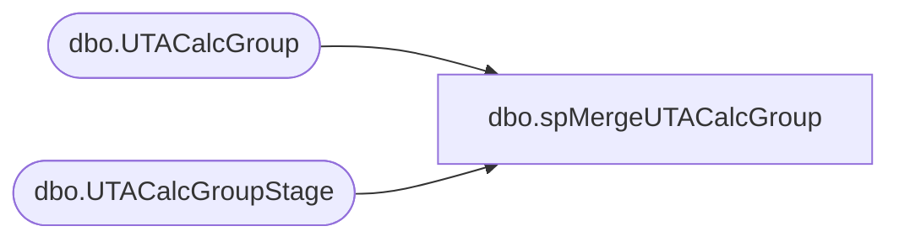

# dbo.spMergeUTACalcGroup

**Database:** DWStaging  
**Server:** papamart  

## Architecture Diagram



## Table Dependencies

| Referenced Table |
|---|
| dbo.UTACalcGroup |
| dbo.UTACalcGroupStage |

## Stored Procedure Code

```sql
create proc [dbo].[spMergeUTACalcGroup]

as 

-------------------------------------------------------------------------------------------------------
-- Dan Tweedie	2019-01-16	Created Proc for merging data from new UTA system that replaces Workbrain
-------------------------------------------------------------------------------------------------------

set nocount on

merge into DW.dbo.UTACalcGroup as target
using DWStaging.dbo.UTACalcGroupStage as source 
on 
	(
		target.Calcgrp_ID=source.Calcgrp_ID
	)
When Matched and
	(
		isnull(target.Calcgrp_Name,'x')<>isnull(source.Calcgrp_Name,'x')
	)
Then Update
	set 
		target.Calcgrp_Name=source.Calcgrp_Name,
		target.UpdateDate=getdate()
When Not Matched by target
Then Insert
	(
		Calcgrp_ID,
		Calcgrp_Name,
		InsertDate
	)
Values
	(
		source.Calcgrp_ID,
		source.Calcgrp_Name,
		getdate()
	)
;
```

