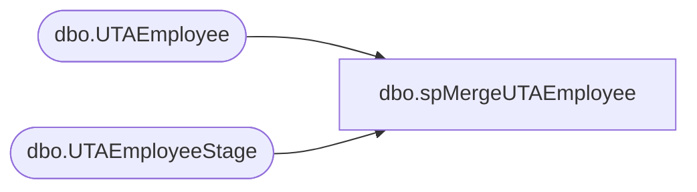

# dbo.spMergeUTAEmployee

**Database:** DWStaging  
**Server:** papamart  

## Architecture Diagram



## Table Dependencies

| Referenced Table |
|---|
| dbo.UTAEmployee |
| dbo.UTAEmployeeStage |

## Stored Procedure Code

```sql
CREATE proc [dbo].[spMergeUTAEmployee]

as 

-------------------------------------------------------------------------------------------------------
-- Dan Tweedie	2019-01-16	Created Proc for merging data from new UTA system that replaces Workbrain
-------------------------------------------------------------------------------------------------------

set nocount on

merge into DW.dbo.UTAEmployee as target
using DWStaging.dbo.UTAEmployeeStage as source 
on 
	(
		target.Emp_ID=source.Emp_ID
	)
When Matched and
	(
		isnull(target.Emp_FullName,'x')<>isnull(source.Emp_FullName,'x')
		OR
		isnull(target.Emp_Name,'x')<>isnull(source.Emp_Name,'x')
		OR
		isnull(target.Calcgrp_ID,99999999)<>isnull(source.Calcgrp_ID,99999999)
		OR
		isnull(target.Emp_Base_Rate,9999999.999999)<>isnull(source.Emp_Base_Rate,9999999.999999)
	)
Then Update
	set 
		target.Emp_FullName=source.Emp_FullName,
		target.Emp_Name=source.Emp_Name,
		target.Calcgrp_ID=source.Calcgrp_ID,
		target.Emp_Base_Rate=source.Emp_Base_Rate,
		target.UpdateDate=getdate()
When Not Matched by target
Then Insert
	(
		Emp_ID,
		Emp_FullName,
		Emp_Name,
		Calcgrp_ID,
		Emp_Base_Rate,
		InsertDate
	)
Values
	(
		source.Emp_ID,
		source.Emp_FullName,
		source.Emp_Name,
		source.Calcgrp_ID,
		source.Emp_Base_Rate,
		getdate()
	)
;
```

