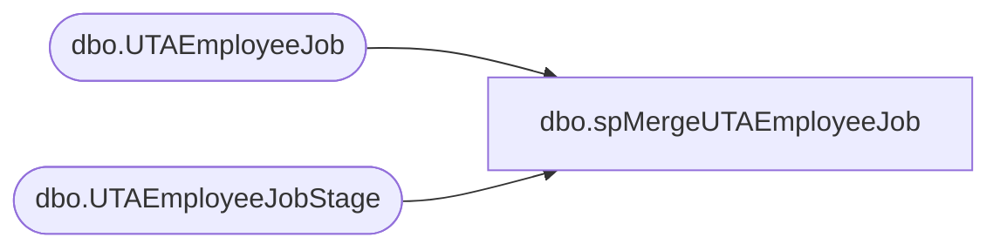

# dbo.spMergeUTAEmployeeJob

**Database:** DWStaging  
**Server:** papamart  

## Architecture Diagram



## Table Dependencies

| Referenced Table |
|---|
| dbo.UTAEmployeeJob |
| dbo.UTAEmployeeJobStage |

## Stored Procedure Code

```sql
CREATE proc [dbo].[spMergeUTAEmployeeJob]

as 

-------------------------------------------------------------------------------------------------------
-- Dan Tweedie	2019-01-16	Created Proc for merging data from new UTA system that replaces Workbrain
-------------------------------------------------------------------------------------------------------

set nocount on

merge into DW.dbo.UTAEmployeeJob as target
using DWStaging.dbo.UTAEmployeeJobStage as source 
on 
	(
		target.Emp_ID=source.Emp_ID
		and
		target.Job_ID=source.Job_ID
		and
		target.EmpJob_Start_Date=source.EmpJob_Start_Date
	)
When Matched and
	(
		isnull(target.EmpJob_End_Date,'3030-12-31')<>isnull(source.EmpJob_End_Date,'3030-12-31')
	)
Then Update
	set 
		target.EmpJob_End_Date=source.EmpJob_End_Date,
		target.UpdateDate=getdate()
When Not Matched by target
Then Insert
	(
		Emp_ID,
		Job_ID,
		EmpJob_Start_Date,
		EmpJob_End_Date,
		InsertDate
	)
Values
	(
		source.Emp_ID,
		source.Job_ID,
		source.EmpJob_Start_Date,
		source.EmpJob_End_Date,
		getdate()
	)
;
```

