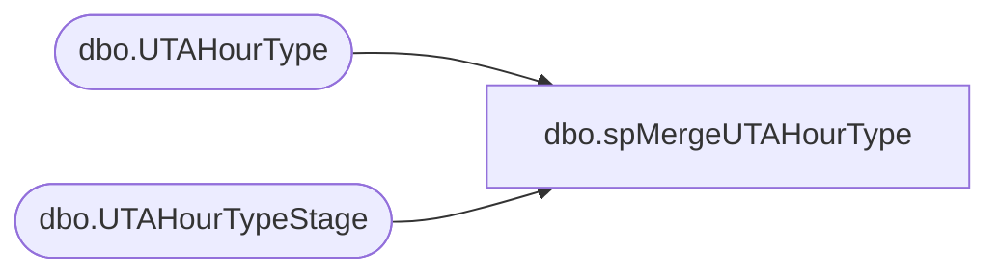

# dbo.spMergeUTAHourType

**Database:** DWStaging  
**Server:** papamart  

## Architecture Diagram



## Table Dependencies

| Referenced Table |
|---|
| dbo.UTAHourType |
| dbo.UTAHourTypeStage |

## Stored Procedure Code

```sql
create proc [dbo].[spMergeUTAHourType]

as 

-------------------------------------------------------------------------------------------------------
-- Dan Tweedie	2019-01-16	Created Proc for merging data from new UTA system that replaces Workbrain
-------------------------------------------------------------------------------------------------------

set nocount on

merge into DW.dbo.UTAHourType as target
using DWStaging.dbo.UTAHourTypeStage as source 
on 
	(
		target.Htype_ID=source.Htype_ID
	)
When Matched and
	(
		isnull(target.Htype_Name,'x')<>isnull(source.Htype_Name,'x')
	)
Then Update
	set 
		target.Htype_Name=source.Htype_Name,
		target.UpdateDate=getdate()
When Not Matched by target
Then Insert
	(
		Htype_ID,
		Htype_Name,
		InsertDate
	)
Values
	(
		source.Htype_ID,
		source.Htype_Name,
		getdate()
	)
;
```

