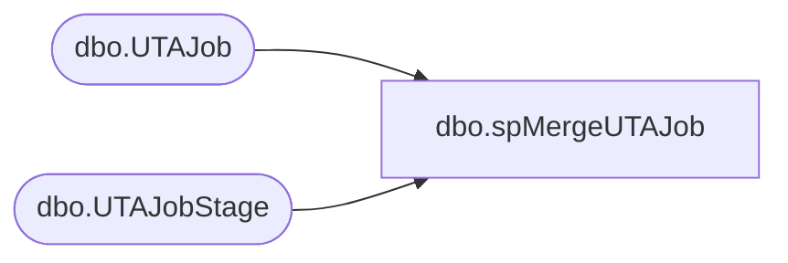

# dbo.spMergeUTAJob

**Database:** DWStaging  
**Server:** papamart  

## Architecture Diagram



## Table Dependencies

| Referenced Table |
|---|
| dbo.UTAJob |
| dbo.UTAJobStage |

## Stored Procedure Code

```sql
CREATE proc [dbo].[spMergeUTAJob]

as 

-------------------------------------------------------------------------------------------------------
-- Dan Tweedie	2019-01-16	Created Proc for merging data from new UTA system that replaces Workbrain
-------------------------------------------------------------------------------------------------------

set nocount on

merge into DW.dbo.UTAJob as target
using DWStaging.dbo.UTAJobStage as source 
on 
	(
		target.Job_ID=source.Job_ID
	)
When Matched and
	(
		isnull(target.Job_Name,'x')<>isnull(source.Job_Name,'x')
		OR
		isnull(target.Job_Desc,'x')<>isnull(source.Job_Desc,'x')
	)
Then Update
	set 
		target.Job_Name=source.Job_Name,
		target.Job_Desc=source.Job_Desc,
		target.UpdateDate=getdate()
When Not Matched by target
Then Insert
	(
		Job_ID,
		Job_Name,
		Job_Desc,
		InsertDate
	)
Values
	(
		source.Job_ID,
		source.Job_Name,
		source.Job_Desc,
		getdate()
	)
;
```

