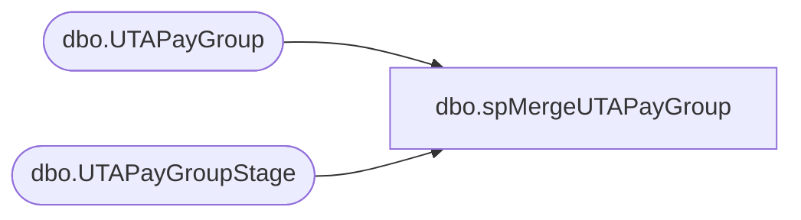

# dbo.spMergeUTAPayGroup

**Database:** DWStaging  
**Server:** papamart  

## Architecture Diagram



## Table Dependencies

| Referenced Table |
|---|
| dbo.UTAPayGroup |
| dbo.UTAPayGroupStage |

## Stored Procedure Code

```sql
create proc [dbo].[spMergeUTAPayGroup]

as 

-------------------------------------------------------------------------------------------------------
-- Dan Tweedie	2019-01-16	Created Proc for merging data from new UTA system that replaces Workbrain
-------------------------------------------------------------------------------------------------------

set nocount on

merge into DW.dbo.UTAPayGroup as target
using DWStaging.dbo.UTAPayGroupStage as source 
on 
	(
		target.PayGrp_ID=source.PayGrp_ID
	)
When Matched and
	(
		isnull(target.PayGrp_Name,'x')<>isnull(source.PayGrp_Name,'x')
	)
Then Update
	set 
		target.PayGrp_Name=source.PayGrp_Name,
		target.UpdateDate=getdate()
When Not Matched by target
Then Insert
	(
		PayGrp_ID,
		PayGrp_Name,
		InsertDate
	)
Values
	(
		source.PayGrp_ID,
		source.PayGrp_Name,
		getdate()
	)
;
```

