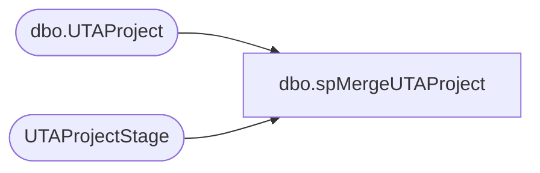

# dbo.spMergeUTAProject

**Database:** DWStaging  
**Server:** papamart  

## Architecture Diagram



## Table Dependencies

| Referenced Table |
|---|
| dbo.UTAProject |
| UTAProjectStage |

## Stored Procedure Code

```sql
create proc spMergeUTAProject

--==============================================================================
--	Dan Tweedie	2019-04-05	Created proc
--==============================================================================
as 

set nocount on

merge into DW.dbo.UTAProject as target
using UTAProjectStage as source
on	
	(
		target.proj_id=source.proj_id
	)
when matched and 
	(
		isnull(target.proj_name,'x')<>isnull(source.proj_name,'x')
		OR
		isnull(target.proj_desc,'x')<>isnull(source.proj_desc,'x')
	)
then update
	set
		target.proj_name=source.proj_name,
		target.proj_desc=source.proj_desc,
		target.UpdateDate=getdate()
when not matched by target
then insert 
	(
		proj_id,
		proj_name,
		proj_desc,
		InsertDate
	)
values
	(
		source.proj_id,
		source.proj_name,
		source.proj_desc,
		getdate()
	)
;
```

