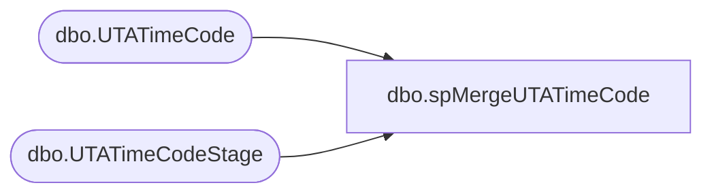

# dbo.spMergeUTATimeCode

**Database:** DWStaging  
**Server:** papamart  

## Architecture Diagram



## Table Dependencies

| Referenced Table |
|---|
| dbo.UTATimeCode |
| dbo.UTATimeCodeStage |

## Stored Procedure Code

```sql
CREATE proc [dbo].[spMergeUTATimeCode]

as 

-------------------------------------------------------------------------------------------------------
-- Dan Tweedie	2019-01-16	Created Proc for merging data from new UTA system that replaces Workbrain
-------------------------------------------------------------------------------------------------------

set nocount on

merge into DW.dbo.UTATimeCode as target
using DWStaging.dbo.UTATimeCodeStage as source 
on 
	(
		target.TCode_ID=source.TCode_ID
	)
When Matched and
	(
		isnull(target.TCode_Name,'x')<>isnull(source.TCode_Name,'x')
		OR
		isnull(target.TCode_Desc,'x')<>isnull(source.TCode_Desc,'x')
	)
Then Update
	set 
		target.TCode_Name=source.TCode_Name,
		target.TCode_Desc=source.TCode_Desc,
		target.UpdateDate=getdate()
When Not Matched by target
Then Insert
	(
		TCode_ID,
		TCode_Name,
		TCode_Desc,
		InsertDate
	)
Values
	(
		source.TCode_ID,
		source.TCode_Name,
		source.TCode_Desc,
		getdate()
	)
;
```

