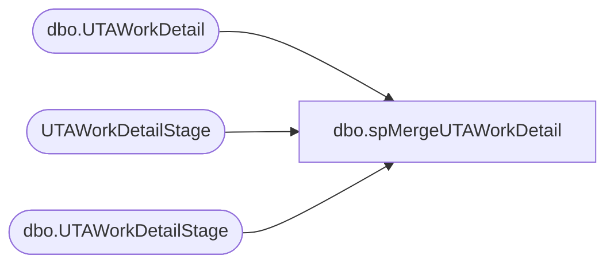

# dbo.spMergeUTAWorkDetail

**Database:** DWStaging  
**Server:** papamart  

## Architecture Diagram



## Table Dependencies

| Referenced Table |
|---|
| dbo.UTAWorkDetail |
| UTAWorkDetailStage |
| dbo.UTAWorkDetailStage |

## Stored Procedure Code

```sql
CREATE proc [dbo].[spMergeUTAWorkDetail]

as 

-------------------------------------------------------------------------------------------------------
-- Dan Tweedie	2019-01-16	Created Proc for merging data from new UTA system that replaces Workbrain
-------------------------------------------------------------------------------------------------------

set nocount on


-- Delete work detail rows where the work date is within 21 days, but is not in the work detail file, so therefore is not in Ultipro since the file contains rolling 30 days

merge into dw.dbo.UTAWorkDetail as target
using 
	( 
		select wd.wrks_id, wd.wrkd_id
		from dw.dbo.UTAWorkDetail wd with (nolock) 
		left join UTAWorkDetailStage wds with (nolock) on wd.wrkd_id=wds.wrkd_id
		where datediff(dd, wd.wrkd_work_date, getdate()) <= 30
		and wds.wrkd_id is null
	) 
	as source 
on 
	target.wrks_id=source.wrks_id
	and 
	target.wrkd_id=source.wrkd_id
when matched then delete
;
----------------------

merge into DW.dbo.UTAWorkDetail as target
using DWStaging.dbo.UTAWorkDetailStage as source 
on 
	(
		target.Wrkd_ID=source.Wrkd_ID
	)
When Matched and
	(
		isnull(target.Wrks_ID,0)<>isnull(source.Wrks_ID,0)
		OR
		isnull(target.Job_ID,0)<>isnull(source.Job_ID,0)
		OR
		isnull(target.Dept_ID,0)<>isnull(source.Dept_ID,0)
		OR
		isnull(target.Wrkd_Start_Time,'3030-12-31')<>isnull(source.Wrkd_Start_Time,'3030-12-31')
		OR
		isnull(target.Wrkd_End_Time,'3030-12-31')<>isnull(source.Wrkd_End_Time,'3030-12-31')
		OR
		isnull(target.Wrkd_Minutes,0)<>isnull(source.Wrkd_Minutes,0)
		OR
		isnull(target.Wbt_ID,0)<>isnull(source.Wbt_ID,0)
		OR
		isnull(target.Tcode_ID,0)<>isnull(source.TCode_ID,0)
		OR
		isnull(target.Htype_ID,0)<>isnull(source.Htype_ID,0)
		OR
		isnull(target.Wrkd_Rate,0.0)<>isnull(source.Wrkd_Rate,0.0)
		OR
		isnull(target.Wrkd_Work_Date,'3030-12-31')<>isnull(source.Wrkd_Work_Date,'3030-12-31')
		OR
		isnull(target.proj_id,0)<>isnull(source.proj_id,0)
	)
Then Update
	set 
		target.Wrks_ID=source.Wrks_ID,
		target.Job_ID=source.Job_ID,
		target.Dept_ID=source.Dept_ID,
		target.Wrkd_Start_Time=source.Wrkd_Start_Time,
		target.Wrkd_End_Time=source.Wrkd_End_Time,
		target.Wrkd_Minutes=source.Wrkd_Minutes,
		target.Wbt_ID=source.Wbt_ID,
		target.Tcode_ID=source.Tcode_ID,
		target.Htype_ID=source.Htype_ID,
		target.Wrkd_Rate=source.Wrkd_Rate,
		target.Wrkd_Work_Date=source.Wrkd_Work_Date,
		target.proj_id=source.proj_id,
		target.UpdateDate=getdate()
When Not Matched by target
Then Insert
	(
		Wrks_ID,
		Wrkd_ID,
		Job_ID,
		Wrkd_Start_Time,
		Wrkd_End_Time,
		Wrkd_Minutes,
		Wbt_ID,
		Tcode_ID,
		Htype_ID,
		Wrkd_Rate,
		Wrkd_Work_Date,
		Dept_ID,
		proj_id,
		InsertDate
	)
Values
	(
		source.Wrks_ID,
		source.Wrkd_ID,
		source.Job_ID,
		source.Wrkd_Start_Time,
		source.Wrkd_End_Time,
		source.Wrkd_Minutes,
		source.Wbt_ID,
		source.Tcode_ID,
		source.Htype_ID,
		source.Wrkd_Rate,
		source.Wrkd_Work_Date,
		source.Dept_ID,
		source.proj_id,
		getdate()
	)
;
```

