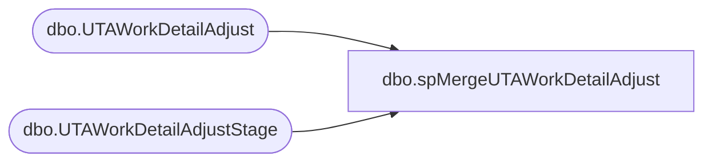

# dbo.spMergeUTAWorkDetailAdjust

**Database:** DWStaging  
**Server:** papamart  

## Architecture Diagram



## Table Dependencies

| Referenced Table |
|---|
| dbo.UTAWorkDetailAdjust |
| dbo.UTAWorkDetailAdjustStage |

## Stored Procedure Code

```sql
CREATE proc [dbo].[spMergeUTAWorkDetailAdjust]

as 


-------------------------------------------------------------------------------------------------------
-- Dan Tweedie	2019-01-16	Created Proc for merging data from new UTA system that replaces Workbrain
-------------------------------------------------------------------------------------------------------

set nocount on

merge into DW.dbo.UTAWorkDetailAdjust as target
using DWStaging.dbo.UTAWorkDetailAdjustStage as source 
on 
	(
		target.Wrkda_ID=source.Wrkda_ID
	)
When Matched and
	(
		isnull(target.wbt_ID,0)<>isnull(source.wbt_ID,0)
		OR
		isnull(target.Job_ID,0)<>isnull(source.Job_ID,0)
		OR
		isnull(target.Dept_ID,0)<>isnull(source.Dept_ID,0)
		OR
		isnull(target.Wrkda_Work_Date,'3030-12-31')<>isnull(source.Wrkda_Work_Date,'3030-12-31')
		OR
		isnull(target.wrkda_minutes,0)<>isnull(source.wrkda_minutes,0)
		OR
		isnull(target.Tcode_ID,0)<>isnull(source.TCode_ID,0)
		OR
		isnull(target.Htype_ID,0)<>isnull(source.Htype_ID,0)
		OR
		isnull(target.wrkda_adjust_date,'3030-12-31')<>isnull(source.wrkda_adjust_date,'3030-12-31')
		OR
		isnull(target.proj_id,0)<>isnull(source.proj_id,0)
	)
Then Update
	set 
		target.wbt_ID=source.wbt_ID,
		target.Job_ID=source.Job_ID,
		target.Dept_ID=source.Dept_ID,
		target.Wrkda_Work_Date=source.Wrkda_Work_Date,
		target.wrkda_minutes=source.wrkda_minutes,
		target.Tcode_ID=source.Tcode_ID,
		target.Htype_ID=source.Htype_ID,
		target.wrkda_adjust_date=source.wrkda_adjust_date,
		target.proj_id=source.proj_id,
		target.UpdateDate=getdate()
When Not Matched by target
Then Insert
	(
		wbt_id,
		Wrkda_ID,
		Job_ID,
		Dept_ID,
		Wrkda_Work_Date,
		wrkda_minutes,
		Tcode_ID,
		Htype_ID,
		wrkda_adjust_date,
		proj_id,
		InsertDate
	)
Values
	(
		source.wbt_id,
		source.Wrkda_ID,
		source.Job_ID,
		source.Dept_ID,
		source.Wrkda_Work_Date,
		source.wrkda_minutes,
		source.Tcode_ID,
		source.Htype_ID,
		source.wrkda_adjust_date,
		source.proj_id,
		getdate()
	)
;
```

