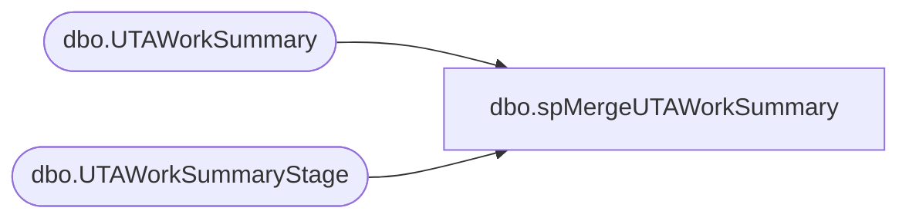

# dbo.spMergeUTAWorkSummary

**Database:** DWStaging  
**Server:** papamart  

## Architecture Diagram



## Table Dependencies

| Referenced Table |
|---|
| dbo.UTAWorkSummary |
| dbo.UTAWorkSummaryStage |

## Stored Procedure Code

```sql
CREATE proc [dbo].[spMergeUTAWorkSummary]

as 

-------------------------------------------------------------------------------------------------------
-- Dan Tweedie	2019-01-16	Created Proc for merging data from new UTA system that replaces Workbrain
-------------------------------------------------------------------------------------------------------

set nocount on

merge into DW.dbo.UTAWorkSummary as target
using DWStaging.dbo.UTAWorkSummaryStage as source 
on 
	(
		target.Wrks_ID=source.Wrks_ID
	)
When Matched and
	(
		isnull(target.Wrks_Work_Date,'3030-12-31')<>isnull(source.Wrks_Work_Date,'3030-12-31')
		OR
		isnull(target.Paygrp_ID,0)<>isnull(source.Paygrp_ID,0)
		OR
		isnull(target.Emp_ID,0)<>isnull(source.Emp_ID,0)
	)
Then Update
	set 
		target.Wrks_Work_Date=source.Wrks_Work_Date,
		target.Paygrp_ID=source.Paygrp_ID,
		target.Emp_ID=source.Emp_ID,
		target.UpdateDate=getdate()
When Not Matched by target
Then Insert
	(
		Wrks_ID,
		Emp_ID,
		Wrks_Work_Date,
		Paygrp_ID,
		InsertDate
	)
Values
	(
		source.Wrks_ID,
		source.Emp_ID,
		source.Wrks_Work_Date,
		source.Paygrp_ID,
		getdate()
	)
;
```

