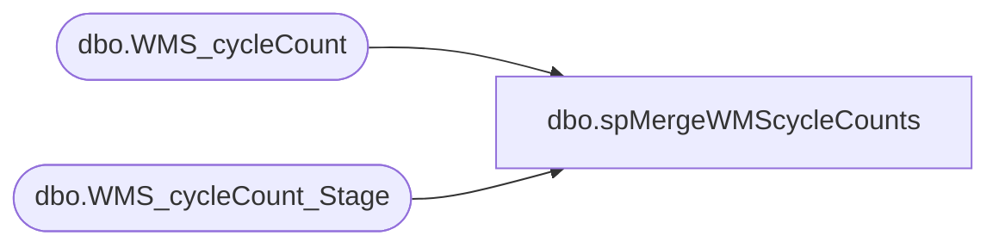

# dbo.spMergeWMScycleCounts

**Database:** DWStaging  
**Server:** papamart  

## Architecture Diagram



## Table Dependencies

| Referenced Table |
|---|
| dbo.WMS_cycleCount |
| dbo.WMS_cycleCount_Stage |

## Stored Procedure Code

```sql
CREATE proc [dbo].[spMergeWMScycleCounts]

as 

-------------------------------------------------------------------------------------------------------
-- Ian Wallace	2021-05-12	Created Proc for merging cycle count data from D365
-------------------------------------------------------------------------------------------------------

set nocount on

merge into dw.dbo.WMS_cycleCount as target
--using DWStaging.dbo.WMS_cycleCount_stage as source 
using 
 (
 select distinct  [AcceptReject],[AmtBeforeCount],[ApprovedDate],[ApproverId],[CostPerUnit],[CostPrice],[CounterId],[dataAreaId],[DateOfCount],[FinalCountAmt]
,[InventDimId],[InventJournalNum],[LicensePlate],[LineNum],[Location],[SKU],[Tolerance],[UnitDifference],[Warehouse],[WorkId],[WorkStatus]
from [dbo].[WMS_cycleCount_Stage]
)
as source
on 
	(
		target.[WorkId]=source.[WorkId]
		and
		target.[LicensePLate]=source.[LicensePLate]
		and
		target.[InventDimId]=source.[InventDimId]
		and
		target.[SKU]=source.[SKU]
	)
When Matched and
	(
	isnull(target.[AcceptReject],'x')<>isnull(source.[AcceptReject],'x')
	OR
	isnull(target.[AmtBeforeCount],0)<> isnull(source.[AmtBeforeCount],0)
	OR
	isnull(target.[ApprovedDate],'3030-12-31')<>isnull(source.[ApprovedDate],'3030-12-31')
	OR
	isnull(target.[ApproverId],'x')<>isnull(source.[ApproverId],'x')
	OR
	isnull(target.[CostPerUnit],0)<> isnull(source.[CostPerUnit],0)
	OR
	isnull(target.[CostPrice],0)<> isnull(source.[CostPrice],0)
	OR
	isnull(target.[CounterId],'x')<>isnull(source.[CounterId],'x')
	OR
	isnull(target.[dataAreaId],'x')<>isnull(source.[dataAreaId],'x')
	OR
	isnull(target.[DateOfCount],'3030-12-31')<>isnull(source.[DateOfCount],'3030-12-31')
	OR
	isnull(target.[FinalCountAmt],0)<> isnull(source.[FinalCountAmt],0)
	OR
	isnull(target.[InventJournalNum],'x')<>isnull(source.[InventJournalNum],'x')
	OR
	isnull(target.[LineNum],0)<> isnull(source.[LineNum],0)
	OR
	isnull(target.[Location],'x')<>isnull(source.[Location],'x')
	OR
	isnull(target.[Tolerance],0)<> isnull(source.[Tolerance],0)
	OR
	isnull(target.[UnitDifference],0)<> isnull(source.[UnitDifference],0)
	OR
	isnull(target.[Warehouse],'x')<>isnull(source.[Warehouse],'x')
	OR
	isnull(target.[WorkStatus],'x')<>isnull(source.[WorkStatus],'x')
	)
Then Update
	set 

	target.[AcceptReject]=source.[AcceptReject],
	target.[AmtBeforeCount]=source.[AmtBeforeCount],
	target.[ApprovedDate]=source.[ApprovedDate],
	target.[ApproverId]=source.[ApproverId],
	target.[CostPerUnit]=source.[CostPerUnit],
	target.[CostPrice]=source.[CostPrice],
	target.[CounterId]=source.[CounterId],
	target.[dataAreaId]=source.[dataAreaId],
	target.[DateOfCount]=source.[DateOfCount],
	target.[FinalCountAmt]=source.[FinalCountAmt],
	target.[InventJournalNum]=source.[InventJournalNum],
	target.[LineNum]=source.[LineNum],
	target.[Location]=source.[Location],
	target.[Tolerance]=source.[Tolerance],
	target.[UnitDifference]=source.[UnitDifference],
	target.[Warehouse]=source.[Warehouse],
	target.[WorkStatus]=source.[WorkStatus],
	target.UpdateDate=getdate()

When Not Matched by target
Then Insert
	(
	[AcceptReject],
	[AmtBeforeCount],
	[ApprovedDate],
	[ApproverId],
	[CostPerUnit],
	[CostPrice],
	[CounterId],
	[dataAreaId],
	[DateOfCount],
	[FinalCountAmt],
	[InventDimId],
	[InventJournalNum],
	[LicensePlate],
	[LineNum],
	[Location],
	[SKU],
	[Tolerance],
	[UnitDifference],
	[Warehouse],
	[WorkId],
	[WorkStatus],
	[InsertDate]

	)
Values
	(
	source.[AcceptReject],
	source.[AmtBeforeCount],
	source.[ApprovedDate],
	source.[ApproverId],
	source.[CostPerUnit],
	source.[CostPrice],
	source.[CounterId],
	source.[dataAreaId],
	source.[DateOfCount],
	source.[FinalCountAmt],
	source.[InventDimId],
	source.[InventJournalNum],
	source.[LicensePlate],
	source.[LineNum],
	source.[Location],
	source.[SKU],
	source.[Tolerance],
	source.[UnitDifference],
	source.[Warehouse],
	source.[WorkId],
	source.[WorkStatus],
	getdate()
	)
;
```

