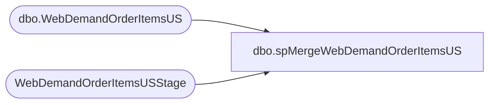

# dbo.spMergeWebDemandOrderItemsUS

**Database:** DWStaging  
**Server:** papamart  

## Architecture Diagram



## Table Dependencies

| Referenced Table |
|---|
| dbo.WebDemandOrderItemsUS |
| WebDemandOrderItemsUSStage |

## Stored Procedure Code

```sql
CREATE proc [dbo].[spMergeWebDemandOrderItemsUS]

as 

set nocount on
;
with
Files as
(
	select distinct FileName 
	from WebDemandOrderItemsUSStage
)
delete t
from dw.dbo.WebDemandOrderItemsUS t
join Files f on f.FileName=t.FileName
;

merge into dw.dbo.WebDemandOrderItemsUS as target
using WebDemandOrderItemsUSStage as source
on 
	target.FileName=source.FileName
--when matched 
--	then delete
when not matched by target
	then insert
		(
			OrderNumber,	
			UPC,	
			ItemStatus,	
			OrderItemTypeName,	
			OrderDiscount,	
			ItemDiscount,	
			GiftCardNumber,	
			ToName,	
			ToEmail,	
			FromName,	
			FromEmail,	
			Message,	
			OrderLineNumber,	
			LastUpdateDateUTC,	
			SKU,	
			Quantity,	
			Price,	
			SubTotal,	
			USSalesTotal,	
			Tax,	
			Total,	
			Custom1,	
			Custom2,	
			Custom3,	
			Custom4,	
			Custom5,	
			CustomExtendedAttributes,	
			OrderShipmentID,	
			EstimatedShipDateUTC,	
			EndEstimatedShipDateUTC,	
			ShippingMethod,	
			ShippingMethodCode,	
			ShippedDateUTC,	
			OrderReturnID,	
			DateReturnedUTC,
			ReturnReason,	
			ReturnType,	
			ItemStatusCode,	
			GiftCardType,	
			Balance,	
			DeliveryType,	
			WarehouseCode,	
			WarehouseLocation,	
			ShippingErrorID,	
			OrderPaymentID,	
			OrderItemPromotionIds,	
			OrderItemCampaignIds,	
			OrderItemCoupons,	
			OrderPromotionIds,	
			OrderCampaignIds,	
			OrderCoupons,	
			OrderPlacementDateUTC,	
			ReturnNodeLocation,	
			ReturnNodeCode,	
			ReturnUser,	
			FulfillmentNodeType,	
			Brand,	
			Cost,	
			FileName,	
			SiteCode,
			InsertDate
		)
	values
		(
			source.OrderNumber,	
			source.UPC,	
			source.ItemStatus,	
			source.OrderItemTypeName,	
			source.OrderDiscount,	
			source.ItemDiscount,	
			source.GiftCardNumber,	
			source.ToName,	
			source.ToEmail,	
			source.FromName,	
			source.FromEmail,	
			source.Message,	
			source.OrderLineNumber,	
			source.LastUpdateDateUTC,	
			source.SKU,	
			source.Quantity,	
			source.Price,	
			source.SubTotal,	
			source.USSalesTotal,	
			source.Tax,	
			source.Total,	
			source.Custom1,	
			source.Custom2,	
			source.Custom3,	
			source.Custom4,	
			source.Custom5,	
			source.CustomExtendedAttributes,	
			source.OrderShipmentID,	
			source.EstimatedShipDateUTC,	
			source.EndEstimatedShipDateUTC,	
			source.ShippingMethod,	
			source.ShippingMethodCode,	
			source.ShippedDateUTC,	
			source.OrderReturnID,	
			source.DateReturnedUTC,
			source.ReturnReason,	
			source.ReturnType,	
			source.ItemStatusCode,	
			source.GiftCardType,	
			source.Balance,	
			source.DeliveryType,	
			source.WarehouseCode,	
			source.WarehouseLocation,	
			source.ShippingErrorID,	
			source.OrderPaymentID,	
			source.OrderItemPromotionIds,	
			source.OrderItemCampaignIds,	
			source.OrderItemCoupons,	
			source.OrderPromotionIds,	
			source.OrderCampaignIds,	
			source.OrderCoupons,	
			source.OrderPlacementDateUTC,	
			source.ReturnNodeLocation,	
			source.ReturnNodeCode,	
			source.ReturnUser,	
			source.FulfillmentNodeType,	
			source.Brand,	
			source.Cost,	
			source.FileName,	
			source.SiteCode,
			getdate()
		)
;
```

