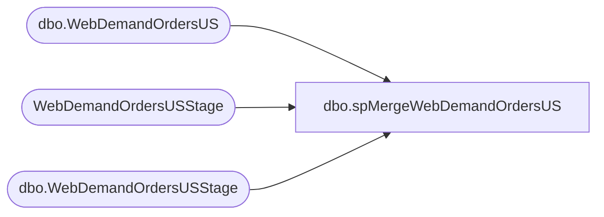

# dbo.spMergeWebDemandOrdersUS

**Database:** DWStaging  
**Server:** papamart  

## Architecture Diagram



## Table Dependencies

| Referenced Table |
|---|
| dbo.WebDemandOrdersUS |
| WebDemandOrdersUSStage |
| dbo.WebDemandOrdersUSStage |

## Stored Procedure Code

```sql
CREATE proc [dbo].[spMergeWebDemandOrdersUS]

as 

set nocount on
;
with
Files as
(
	select distinct FileName 
	from WebDemandOrdersUSStage
)
delete t
from dw.dbo.WebDemandOrdersUS t
join Files f on f.FileName=t.FileName
;

merge into dw.dbo.WebDemandOrdersUS as target
--using WebDemandOrdersUSStage as source
using
(

SELECT [OrderNumber],[OrderDateUTC],[LastUpdateDateUTC],[CustomerID]
      ,[OrderStatus],[OrderStatusCode],[BillingProvince],[BillingPostalCode],[BillingCountry],[ShippingProvince],[ShippingPostalCode],[ShippingCountry]
      ,[SubTotal],[USSalesTotal],[USShippingTotal],[TotalTax],[ShippingTax],[OriginalShipping],[Shipping],[ShippingMethod],[ShippingMethodCode],[OrderDiscount]
      ,[ShippingDiscount],[OrderGrossTotal],[GiftReceipt],[GiftWrap],[OrderSource],[Source1],[Source2],[Source3],[Custom1],[Custom2],[Custom3],[Custom4],[Custom5]
      ,substring([CustomOrderAttributes],1, 999) as CustomOrderAttributes,[ChannelName],[OrderPromotionIDs],[OrderCampaignIDs],[OrderCoupons],[FileName],[SiteCode]
  FROM [dbo].[WebDemandOrdersUSStage]

) as source

on 
	target.FileName=source.FileName
--when matched 
--	then delete
when not matched by target
	then insert
		(
			OrderNumber,	
			OrderDateUTC,	
			LastUpdateDateUTC,	
			CustomerID,	
			OrderStatus,	
			OrderStatusCode,	
			BillingProvince,	
			BillingPostalCode,	
			BillingCountry,	
			ShippingProvince,	
			ShippingPostalCode,	
			ShippingCountry,	
			SubTotal,	
			USSalesTotal,	
			USShippingTotal,	
			TotalTax,	
			ShippingTax,	
			OriginalShipping,	
			Shipping,	
			ShippingMethod,	
			ShippingMethodCode,	
			OrderDiscount,	
			ShippingDiscount,	
			OrderGrossTotal,	
			GiftReceipt,	
			GiftWrap,	
			OrderSource,	
			Source1,	
			Source2,	
			Source3,	
			Custom1,	
			Custom2,	
			Custom3,	
			Custom4,	
			Custom5,	
			CustomOrderAttributes,	
			ChannelName,	
			OrderPromotionIDs,	
			OrderCampaignIDs,	
			OrderCoupons,	
			FileName,	
			SiteCode,
			InsertDate
		)
	values
		(
			source.OrderNumber,	
			source.OrderDateUTC,	
			source.LastUpdateDateUTC,	
			source.CustomerID,	
			source.OrderStatus,	
			source.OrderStatusCode,	
			source.BillingProvince,	
			source.BillingPostalCode,	
			source.BillingCountry,	
			source.ShippingProvince,	
			source.ShippingPostalCode,	
			source.ShippingCountry,	
			source.SubTotal,	
			source.USSalesTotal,	
			source.USShippingTotal,	
			source.TotalTax,	
			source.ShippingTax,	
			source.OriginalShipping,	
			source.Shipping,	
			source.ShippingMethod,	
			source.ShippingMethodCode,	
			source.OrderDiscount,	
			source.ShippingDiscount,	
			source.OrderGrossTotal,	
			source.GiftReceipt,	
			source.GiftWrap,	
			source.OrderSource,	
			source.Source1,	
			source.Source2,	
			source.Source3,	
			source.Custom1,	
			source.Custom2,	
			source.Custom3,	
			source.Custom4,	
			source.Custom5,	
			source.CustomOrderAttributes,	
			source.OrderSource,	---this actually contains the Channel so we are sourcing from OrderSource instead of ChannelName, which is NULL
			source.OrderPromotionIDs,	
			source.OrderCampaignIDs,	
			source.OrderCoupons,	
			source.FileName,	
			source.SiteCode,
			getdate()
		)
;
```

