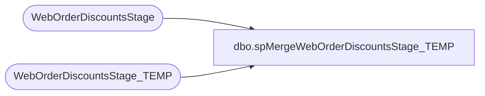

# dbo.spMergeWebOrderDiscountsStage_TEMP

**Database:** DWStaging  
**Server:** papamart  

## Architecture Diagram



## Table Dependencies

| Referenced Table |
|---|
| WebOrderDiscountsStage |
| WebOrderDiscountsStage_TEMP |

## Stored Procedure Code

```sql
CREATE proc [dbo].[spMergeWebOrderDiscountsStage_TEMP]
as
set nocount on

Merge into WebOrderDiscountsStage_TEMP as target
using WebOrderDiscountsStage as source
on target.OrderDate = source.OrderDate
AND target.OrderNumber = source.OrderNumber
AND target.SKU = source.SKU
AND target.ItemDiscountAmount = source.ItemDiscountAmount
AND target.OrderItemDiscountAmount = source.OrderItemDiscountAmount
AND target.TotalDiscountAmount = source.TotalDiscountAmount
AND target.SourceSite = source.SourceSite
when not matched by target
then insert
	(
		OrderDate
		, OrderNumber
		, SKU
		, ItemDiscountAmount
		, OrderItemDiscountAmount
		, TotalDiscountAmount
		, SourceSite
	)
values
	(
		source.OrderDate
		, source.OrderNumber
		, source.SKU
		, source.ItemDiscountAmount
		, source.OrderItemDiscountAmount
		, source.TotalDiscountAmount
		, source.SourceSite
	)
;
```

