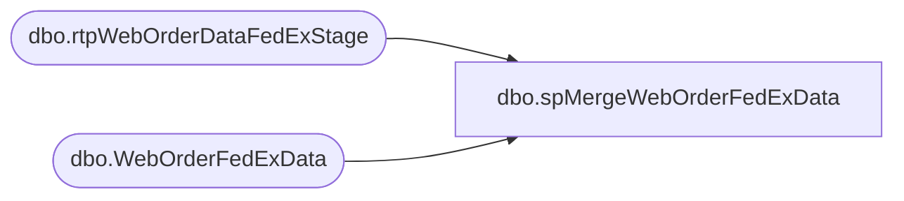

# dbo.spMergeWebOrderFedExData

**Database:** DWStaging  
**Server:** papamart  

## Architecture Diagram



## Table Dependencies

| Referenced Table |
|---|
| dbo.rtpWebOrderDataFedExStage |
| dbo.WebOrderFedExData |

## Stored Procedure Code

```sql
CREATE proc [dbo].[spMergeWebOrderFedExData] as

set nocount on

Merge into dw.dbo.WebOrderFedExData as target
Using dwstaging.dbo.rtpWebOrderDataFedExStage as source
On (
			target.ShipmentTrackingNumber = source.ShipmentTrackingNumber
			and 
			target.MasterTrackingNumber = source.MasterTrackingNumber
	)
when matched 
	and
		(
			isnull(target.ServiceType, 'xx') <> isnull(source.ServiceType, 'xx')
			OR
			isnull(target.ShipmentDeliveryDate, '3030-12-31') <> isnull(source.ShipmentDeliveryDate, '3030-12-31')
			OR
			isnull(target.NetChargeAmountUSD, 0.0) <> isnull(source.NetChargeAmountUSD, 0.0)
			OR
			isnull(target.Invoicedate, '3030-12-31') <> isnull(source.Invoicedate, '3030-12-31')
		)
		then UPDATE
			set
				target.ServiceType = source.ServiceType,
				target.ShipmentDeliveryDate = source.ShipmentDeliveryDate,
				target.NetChargeAmountUSD = source.NetChargeAmountUSD,
				target.Invoicedate = source.Invoicedate,
				target.UpdateDate = getdate()
When Not Matched By Target 
	Then 
		Insert (
					ShipmentTrackingNumber,
					ServiceType,
					ShipmentDeliveryDate,
					NetChargeAmountUSD,
					Invoicedate,
					MasterTrackingNumber,
					InsertDate,
					UpdateDate
				)
		Values (	
					source.ShipmentTrackingNumber,
					source.ServiceType,
					source.ShipmentDeliveryDate,
					source.NetChargeAmountUSD,
					source.Invoicedate,
					source.MasterTrackingNumber,
					getdate(),
					getdate()
				)
;
```

