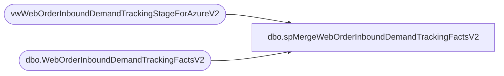

# dbo.spMergeWebOrderInboundDemandTrackingFactsV2

**Database:** DWStaging  
**Server:** papamart  

## Architecture Diagram



## Table Dependencies

| Referenced Table |
|---|
| vwWebOrderInboundDemandTrackingStageForAzureV2 |
| dbo.WebOrderInboundDemandTrackingFactsV2 |

## Stored Procedure Code

```sql
CREATE proc [dbo].[spMergeWebOrderInboundDemandTrackingFactsV2]
as
set nocount on

--delete x 
--from dw.dbo.WebOrderInboundDemandTrackingFacts x
--where x.OrderDate <= cast(getdate()-15 as date)
;
Merge into dw.dbo.WebOrderInboundDemandTrackingFactsV2 as target
using vwWebOrderInboundDemandTrackingStageForAzureV2 as source
on target.OrderNumber=source.OrderNumber
and target.DeckSKU=source.DeckSKU
and isnull(target.OrderItemGrouping,99999)=isnull(source.OrderItemGrouping,99999)
when not matched by target
then insert
	(
		OrderDate,	
		OrderNumber,	
		DeckSku,	
		ItemDescription,	
		KeyStory,	
		GrossProductSales,	
		ProductDiscounts,	
		NetProductSales,	
		GrossShippingRevenue,	
		ShippingDiscounts,	
		NetShippingRevenue,	
		OrderUnits,	
		PartyEGiftCardUnits,	
		PartyEGiftCardValue,	
		UpsellEGiftCardUnits,	
		UpsellEGiftCardValue,	
		EGiftCardUnits,	
		EGiftCardValue,	
		PhysicalGiftCardUnits,	
		PhysicalGiftCardValue,	
		DonationUnits,	
		DonationValue,	
		CondoUnits,	
		GiftBoxUnits,	
		isGiftOrder,	
		GiftOrderUnits,	
		GiftOrderValue,	
		ProductCost,	
		isGiftCard,	
		isPhysicalGiftCard,	
		isEGiftCard,	
		isPartyEGiftCard,	
		isUpsellEGiftCard,	
		isDonation,	
		isCondo,	
		isGiftBox,	
		hasGiftMessage,	
		isBundleMaster,	
		isStuffed,	
		isUnstuffed,	
		isDressed,	
		isUndressed,	
		ChainAverageOnHandCost,	
		ChainAverageOnHandCostGBP,	
		isUS,	
		isUK,	
		isShipFromStore,	
		isBillingVShippingDiff,	
		CurrentStatus,	
		PendingStatusDate,	
		WavedStatusDate,	
		ShippedCompletedStatusDate,	
		LastStatusDate,	
		DaysBetweenWavedAndShipped,	
		DaysSinceWavedStatus,	
		DaysBetweenPendingAndWaved,	
		DaysBetweenPendingAndShipped,	
		DaysSincePendingStatus,	
		DaysSinceLastStatus,	
		InsertDate,	
		Channel,	
		OrderItemGrouping
	)
values
	(
		source.OrderDate,	
		source.OrderNumber,	
		source.DeckSku,	
		source.ItemDescription,	
		source.KeyStory,	
		source.GrossProductSales,	
		source.ProductDiscounts,	
		source.NetProductSales,	
		source.GrossShippingRevenue,	
		source.ShippingDiscounts,	
		source.NetShippingRevenue,	
		source.OrderUnits,	
		source.PartyEGiftCardUnits,	
		source.PartyEGiftCardValue,	
		source.UpsellEGiftCardUnits,	
		source.UpsellEGiftCardValue,	
		source.EGiftCardUnits,	
		source.EGiftCardValue,	
		source.PhysicalGiftCardUnits,	
		source.PhysicalGiftCardValue,	
		source.DonationUnits,	
		source.DonationValue,	
		source.CondoUnits,	
		source.GiftBoxUnits,	
		source.isGiftOrder,	
		source.GiftOrderUnits,	
		source.GiftOrderSales,	
		source.ProductCost,	
		source.isGiftCard,	
		source.isPhysicalGiftCard,	
		source.isEGiftCard,	
		source.isPartyEGiftCard,	
		source.isUpsellEGiftCard,	
		source.isDonation,	
		source.isCondo,	
		source.isGiftBox,	
		source.hasGiftMessage,	
		source.isBundleMaster,	
		source.isStuffed,	
		source.isUnstuffed,	
		source.isDressed,	
		source.isUndressed,	
		source.ChainAverageOnHandCost,	
		source.ChainAverageOnHandCostGBP,	
		source.isUS,	
		source.isUK,	
		source.isShipFromStore,	
		source.isBillingVShippingDiff,	
		source.CurrentStatus,	
		source.PendingStatusDate,	
		source.WavedStatusDate,	
		source.ShippedCompletedStatusDate,	
		source.LastStatusDate,	
		source.DaysBetweenWavedAndShipped,	
		source.DaysSinceWavedStatus,	
		source.DaysBetweenPendingAndWaved,	
		source.DaysBetweenPendingAndShipped,	
		source.DaysSincePendingStatus,	
		source.DaysSinceLastStatus,	
		source.InsertDate,	
		source.Channel,	
		source.OrderItemGrouping
	)
--when matched
--then update
--	set 
--		target.OrderDate					=source.OrderDate,	
--		target.ItemDescription				=source.ItemDescription,	
--		target.KeyStory						=source.KeyStory,	
--		target.GrossProductSales			=source.GrossProductSales,	
--		target.ProductDiscounts				=source.ProductDiscounts,	
--		target.NetProductSales				=source.NetProductSales,	
--		target.GrossShippingRevenue			=source.GrossShippingRevenue,	
--		target.ShippingDiscounts			=source.ShippingDiscounts,	
--		target.NetShippingRevenue			=source.NetShippingRevenue,	
--		target.OrderUnits					=source.OrderUnits,	
--		target.PartyEGiftCardUnits			=source.PartyEGiftCardUnits,	
--		target.PartyEGiftCardValue			=source.PartyEGiftCardValue,	
--		target.UpsellEGiftCardUnits			=source.UpsellEGiftCardUnits,	
--		target.UpsellEGiftCardValue			=source.UpsellEGiftCardValue,	
--		target.EGiftCardUnits				=source.EGiftCardUnits,	
--		target.EGiftCardValue				=source.EGiftCardValue,	
--		target.PhysicalGiftCardUnits		=source.PhysicalGiftCardUnits,	
--		target.PhysicalGiftCardValue		=source.PhysicalGiftCardValue,	
--		target.DonationUnits				=source.DonationUnits,	
--		target.DonationValue				=source.DonationValue,	
--		target.CondoUnits					=source.CondoUnits,	
--		target.GiftBoxUnits					=source.GiftBoxUnits,	
--		target.isGiftOrder					=source.isGiftOrder,	
--		target.GiftOrderUnits				=source.GiftOrderUnits,	
--		target.GiftOrderValue				=source.GiftOrderSales,	
--		target.ProductCost					=source.ProductCost,	
--		target.isGiftCard					=source.isGiftCard,	
--		target.isPhysicalGiftCard			=source.isPhysicalGiftCard,	
--		target.isEGiftCard					=source.isEGiftCard,	
--		target.isPartyEGiftCard				=source.isPartyEGiftCard,	
--		target.isUpsellEGiftCard			=source.isUpsellEGiftCard,	
--		target.isDonation					=source.isDonation,	
--		target.isCondo						=source.isCondo,	
--		target.isGiftBox					=source.isGiftBox,	
--		target.hasGiftMessage				=source.hasGiftMessage,	
--		target.isBundleMaster				=source.isBundleMaster,	
--		target.isStuffed					=source.isStuffed,	
--		target.isUnstuffed					=source.isUnstuffed,	
--		target.isDressed					=source.isDressed,	
--		target.isUndressed					=source.isUndressed,	
--		target.ChainAverageOnHandCost		=source.ChainAverageOnHandCost,	
--		target.ChainAverageOnHandCostGBP	=source.ChainAverageOnHandCostGBP,	
--		target.isUS							=source.isUS,	
--		target.isUK							=source.isUK,	
--		target.isShipFromStore				=source.isShipFromStore,	
--		target.isBillingVShippingDiff		=source.isBillingVShippingDiff,	
--		target.CurrentStatus				=source.CurrentStatus,	
--		target.PendingStatusDate			=source.PendingStatusDate,	
--		target.WavedStatusDate				=source.WavedStatusDate,	
--		target.ShippedCompletedStatusDate	=source.ShippedCompletedStatusDate,	
--		target.LastStatusDate				=source.LastStatusDate,	
--		target.DaysBetweenWavedAndShipped	=source.DaysBetweenWavedAndShipped,	
--		target.DaysSinceWavedStatus			=source.DaysSinceWavedStatus,	
--		target.DaysBetweenPendingAndWaved	=source.DaysBetweenPendingAndWaved,	
--		target.DaysBetweenPendingAndShipped	=source.DaysBetweenPendingAndShipped,	
--		target.DaysSincePendingStatus		=source.DaysSincePendingStatus,	
--		target.DaysSinceLastStatus			=source.DaysSinceLastStatus,				
--		target.Channel						=source.Channel
;
```

