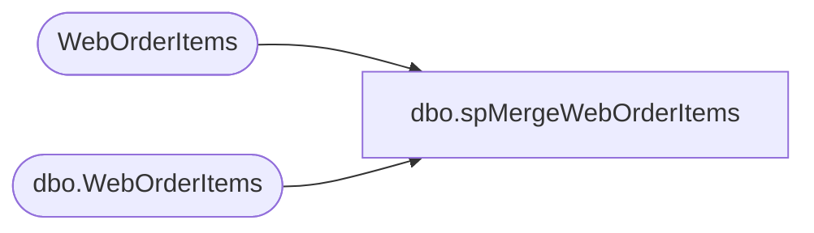

# dbo.spMergeWebOrderItems

**Database:** DWStaging  
**Server:** papamart  

## Architecture Diagram



## Table Dependencies

| Referenced Table |
|---|
| WebOrderItems |
| dbo.WebOrderItems |

## Stored Procedure Code

```sql
CREATE proc [dbo].[spMergeWebOrderItems]

as

-------------------------------------------------------------------------
-- spMergeWebOrderItems
-- 2017-10-18- Dan Tweedie - Created Proc
-------------------------------------------------------------------------

set nocount on

--if object_id('tempdb..#MinProdKey') is not null drop table #MinProdKey
--select
--	style_code, 
--	min(product_key) product_key
--into #MinProdKey
--from dw.dbo.product_dim with (nolock)
--group by style_code


Merge into dw.dbo.WebOrderItems as target
Using WebOrderItems as source
	--(
	--	select 
	--		w.TransactionID,
	--		w.OrderID,
	--		w.OrderItemID,
	--		w.SKU,
	--		w.Qty,
	--		w.ItemDescription,
	--		w.Price,
	--		w.DiscountedPrice,
	--		w.TrackingNumber,
	--		isnull(pd1.product_key, isnull(pd2.product_key,0)) as product_key
	--	from WebOrderItems w with (nolock) 
	--	left join dw.dbo.product_dim pd1 with (nolock) 
	--		on w.JurisdictionCode = pd1.jurisdiction_code 
	--		and w.SKU = pd1.style_code
	--	left join #MinProdKey pd2 
	--		on w.SKU = pd2.style_code
	--) as source

On (
			target.TransactionID = source.TransactionID
			and
			target.OrderID = source.OrderID
			and 
			target.OrderItemID = source.OrderItemID
	)
when matched 
	and
		(
			isnull(target.Qty,0) <> isnull(source.Qty,0)
			OR
			isnull(target.SKU,'xx') <> isnull(source.SKU,'xx')
			OR
			isnull(target.ItemDescription,'xx') <> isnull(source.ItemDescription,'xx')
			OR
			isnull(target.Price,'0.00') <> isnull(source.Price,'0.00')
			OR
			isnull(target.DiscountedPrice,'0.00') <> isnull(source.DiscountedPrice,'0.00')
			OR
			isnull(target.TrackingNumber,'xx') <> isnull(source.TrackingNumber,'xx')
			OR
			isnull(target.product_key, 0) <> isnull(source.ProductKey, 0)
		)
		then UPDATE
			set
			target.Qty = source.Qty,
			target.SKU = source.SKU,
			target.ItemDescription = source.ItemDescription,
			target.Price = source.Price,
			target.DiscountedPrice = source.DiscountedPrice,
			target.TrackingNumber = source.TrackingNumber,
			target.product_key = source.ProductKey,
			target.UpdateDate = getdate()
When Not Matched By Target 
	Then 
		Insert (
					TransactionID,
					OrderID,
					OrderItemID,
					Qty,
					SKU,
					ItemDescription,
					Price,
					DiscountedPrice,
					TrackingNumber,
					product_key,
					InsertDate,
					UpdateDate
				)
		Values (	
					source.TransactionID,
					source.OrderID,
					source.OrderItemID,
					source.Qty,
					source.SKU,
					source.ItemDescription,
					source.Price,
					source.DiscountedPrice,
					source.TrackingNumber,
					source.ProductKey,
					getdate(),
					getdate()
				)
;
```

