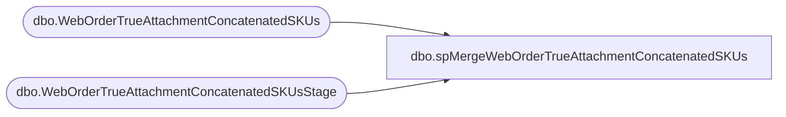

# dbo.spMergeWebOrderTrueAttachmentConcatenatedSKUs

**Database:** DWStaging  
**Server:** papamart  

## Architecture Diagram



## Table Dependencies

| Referenced Table |
|---|
| dbo.WebOrderTrueAttachmentConcatenatedSKUs |
| dbo.WebOrderTrueAttachmentConcatenatedSKUsStage |

## Stored Procedure Code

```sql
CREATE proc [dbo].[spMergeWebOrderTrueAttachmentConcatenatedSKUs] -- Update to Proper Name 


as 

-------------------------------------------------------------------------------------------------------
--	Tim Callahan	-	2022-09-06	-	Created proc -	
--														
-------------------------------------------------------------------------------------------------------

set nocount on


--

merge into DW.[dbo].[WebOrderTrueAttachmentConcatenatedSKUs] as target
--using DWStaging.[dbo].[WebOrderTrueAttachmentConcatenatedSKUsStage] as source -- Use Entire Table as Source 
using ( select 
OrderNum,
OrderDate,
SkuString,
DescriptionString,
sum(Quantity) as Quantity,
Price, 
KeyStoryString,
MstatString, 
Country
from [dbo].[WebOrderTrueAttachmentConcatenatedSKUsStage] (nolock) 
group by OrderNum,
OrderDate,
SkuString,
DescriptionString,
Price,
--Quantity,
KeyStoryString,
MstatString, 
Country
) as source -- Use SQL Command As Source
on 
	(
		target.[OrderNum]=source.[OrderNum]
--			and


		
		-- Key 
	)

When Not Matched by target
Then Insert
	(
	OrderNum, 
	OrderDate, 
	SkuString, 
	DescriptionString, 
	Quantity, 
	Price,
	KeyStoryString, 
	MstatString,
	Country,
	InsertDate 
	)

Values
	(
	source.OrderNum, 
	source.OrderDate, 
	source.SkuString, 
	source.DescriptionString, 
	source.Quantity, 
	source.Price,
	source.KeyStoryString, 
	source.MstatString,
	source.Country,
    getdate()

	)


;
```

