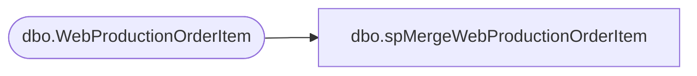

# dbo.spMergeWebProductionOrderItem

**Database:** DWStaging  
**Server:** papamart  

## Architecture Diagram



## Table Dependencies

| Referenced Table |
|---|
| dbo.WebProductionOrderItem |

## Stored Procedure Code

```sql
create proc spMergeWebProductionOrderItem

as

set nocount on


Merge into DW.dbo.WebProductionOrderItem as target
Using dwstaging.dbo.WebProductionOrderItem as source
On (
		isnull(target.ProductionOrderItemID, 0) = isnull(source.ProductionOrderItemID, 0)
	)
when not matched by target 
	then 
		insert 
			(
				ProductionOrderItemWebCartOrderItemId,
				ProductionOrderItemParentOrderItemId,
				ProductionOrderItemParentWebCartOrderItemId,
				ProductionOrderId,
				ProductionOrderItemSku,
				ProductionOrderItemName,
				ProductionOrderItemQuantity,
				ProductionOrderItemUnitPrice,
				ProductionOrderItemExtendedPrice,
				ProductionOrderItemFriendEyeColor,
				ProductionOrderItemFriendFurColor,
				ProductionOrderItemFriendGender,
				ProductionOrderItemFriendHeight,
				ProductionOrderItemFriendWeight,
				ProductionOrderItemDepartment,
				ProductionOrderItemClass,
				ProductionOrderItemSubClass,
				ProductionOrderItemNameMeName,
				ProductionOrderItemNameMeBirthday,
				ProductionOrderItemNameMeIsGift,
				ProductionOrderItemRecipientGender,
				ProductionOrderItemRecipientBirthday,
				ProductionOrderItemRecipientStateProvince,
				ProductionOrderItemRecipientZipPostalCode,
				ProductionOrderItemRecipientCountry,
				ProductionOrderItemSenderGender,
				ProductionOrderItemSenderBirthday,
				ProductionOrderItemSenderStateProvince,
				ProductionOrderItemSenderZipPostalCode,
				ProductionOrderItemSenderCountry,
				ProductionOrderItemBuildASoundId,
				ProductionOrderItemBuildASoundPathAndFilename,
				ProductionOrderItemGiftCardNumber,
				ProductionOrderItemGiftDollarAmount,
				ProductionOrderItemShipUnstuffed,
				ProductionOrderItemIsBackordered,
				ProductionOrderItemIsBuildASound,
				ProductionOrderItemIsPreBuilt,
				ProductionOrderItemIsSound,
				ProductionOrderItemIsAnimal,
				ProductionOrderItemIsPhysicalGiftCard,
				ProductionOrderItemIsVirtualGiftCard,
				ProductionOrderItemIsAccessory,
				ProductionOrderItemIsDoll,
				ProductionOrderItemIsEmbroidery,
				ProductionOrderItemCommodityCode,
				ProductionOrderItemCountryOfManufacture,
				ProductionOrderItemIsKit,
				ProductionOrderItemTinyImage,
				ProductionOrderItemKitName,
				ProductionOrderItemWebCartKitSKU,
				ProductionOrderItemWebCartKitDisplayName,
				ProductionOrderItemIsCar,
				ProductionOrderItemSenderEmailOptIn,
				ProductionOrderItemSenderMailOptIn,
				ProductionOrderItemIsBearBill,
				ProductionOrderItemIsVirtualItem,
				ProductionOrderItemClubBabwSerialNumber,
				InsertDate
			)
		values
		(
				source.ProductionOrderItemWebCartOrderItemId,
				source.ProductionOrderItemParentOrderItemId,
				source.ProductionOrderItemParentWebCartOrderItemId,
				source.ProductionOrderId,
				source.ProductionOrderItemSku,
				source.ProductionOrderItemName,
				source.ProductionOrderItemQuantity,
				source.ProductionOrderItemUnitPrice,
				source.ProductionOrderItemExtendedPrice,
				source.ProductionOrderItemFriendEyeColor,
				source.ProductionOrderItemFriendFurColor,
				source.ProductionOrderItemFriendGender,
				source.ProductionOrderItemFriendHeight,
				source.ProductionOrderItemFriendWeight,
				source.ProductionOrderItemDepartment,
				source.ProductionOrderItemClass,
				source.ProductionOrderItemSubClass,
				source.ProductionOrderItemNameMeName,
				source.ProductionOrderItemNameMeBirthday,
				source.ProductionOrderItemNameMeIsGift,
				source.ProductionOrderItemRecipientGender,
				source.ProductionOrderItemRecipientBirthday,
				source.ProductionOrderItemRecipientStateProvince,
				source.ProductionOrderItemRecipientZipPostalCode,
				source.ProductionOrderItemRecipientCountry,
				source.ProductionOrderItemSenderGender,
				source.ProductionOrderItemSenderBirthday,
				source.ProductionOrderItemSenderStateProvince,
				source.ProductionOrderItemSenderZipPostalCode,
				source.ProductionOrderItemSenderCountry,
				source.ProductionOrderItemBuildASoundId,
				source.ProductionOrderItemBuildASoundPathAndFilename,
				source.ProductionOrderItemGiftCardNumber,
				source.ProductionOrderItemGiftDollarAmount,
				source.ProductionOrderItemShipUnstuffed,
				source.ProductionOrderItemIsBackordered,
				source.ProductionOrderItemIsBuildASound,
				source.ProductionOrderItemIsPreBuilt,
				source.ProductionOrderItemIsSound,
				source.ProductionOrderItemIsAnimal,
				source.ProductionOrderItemIsPhysicalGiftCard,
				source.ProductionOrderItemIsVirtualGiftCard,
				source.ProductionOrderItemIsAccessory,
				source.ProductionOrderItemIsDoll,
				source.ProductionOrderItemIsEmbroidery,
				source.ProductionOrderItemCommodityCode,
				source.ProductionOrderItemCountryOfManufacture,
				source.ProductionOrderItemIsKit,
				source.ProductionOrderItemTinyImage,
				source.ProductionOrderItemKitName,
				source.ProductionOrderItemWebCartKitSKU,
				source.ProductionOrderItemWebCartKitDisplayName,
				source.ProductionOrderItemIsCar,
				source.ProductionOrderItemSenderEmailOptIn,
				source.ProductionOrderItemSenderMailOptIn,
				source.ProductionOrderItemIsBearBill,
				source.ProductionOrderItemIsVirtualItem,
				source.ProductionOrderItemClubBabwSerialNumber,
				getdate()
			)
;
```

