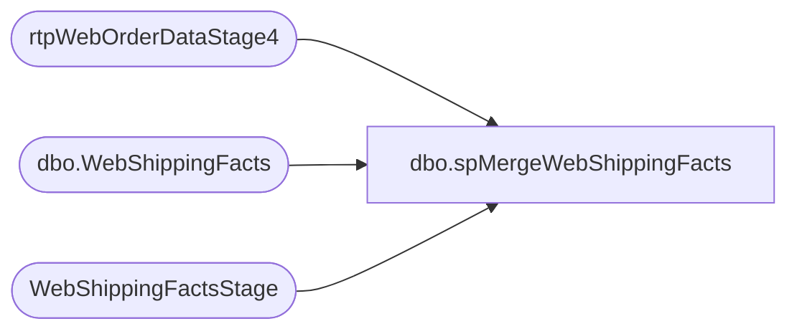

# dbo.spMergeWebShippingFacts

**Database:** DWStaging  
**Server:** papamart  

## Architecture Diagram



## Table Dependencies

| Referenced Table |
|---|
| rtpWebOrderDataStage4 |
| dbo.WebShippingFacts |
| WebShippingFactsStage |

## Stored Procedure Code

```sql
CREATE proc [dbo].[spMergeWebShippingFacts]

as 

set nocount on


merge into dw.dbo.WebShippingFacts as target
using
(select s.* 
from WebShippingFactsStage s 
where not exists (select m.OrderNumber 
					from rtpWebOrderDataStage4 m
					where m.OrderNumber = s.OrderNumber
					group by m.OrderNumber
					having count(m.TrackingNumber) > 1 
				) ---a few tracking numbers had multiple delivery dates, same master and shipping tracking numbers, exclude these to keep it clean, only 21 out of 643K
) as source

on 
	(
		target.OrderNumber=source.OrderNumber
		and 
		target.TrackingNumber=source.TrackingNumber
	)
when matched 
	and
		(
			isnull(target.CreateDate, '3030-12-31')<>isnull(source.CreateDate,'3030-12-31') OR
			isnull(target.ShipDate, '3030-12-31')<>isnull(source.ShipDate,'3030-12-31') OR
			isnull(target.ShipToState,0)<>isnull(source.ShipToState,0) OR
			isnull(target.ShipToCountry,0)<>isnull(source.ShipToCountry,0) OR
			isnull(target.Shipping,0)<>isnull(source.Shipping,0) OR
			isnull(target.ServiceType, 'xx')<>isnull(source.ServiceType, 'xx') OR
			isnull(target.ShipmentDeliveryDate, '3030-12-31')<>isnull(source.ShipmentDeliveryDate, '3030-12-31') OR
			isnull(target.NetChargeAmountUSD, 0.0)<>isnull(source.NetChargeAmountUSD, 0.0) OR
			isnull(target.Invoicedate, '3030-12-31')<>isnull(source.Invoicedate, '3030-12-31') OR
			isnull(target.MasterTrackingNumber, 'xx')<>isnull(source.MasterTrackingNumber, 'xx') OR
			isnull(target.transaction_id,0)<>isnull(source.transaction_id,0)
		)
	then 
		UPDATE
			SET
				target.CreateDate=source.CreateDate,
				target.ShipDate=source.ShipDate,
				target.ShipToState=source.ShipToState,
				target.ShipToCountry=source.ShipToCountry,
				target.Shipping=source.Shipping,
				target.ServiceType=source.ServiceType,
				target.ShipmentDeliveryDate=source.ShipmentDeliveryDate,
				target.NetChargeAmountUSD=source.NetChargeAmountUSD,
				target.Invoicedate=source.Invoicedate,
				target.MasterTrackingNumber=source.MasterTrackingNumber,
				target.transaction_id=source.transaction_id,
				target.UpdateDate=getdate()
when NOT MATCHED by Target
	then
		Insert
			(
				SiteCode,
				OrderNumber,
				CreateDate,
				ShipDate,
				ShipToState,
				ShipToCountry,
				TrackingNumber,
				Shipping,
				ShipmentTrackingNumber,
				ServiceType,
				ShipmentDeliveryDate,
				NetChargeAmountUSD,
				Invoicedate,
				MasterTrackingNumber,
				transaction_id,
				InsertDate
			)
		values
			(
				source.SiteCode,
				source.OrderNumber,
				source.CreateDate,
				source.ShipDate,
				source.ShipToState,
				source.ShipToCountry,
				source.TrackingNumber,
				source.Shipping,
				source.ShipmentTrackingNumber,
				source.ServiceType,
				source.ShipmentDeliveryDate,
				source.NetChargeAmountUSD,
				source.Invoicedate,
				source.MasterTrackingNumber,
				source.transaction_id,
				getdate()
			)

;
```

