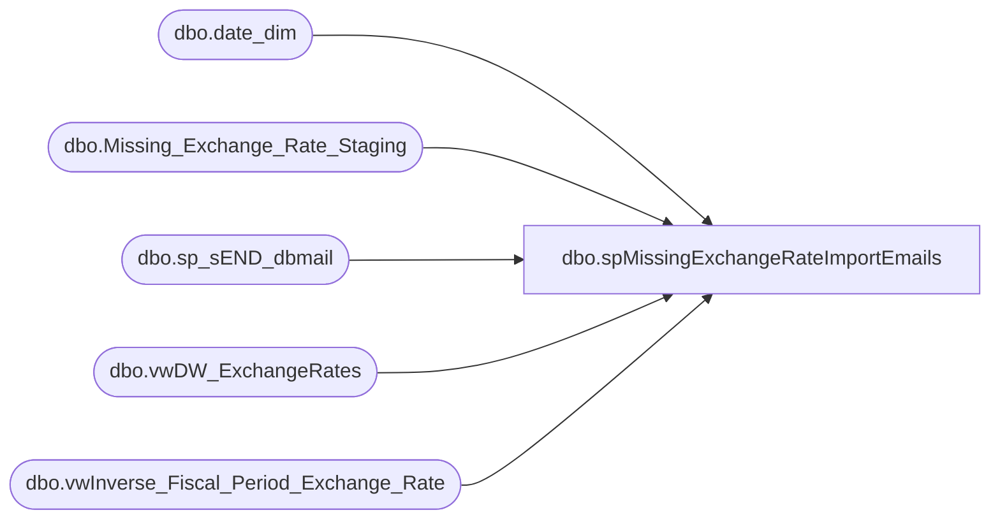

# dbo.spMissingExchangeRateImportEmails

**Database:** DWStaging  
**Server:** papamart  

## Architecture Diagram



## Table Dependencies

| Referenced Table |
|---|
| dbo.date_dim |
| dbo.Missing_Exchange_Rate_Staging |
| dbo.sp_sEND_dbmail |
| dbo.vwDW_ExchangeRates |
| dbo.vwInverse_Fiscal_Period_Exchange_Rate |

## Stored Procedure Code

```sql
-- =====================================================================================================
-- Name: spMissingExchangeRateImportEmails
--
-- Description:	Send Email to Finance when Exchange rates from Previous fiscal period doen't show up in present.
--
-- Input:
--
-- Dependencies: None
--
-- Revision History
--		Name:			Date:			Comments:
--		Brian Byas		5/2/2016		Created
--		Brian Byas		6/17/2016		Set flag once email has gone to Accounting Team.
--		Brian Byas		7/28/2016		Set job to email only once a fiscal period.
-- =====================================================================================================
CREATE PROCEDURE [dbo].[spMissingExchangeRateImportEmails] 
	

AS
BEGIN
	-- SET NOCOUNT ON added to prevent extra result sets from
	-- interfering with SELECT statements.
	SET NOCOUNT ON;


DECLARE @subject nvarchar(max)
DECLARE @body    nvarchar(max)
DECLARE	@query_result nvarchar(max)
DECLARE	@nsql nvarchar(max)
DECLARE	@storeId varchar(4)
DECLARE @icount int
DECLARE @str_email varchar(100)
DECLARE @COUNT int
DECLARE @fperiod int
DECLARE @minperiod int
DECLARE @maxperiod int


	-- SET FISCAL PERIOD
SELECT @fperiod = fiscal_period FROM dw.dbo.date_dim WHERE actual_date  = format(getdate(),'yyyy/MM/dd')
	--SET FISCAL PERIOD PLUS AND MINUS 1

--SELECT @zcount =  COUNT(*)
--  FROM [DWStaging].[dbo].[Fiscal_Period_Exchange_Rate_Staging]
--		  WHERE [FISCAL_PERIOD] = @fperiod -1 
--		  AND RATE = 0
--		  OR [FISCAL_PERIOD] = @fperiod
--		  AND RATE = 0
--		  OR [FISCAL_PERIOD] = @fperiod + 1
--		  AND RATE = 0

SELECT @minperiod = MIN(date_key),@maxperiod = MAX(Date_key) From dw.dbo.date_dim
		WHERE fiscal_period BETWEEN @fperiod -1 AND @fperiod +1
		AND fiscal_year = YEAR(getdate())


	-- SET LOOP BY DISTINCT STORE ID
SELECT @icount = count(*) 
FROM [DWStaging].[dbo].[Missing_Exchange_Rate_Staging] 


	------------------------------------------------------------------------- 
	-- HTML Code & Query
	-------------------------------------------------------------------------
			 
			 	------------------------------------------------------------------------- 
				-- Check for Missing rates before creating html
				-------------------------------------------------------------------------
				IF (@icount > 0)
					BEGIN
							SET @body = cast( '<table border=1 cellpadding=1 cellspacing=1>' as nvarchar(max) )
							SET @body = @body + '<th>From</th><th>To</th><th>IS Rate</th><th>BS Rate</th>'
							--  Form the query, use XML PATH to get the HTML

							SET @nsql = '
							select @qr =
							   CAST( (SELECT( SELECT [FR_CURR_CODE] FOR  XML Path (''td''),type) 
										,( SELECT [TO_CURR_CODE] FOR XML Path (''td''),type) 
										,( SELECT [MONTH_AVG_RATE] AS [IS] FOR XML Path (''td''),type)
										,( SELECT [MONTH_END_RATE] AS [BS] FOR XML Path (''td''),type)  
										FROM (SELECT DISTINCT t.* 
											  FROM [DWStaging].[dbo].[Missing_Exchange_Rate_Staging] t INNER JOIN
											  [DWStaging].[dbo].[vwInverse_Fiscal_Period_Exchange_Rate] v
											   ON t.[FR_CURR_KEY] = v.[FR_CURR_KEY]  AND t.[TO_CURR_KEY] = v.[TO_CURR_KEY]) a 
											WHERE NOT EXISTS (SELECT from_currency_key,to_currency_key
											  FROM [dw].[dbo].[vwDW_ExchangeRates] as vw
											  WHERE date_key BETWEEN '+ CONVERT(nvarchar(4),@minperiod) +' AND '+ CONVERT(nvarchar(4),@maxperiod) +' 
											  AND vw.[from_currency_key] =  a.[FR_CURR_KEY]
											  AND vw.[to_currency_key] =  a.[TO_CURR_KEY])
											  
											   for xml path( ''tr'' ), type
											   ) as nvarchar(max) )'

							EXEC sp_EXECutesql @nsql, N'@qr nvarchar(max) output', @query_result output

							SET @body = @body + @query_result
							SET @body = @body + cast( '</table>' as nvarchar(max) )
						END

			 	------------------------------------------------------------------------- 
				-- Check for zero rates before creating html
				-------------------------------------------------------------------------
				--SET @nsql = ''
				--SET @query_result = ''
				
				--IF (@zcount > 0)
				--	BEGIN
							
				--			SET @body = @body + '<br><br>The below list of Exchange Rate(s) have values of zero in Lawson.
				--			<br><br><table border=1 cellpadding=1 cellspacing=1><th>From</th><th>To</th><th>Fiscal Period</th><th>IS Rate</th><th>BS Rate</th>'
				--			--  Form the query, use XML PATH to get the HTML

				--			SET @nsql = '
				--			select @qr =
				--			   CAST( (SELECT( SELECT [FR_CURR_CODE] FOR  XML Path (''td''),type) 
				--						,( SELECT [TO_CURR_CODE] FOR XML Path (''td''),type) 
				--						,( SELECT [FISCAL_PERIOD] FOR XML Path (''td''),type)
				--						,( SELECT CASE WHEN [TRANSL_CODE] = ''BS'' THEN RATE 
				--									END AS MONTH_AVG_RATE FOR XML Path (''td''),type)
				--						,( SELECT CASE WHEN [TRANSL_CODE] = ''IS'' THEN RATE 
				--									END AS MONTH_END_RATE FOR XML Path (''td''),type)  
				--						FROM [DWStaging].[dbo].[Fiscal_Period_Exchange_Rate_Staging]
				--							  WHERE [FISCAL_PERIOD] = '+ CONVERT(nvarchar(2),@fperiod) +'-1
				--							  AND RATE = 0
				--							  OR [FISCAL_PERIOD] = '+ CONVERT(nvarchar(2),@fperiod) +'
				--							  AND RATE = 0
				--							  OR [FISCAL_PERIOD] = '+ CONVERT(nvarchar(2),@fperiod) +'+1
				--							  AND RATE = 0
				--							   for xml path( ''tr'' ), type
				--							   ) as nvarchar(max) )'

				--			EXEC sp_EXECutesql @nsql, N'@qr nvarchar(max) output', @query_result output
				
				--			SET @body = @body + @query_result
				--			SET @body = @body + cast( '</table>' as nvarchar(max) )
				--	END
				
	
	-------------------------------------------------------------------------
	-- SEND EMAIL IF ANY DATA EXIST AND BEGINING OF FISCAL PERIOD
	-------------------------------------------------------------------------
	SELECT @COUNT = count(*) FROM (SELECT DISTINCT t.* 
				  FROM [DWStaging].[dbo].[Missing_Exchange_Rate_Staging] t INNER JOIN
				  [DWStaging].[dbo].[vwInverse_Fiscal_Period_Exchange_Rate] v
				   ON t.[FR_CURR_KEY] = v.[FR_CURR_KEY]  AND t.[TO_CURR_KEY] = v.[TO_CURR_KEY]) a 
				WHERE NOT EXISTS (SELECT from_currency_key,to_currency_key
				  FROM [dw].[dbo].[vwDW_ExchangeRates] as vw
				  WHERE date_key >= @fperiod AND vw.[from_currency_key] =  a.[FR_CURR_KEY]
				  AND vw.[to_currency_key] =  a.[TO_CURR_KEY])
				  AND EMAILED = 0

IF ((SELECT FORMAT(getdate(),'yyyy-MM-dd')) = (SELECT min(actual_date) from dw.dbo.date_dim
												WHERE fiscal_period = (SELECT fiscal_period 
												FROM dw.dbo.date_dim WHERE actual_date = FORMAT(getdate(),'yyyy/MM/dd'))
AND fiscal_year = YEAR(getdate())))
	BEGIN
				IF (@COUNT > 0)
					BEGIN
						SET @subject = 'Missing Exchange Rate in Lawson'
						SET @body = 'The below list of Exchange Rate(s) have values for the previous fiscal period, but have missing value(s) for the present fiscal period.<br><br>' + @body 
						EXEC msdb.dbo.sp_sEND_dbmail  @from_address = 'BIAdmin@buildabear.com',
													  --@recipients = @str_email,
													  --@recipients = 'brianb@buildabear.com',
													  @recipients = 'brianb@buildabear.com', --TESTING
													  --@copy_recipients = 'biadmin@buildabear.com',
													  @body_format = 'HTML',
													  @body = @body,
													  @subject = @subject
					END
	END


END
```

