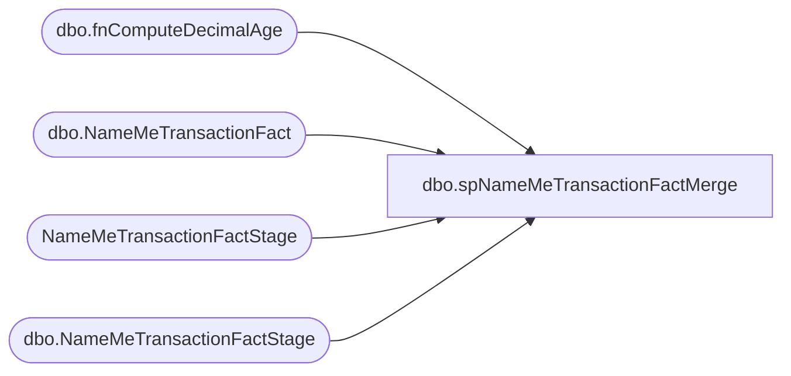

# dbo.spNameMeTransactionFactMerge

**Database:** DWStaging  
**Server:** papamart  

## Architecture Diagram



## Table Dependencies

| Referenced Table |
|---|
| dbo.fnComputeDecimalAge |
| dbo.NameMeTransactionFact |
| NameMeTransactionFactStage |
| dbo.NameMeTransactionFactStage |

## Stored Procedure Code

```sql
CREATE PROC [dbo].[spNameMeTransactionFactMerge] as

-- =====================================================================================================
-- Name: spNameMeTransactionFactMerge
--
--Description: Merges data from dwstaging.dbo.NameMeTransactionFactStage into dw.dbo.NameMeTransactionFact
--				
-- Revision History
--		Name:			Date:			Comments:
--		Dan Tweedie		09/19/2016		Created proc.	
--      Tim Bytnar		1/16/2018		Added in support for POSTransactionID
-- =====================================================================================================

if (select count(*) from dwstaging.dbo.NameMeTransactionFactStage) > 0

BEGIN

	declare 
		@Output table 
			(
				Action varchar(10),
				NameMeTransactionNumber1 int,
				NameMeTransactionNumber2 int
			)
	
	MERGE into dw.dbo.NameMeTransactionFact as target
		using
			(
				select
					StoreKey,
					ProductKey,
					NameMeTransactionNumber,
					AnimalBarCode,
					AnimalName,
					AnimalBirthDate,
					TransactionStartDate,
					TransactionEndDate,
					TransactionDuration,
					Gift,
					FirstVisit,
					cast(dw.dbo.fnComputeDecimalAge(RecipBirthDate, TransactionStartDate) as numeric(4,1)) as Age,
					TransactionSource,
					Gender,
					InsertedDate,
					ETLLogID,
					ETLEventID,
					POSTransactionID
				from
					dwstaging.dbo.NameMeTransactionFactStage
			) as source
		on
			(
				target.NameMeTransactionNumber = source.NameMeTransactionNumber
			)

		when matched
			and
				(
					isnull(target.StoreKey, 0) <> isnull(source.StoreKey, 0) OR
					isnull(target.ProductKey, 0) <> isnull(source.ProductKey, 0) OR
					isnull(target.AnimalBarCode, '') <> isnull(source.AnimalBarCode, '') OR
					isnull(target.AnimalName, '') <> isnull(source.AnimalName, '') OR
					isnull(target.AnimalBirthDate, '') <> isnull(source.AnimalBirthDate, '') OR
					isnull(target.TransactionStartDate, '') <> isnull(source.TransactionStartDate, '') OR
					isnull(target.TransactionEndDate, '') <> isnull(source.TransactionEndDate, '') OR
					isnull(target.TransactionDuration, 0) <> isnull(source.TransactionDuration, 0) OR
					isnull(target.Gift, 0) <> isnull(source.Gift, 0) OR
					isnull(target.FirstVisit, 0) <> isnull(source.FirstVisit, 0) OR
					isnull(target.Age, 0.0) <> isnull(source.Age, 0.0) OR
					isnull(target.TransactionSource, '') <> isnull(source.TransactionSource, '') OR
					isnull(target.Gender, '') <> isnull(source.Gender, '') OR
					isnull(target.POSTransactionID, 0) <> isnull(source.POSTransactionID,0)
				)
				then UPDATE
					set
						target.StoreKey = source.StoreKey,
						target.ProductKey = source.ProductKey,
						target.AnimalBarCode = source.AnimalBarCode,
						target.AnimalName = source.AnimalName,
						target.AnimalBirthDate = source.AnimalBirthDate,
						target.TransactionStartDate = source.TransactionStartDate,
						target.TransactionEndDate = source.TransactionEndDate,
						target.TransactionDuration = source.TransactionDuration,
						target.Gift = source.Gift,
						target.FirstVisit = source.FirstVisit,
						target.Age = source.Age,
						target.TransactionSource = source.TransactionSource,
						target.Gender = source.Gender,
						target.UpdatedDate = source.InsertedDate,
						target.UpdatedBy = 'spNameMeTransactionFactMerge',
						target.POSTransactionID = source.POSTransactionID

		when not matched by target
			then INSERT
				(
					StoreKey,
					ProductKey,
					NameMeTransactionNumber,
					AnimalBarCode,
					AnimalName,
					AnimalBirthDate,
					TransactionStartDate,
					TransactionEndDate,
					TransactionDuration,
					Gift,
					FirstVisit,
					Age,
					TransactionSource,
					Gender,
					InsertedDate,
					UpdatedDate,
					InsertedBy,
					UpdatedBy,
					ETLLogID,
					ETLEventID,
					POSTransactionID
				)
			values
				(
					source.StoreKey,
					source.ProductKey,
					source.NameMeTransactionNumber,
					source.AnimalBarCode,
					source.AnimalName,
					source.AnimalBirthDate,
					source.TransactionStartDate,
					source.TransactionEndDate,
					source.TransactionDuration,
					source.Gift,
					source.FirstVisit,
					source.Age,
					source.TransactionSource,
					source.Gender,
					source.InsertedDate,
					NULL,
					'spNameMeTransactionFactMerge',
					NULL,
					ETLLogID,
					ETLEventID,
					source.POSTransactionID
				)
	
		OUTPUT 
			$action, 
			inserted.NameMeTransactionNumber, 
			deleted.NameMeTransactionNumber
			into @Output


	; --A MERGE statement must be terminated by a semi-colon (;).		
	
		
		with MergeOutput as
			(
				select 
					InsertedRows = (select count(*) from @Output where Action = 'INSERT'), 
					UpdatedRows = 0
				UNION 
				select 
					InsertedRows = 0, 
					UpdatedRows = (select count(*) from @Output where Action = 'UPDATE')
			),
		ValidationStatus as 
			(
				select case when count(*) = 0 then 1 else 0 end as ValidationStatus 
				from NameMeTransactionFactStage s 
				where not exists 
					(
						select d.NameMeTransactionNumber 
						from DW.dbo.NameMeTransactionFact d with (nolock) 
						where 
							d.NameMeTransactionNumber = s.NameMeTransactionNumber
						and isnull(d.StoreKey, 0) = isnull(s.StoreKey, 0)
						and isnull(d.ProductKey, 0) = isnull(s.ProductKey, 0)
						and isnull(d.AnimalBarCode, '') = isnull(s.AnimalBarCode, '')
						and isnull(d.AnimalName, '') = isnull(s.AnimalName, '')
						and isnull(d.AnimalBirthDate, '') = isnull(s.AnimalBirthDate, '')
						and isnull(d.TransactionStartDate, '') = isnull(s.TransactionStartDate, '')
						and isnull(d.TransactionEndDate, '') = isnull(s.TransactionEndDate, '')
						and isnull(d.TransactionDuration, 0) = isnull(s.TransactionDuration, 0)
						and isnull(d.Gift, 0) = isnull(s.Gift, 0)
						and isnull(d.FirstVisit, 0) = isnull(s.FirstVisit, 0)
						and isnull(d.Age, 0.0) = cast(dw.dbo.fnComputeDecimalAge(s.RecipBirthDate, s.TransactionStartDate) as numeric(4,1))
						and isnull(d.TransactionSource, '') = isnull(s.TransactionSource, '')
						and isnull(d.Gender, '') = isnull(s.Gender, '')
						and isnull(d.POSTransactionID, 0) = isnull(s.POSTransactionID,0)
					)
			)
		select 
			sum(m.InsertedRows) as InsertedRows,
			sum(m.UpdatedRows) as UpdatedRows,
			v.ValidationStatus
		from
			MergeOutput	m
			cross join ValidationStatus v
		group by v.ValidationStatus		

END

else

begin
	select 0 as InsertedRows, 0 as UpdatedRows, 1 as ValidationStatus
end
```

