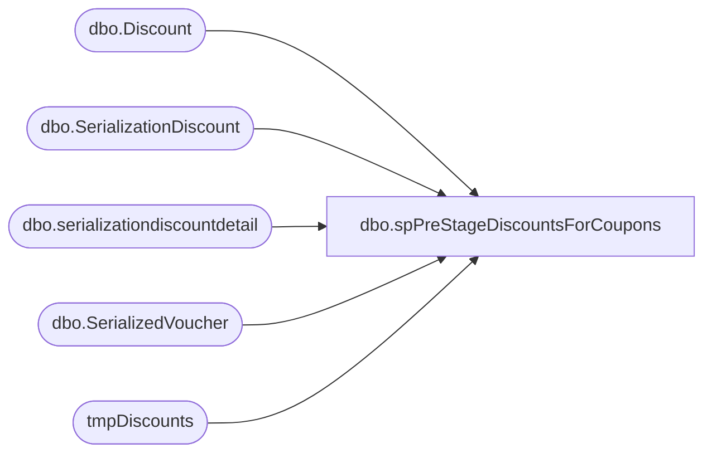

# dbo.spPreStageDiscountsForCoupons

**Database:** DWStaging  
**Server:** papamart  

## Architecture Diagram



## Table Dependencies

| Referenced Table |
|---|
| dbo.Discount |
| dbo.SerializationDiscount |
| dbo.serializationdiscountdetail |
| dbo.SerializedVoucher |
| tmpDiscounts |

## Stored Procedure Code

```sql
CREATE proc [dbo].[spPreStageDiscountsForCoupons]

as

set nocount on

IF (Object_ID('tempdb..#tmpDiscounts') IS NOT NULL) DROP TABLE #tmpDiscounts;
select 
	sdd.serializedNum, 
	CAST(d.couponNumber AS int) Coupon
into #tmpDiscounts
from kodiak.discountmstrdata.dbo.SerializationDiscount sd
join kodiak.discountmstrdata.dbo.serializationdiscountdetail sdd on sd.serializationid = sdd.serializationid
join kodiak.discountmstrdata.dbo.Discount d on sd.discountID = d.discountID and d.isSerializedCoupon = 1

union 
select SerializedNumber as SerializedNum, CouponID as Coupon from DW.dbo.SerializedVoucher

;
merge into tmpDiscounts as target
using #tmpDiscounts as source
on 
	target.serializedNum=source.serializedNum
	and 
	target.Coupon=source.Coupon
when not matched by target
then insert
	(
		serializedNum,
		Coupon
	)
values
	(
		source.serializedNum,
		source.Coupon
	)
when not matched by source
then delete
;
```

