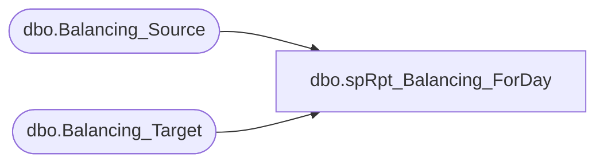

# dbo.spRpt_Balancing_ForDay

**Database:** DWStaging  
**Server:** papamart  

## Architecture Diagram



## Table Dependencies

| Referenced Table |
|---|
| dbo.Balancing_Source |
| dbo.Balancing_Target |

## Stored Procedure Code

```sql
CREATE PROCEDURE [dbo].[spRpt_Balancing_ForDay]
	-- =============================================================================================================
	-- Name: spRpt_Balancing_ForDay
	--
	-- Description:	
	--	Generate the recordset to print the balancing by Day. This extracts the information for a day by store
	--		basis from the Balancing tables.
	--
	-- Input:	
	--		forDate - Date of the day to list	
	--
	-- Output: 
	--
	-- Dependencies: 
	--
	-- Revision History
	--		Name:			Date:			Comments:
	--		Gary Murrish	4/17/2013		Created

	-- =============================================================================================================
	@forDate datetime
AS

	SET NOCOUNT ON

	IF OBJECT_ID('tempdb..#tmpSource') IS NOT NULL
	BEGIN
		DROP TABLE #tmpSource
	END

	SELECT
		bs.Transaction_Date,
		bs.Store_No,
		SUM(bs.GAAPSales) + SUM(ISNULL(bs.VATAmount, 0)) AS AWGAAPSales
	INTO #tmpSource
	FROM
		DWStaging.dbo.Balancing_Source bs WITH (NOLOCK)
	WHERE
		bs.Transaction_Date = @forDate
	GROUP BY	bs.Transaction_Date,
				bs.Store_No

	IF OBJECT_ID('tempdb..#tmpTarget') IS NOT NULL
	BEGIN
		DROP TABLE #tmpTarget
	END

	SELECT
		bt.Transaction_Date,
		bt.Store_No,
		SUM(bt.GAAPSales) AS DWGAAPSales
	INTO #tmpTarget
	FROM
		DWStaging.dbo.Balancing_Target bt WITH (NOLOCK)
	WHERE
		bt.Transaction_Date = @forDate
	GROUP BY	bt.Transaction_Date,
				bt.Store_No

	SELECT
		s.Transaction_Date,
		s.Store_No,
		s.AWGAAPSales,
		ISNULL(t.dwGAAPSales, 0) AS DWAGGPSales,
		s.AWGAAPSales - ISNULL(t.dwGAAPSales, 0) AS Difference
	FROM
		#tmpSource s WITH (NOLOCK)
		LEFT JOIN #tmpTarget t WITH (NOLOCK)
			ON s.Transaction_Date = t.Transaction_Date
			AND s.Store_No = t.Store_No
	WHERE
		s.AWGAAPSales - ISNULL(t.dwGAAPSales, 0) <> 0
	UNION ALL
	-- Get the ones in the Target not in the source
	SELECT
		t.Transaction_Date,
		t.Store_No,
		ISNULL(s.AWGAAPSales, 0) AS AWGAAPSales,
		ISNULL(t.dwGAAPSales, 0) AS DWAGGPSales,
		ISNULL(s.AWGAAPSales, 0) - ISNULL(t.dwGAAPSales, 0) AS Difference
	FROM
		#tmpTarget t WITH (NOLOCK)
		LEFT JOIN #tmpSource s WITH (NOLOCK)
			ON s.Transaction_Date = t.Transaction_Date
			AND s.Store_No = t.Store_No
	WHERE
		ISNULL(s.AWGAAPSales, 0) - ISNULL(t.dwGAAPSales, 0) <> 0
		AND s.Transaction_Date IS NULL
```

