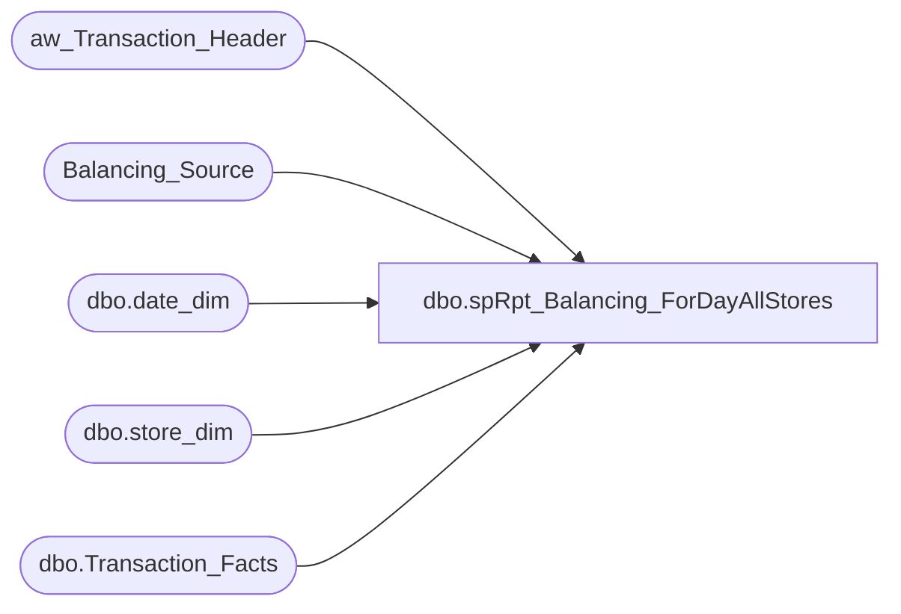

# dbo.spRpt_Balancing_ForDayAllStores

**Database:** DWStaging  
**Server:** papamart  

## Architecture Diagram



## Table Dependencies

| Referenced Table |
|---|
| aw_Transaction_Header |
| Balancing_Source |
| dbo.date_dim |
| dbo.store_dim |
| dbo.Transaction_Facts |

## Stored Procedure Code

```sql
CREATE PROCEDURE [dbo].[spRpt_Balancing_ForDayAllStores]
	-- =============================================================================================================
	-- Name: spRpt_Balancing_ForDayAndStore
	--
	-- Description:	
	--	Generate the recordset to print the balancing by Day. This extracts the information for a day and all stores
	--		by transaction
	--		basis from the Balancing tables.
	--
	-- Input:	
	--		forDate - Date of the day to list
	--
	-- Output: 
	--
	-- Dependencies: 
	--
	-- Revision History
	--		Name:			Date:			Comments:
	--		Gary Murrish	4/17/2013		Created

	-- =============================================================================================================
	@forDate datetime

AS

	SET NOCOUNT ON


	DECLARE @dateKey int
	SELECT
		@dateKey = date_key
	FROM
		dw.dbo.date_dim dd WITH (NOLOCK)
	WHERE
		dd.actual_date = @forDate


	IF OBJECT_ID('tempdb..#tmpSource') IS NOT NULL
	BEGIN
		DROP TABLE #tmpSource
	END

	SELECT
		bs.transaction_date,
		bs.store_no,
		bs.transaction_id,
		ath.Register_No,
		ath.Transaction_No,
		SUM(bs.gaapsales) + SUM(ISNULL(bs.VATAmount, 0)) AS gaapsales
	INTO #tmpSource

	FROM
		Balancing_Source bs WITH (NOLOCK)
		LEFT JOIN aw_Transaction_Header ath WITH (NOLOCK)
			ON bs.transaction_id = ath.transaction_id
	WHERE
		bs.transaction_date = @forDate
	GROUP BY	bs.transaction_date,
				bs.store_no,
				bs.transaction_id,
				ath.Register_No,
				ath.Transaction_No

	SELECT
		@forDate AS transaction_date,
		sd.store_id AS Store_no,
		ISNULL(s.GAAPSales, 0) AS AWGAAPSales,
		tf.GAAP_Sales_Amount AS DWGAAPSales,
		tf.GAAP_Sales_Amount - ISNULL(s.GAAPSales, 0) AS Difference,
		tf.transaction_id,
		tf.Register_No,
		tf.Transaction_No
	FROM
		dw.dbo.Transaction_Facts tf WITH (NOLOCK)
		INNER JOIN dw.dbo.store_dim sd WITH (NOLOCK)
			ON tf.store_key = sd.store_key
		LEFT JOIN #tmpSource s WITH (NOLOCK)
			ON tf.transaction_id = s.transaction_id
	WHERE
		tf.GAAP_Sales_Amount <> ISNULL(s.GAAPSales, 0)
		AND tf.date_key = @dateKey
	UNION ALL
	SELECT
		@forDate AS transaction_date,
		s.Store_no AS Store_no,
		ISNULL(s.GAAPSales, 0) AS AWGAAPSales,
		ISNULL(tf.GAAP_Sales_Amount, 0) AS DWGAAPSales,
		ISNULL(tf.GAAP_Sales_Amount, 0) - ISNULL(s.GAAPSales, 0) AS Difference,
		tf.transaction_id,
		s.Register_No,
		s.Transaction_No
	FROM
		#tmpSource s WITH (NOLOCK)
		LEFT JOIN dw.dbo.Transaction_Facts tf WITH (NOLOCK)
			ON tf.transaction_id = s.transaction_id
	WHERE
		tf.transaction_id IS NULL
```

