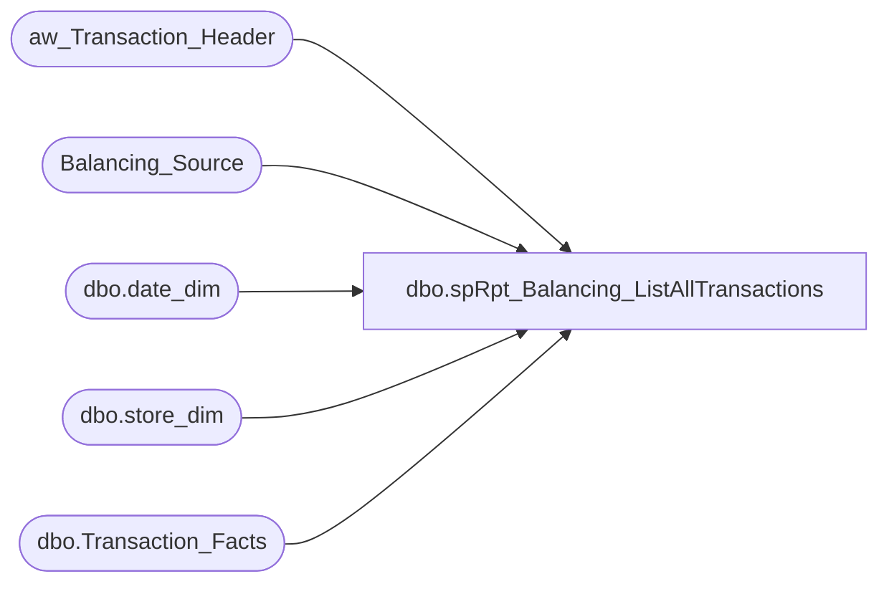

# dbo.spRpt_Balancing_ListAllTransactions

**Database:** DWStaging  
**Server:** papamart  

## Architecture Diagram



## Table Dependencies

| Referenced Table |
|---|
| aw_Transaction_Header |
| Balancing_Source |
| dbo.date_dim |
| dbo.store_dim |
| dbo.Transaction_Facts |

## Stored Procedure Code

```sql
CREATE PROCEDURE [dbo].[spRpt_Balancing_ListAllTransactions]
-- =============================================================================================================
-- Name: spRpt_Balancing_ListAllTransactions
--
-- Description:	
--	Generate the recordset to print the balancing by Day. This extracts the information shows all transactions
--		basis from the Balancing tables.
--
-- Input:	
--
-- Output: 
--
-- Dependencies: 
--
-- Revision History
--		Name:			Date:			Comments:
--		Gary Murrish	4/17/2013		Created

-- =============================================================================================================
AS

	SET NOCOUNT ON

	-- Get the range of dates for this run
	DECLARE @minActualDate datetime
	DECLARE @maxActualDate datetime
	DECLARE @minDateKey int
	DECLARE @maxDateKey int

	SELECT
		@minActualDate = MIN(ath.Transaction_Date),
		@maxActualDate = MAX(ath.Transaction_Date)
	FROM
		aw_Transaction_Header ath WITH (NOLOCK)

	SELECT
		@minDateKey = date_key
	FROM
		dw.dbo.date_dim dd WITH (NOLOCK)
	WHERE
		dd.actual_date = @minActualDate
	SELECT
		@maxDateKey = date_key
	FROM
		dw.dbo.date_dim dd WITH (NOLOCK)
	WHERE
		dd.actual_date = @maxActualDate


	IF OBJECT_ID('tempdb..#tmpSource') IS NOT NULL
	BEGIN
		DROP TABLE #tmpSource
	END

	SELECT
		bs.Transaction_Date,
		bs.Store_No,
		bs.transaction_id,
		SUM(bs.gaapsales) + SUM(ISNULL(bs.VATAmount, 0)) AS gaapsales
	INTO #tmpSource
	FROM
		Balancing_Source bs WITH (NOLOCK)
	GROUP BY	bs.Transaction_Date,
				bs.Store_No,
				bs.transaction_id

	SELECT
		dd.actual_date AS transaction_date,
		sd.store_id AS Store_no,
		ISNULL(s.GAAPSales, 0) AS AWGAAPSales,
		tf.GAAP_sales_amount AS DWGAAPSales,
		tf.GAAP_sales_amount - ISNULL(s.GAAPSales, 0) AS Difference,
		tf.transaction_id

	FROM
		dw.dbo.Transaction_Facts tf WITH (NOLOCK)
		INNER JOIN dw.dbo.date_dim dd WITH (NOLOCK)
			ON tf.date_key = dd.date_key
		INNER JOIN dw.dbo.store_dim sd WITH (NOLOCK)
			ON tf.store_key = sd.store_key
		LEFT JOIN #tmpSource s WITH (NOLOCK)
			ON tf.transaction_id = s.transaction_id
	WHERE
		tf.GAAP_sales_amount <> ISNULL(s.GAAPSales, 0)
		AND tf.date_key BETWEEN @minDateKey AND @maxDateKey

	UNION ALL

	SELECT
		s.transaction_date AS transaction_date,
		s.Store_no AS Store_no,
		ISNULL(s.GAAPSales, 0) AS AWGAAPSales,
		ISNULL(tf.GAAP_sales_amount, 0) AS DWGAAPSales,
		ISNULL(tf.GAAP_sales_amount, 0) - ISNULL(s.GAAPSales, 0) AS Difference,
		tf.transaction_id

	FROM
		#tmpSource s WITH (NOLOCK)
		LEFT JOIN dw.dbo.Transaction_Facts tf WITH (NOLOCK)
			ON tf.transaction_id = s.transaction_id
	WHERE
		tf.transaction_id IS NULL
```

