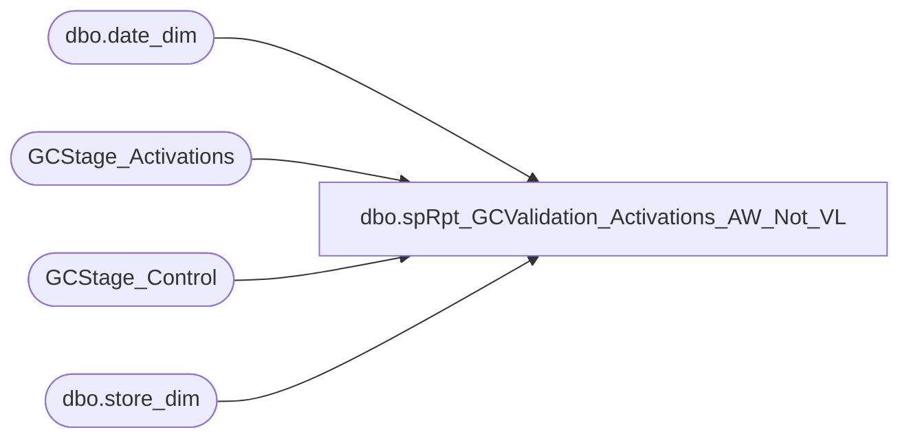

# dbo.spRpt_GCValidation_Activations_AW_Not_VL

**Database:** DWStaging  
**Server:** papamart  

## Architecture Diagram



## Table Dependencies

| Referenced Table |
|---|
| dbo.date_dim |
| GCStage_Activations |
| GCStage_Control |
| dbo.store_dim |

## Stored Procedure Code

```sql
CREATE PROCEDURE [dbo].[spRpt_GCValidation_Activations_AW_Not_VL]
-- =============================================================================================================
-- Name: spRpt_GCValidation_Activations_AW_Not_VL
--
-- Description:	
--	Generate the recordset to print the Giftcards activated in Auditworks, but not validated in Valuelink
--
-- Input:		
--
-- Output: 
--
-- Dependencies: 
--
-- Revision History
--		Name:			Date:			Comments:
--		Gary Murrish	4/17/2013		Created

-- =============================================================================================================
AS

	SET NOCOUNT ON

	DECLARE @minReviewDateKey int
	DECLARE @maxReviewDateKey int
	SELECT
		@maxReviewDateKey = gc.maxDateKey,
		@minReviewDateKey = gc.minAnalysisDateKey
	FROM
		GCStage_Control gc WITH (NOLOCK)

	SELECT
		ISNULL(CAST(sd.store_id AS varchar(255)), 'K:' + CAST(sa.store_key AS varchar)) AS store,
		dd.actual_date,
		sa.giftcard_no,
		sa.Register_No,
		sa.Transaction_No,
		sa.activated_amount,
		sa.discount_amount

	FROM
		GCStage_Activations sa WITH (NOLOCK)
		LEFT JOIN dw.dbo.store_dim sd WITH (NOLOCK)
			ON sa.store_key = sd.store_key
		LEFT JOIN dw.dbo.date_dim dd WITH (NOLOCK)
			ON sa.date_key = dd.date_key
	WHERE
		sa.postedPhase = 0
		AND sa.date_key BETWEEN @minReviewDateKey AND @maxReviewDateKey
		--and sa.giftcard_no not in (select account_number from dwstaging.dbo.GCStage_Valuelink_Activations)
```

