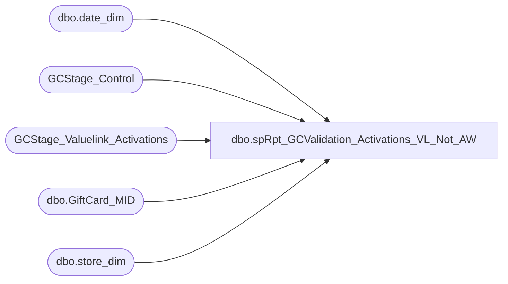

# dbo.spRpt_GCValidation_Activations_VL_Not_AW

**Database:** DWStaging  
**Server:** papamart  

## Architecture Diagram



## Table Dependencies

| Referenced Table |
|---|
| dbo.date_dim |
| GCStage_Control |
| GCStage_Valuelink_Activations |
| dbo.GiftCard_MID |
| dbo.store_dim |

## Stored Procedure Code

```sql
CREATE PROCEDURE [dbo].[spRpt_GCValidation_Activations_VL_Not_AW]
-- =============================================================================================================
-- Name: spRpt_GCValidation_Activations_VL_Not_AW
--
-- Description:	
--	Generate the recordset to print the Giftcards activated in Valuelink, but not found in Auditworks
--
-- Input:		
--
-- Output: 
--
-- Dependencies: 
--
-- Revision History
--		Name:			Date:			Comments:
--		Gary Murrish	4/17/2013		Created
--		Dan Tweedie		10/31/2016		Temporarily setting date range to 8 days instead of 14
-- =============================================================================================================
AS

	SET NOCOUNT ON

	DECLARE @minReviewDateKey int
	DECLARE @maxReviewDateKey int

	SELECT
		@maxReviewDateKey = gc.maxDateKey,
		@minReviewDateKey = gc.minAnalysisDateKey
	FROM
		GCStage_Control gc WITH (NOLOCK)

	--temporary --DanT 10/31/2016
	select 
		@minReviewDateKey = date_key from dw.dbo.date_dim where datediff(dd, actual_date, getdate()-8) = 0
	---end temporary	

	SELECT
		ISNULL(CAST(sd.store_id AS varchar(255)), 'K:' + CAST(sa.store_key AS varchar)) AS store,
		dd.actual_date,
		sa.account_number AS giftcard_no,
		sa.terminal_id AS register_no,
		sa.terminal_transaction_number AS transaction_no,
		sa.transaction_amount AS activated_amount,
		sa.merchant_id,
		ISNULL(gcm.description, '?') AS description
	FROM
		GCStage_Valuelink_Activations sa WITH (NOLOCK)
		LEFT JOIN dw.dbo.store_dim sd WITH (NOLOCK)
			ON sa.store_key = sd.store_key
		LEFT JOIN dw.dbo.date_dim dd WITH (NOLOCK)
			ON sa.date_key = dd.date_key
		LEFT JOIN dw.dbo.GiftCard_MID gcm WITH (NOLOCK)
			ON gcm.MID = sa.merchant_id
	WHERE
		sa.postedPhase = 0
		AND sa.date_key BETWEEN @minReviewDateKey AND @maxReviewDateKey
```

