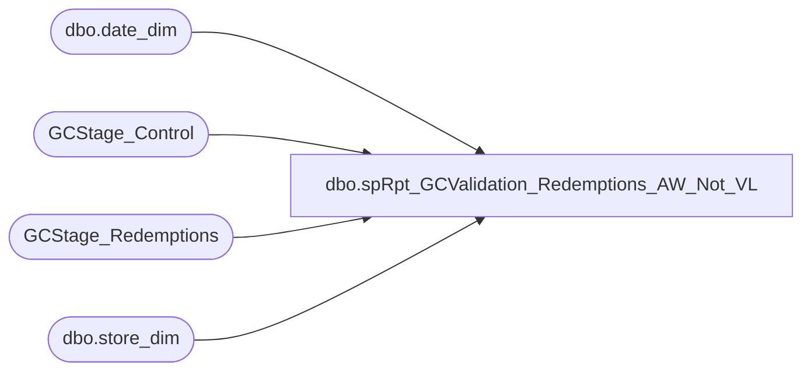

# dbo.spRpt_GCValidation_Redemptions_AW_Not_VL

**Database:** DWStaging  
**Server:** papamart  

## Architecture Diagram



## Table Dependencies

| Referenced Table |
|---|
| dbo.date_dim |
| GCStage_Control |
| GCStage_Redemptions |
| dbo.store_dim |

## Stored Procedure Code

```sql
CREATE PROCEDURE [dbo].[spRpt_GCValidation_Redemptions_AW_Not_VL]
-- =============================================================================================================
-- Name: spRpt_GCValidation_Redemptions_AW_Not_VL
--
-- Description:	
--	Generate the recordset to print the Giftcards Redeemed in Auditworks, but not validated in Valuelink
--
-- Input:		
--
-- Output: 
--
-- Dependencies: 
--
-- Revision History
--		Name:			Date:			Comments:
--		Gary Murrish	4/17/2013		Created

-- =============================================================================================================
AS

	SET NOCOUNT ON

	DECLARE @minReviewDateKey int
	DECLARE @maxReviewDateKey int
	SELECT
		@maxReviewDateKey = gc.maxDateKey,
		@minReviewDateKey = gc.minAnalysisDateKey
	FROM
		GCStage_Control gc WITH (NOLOCK)

	SELECT
		ISNULL(CAST(sd.store_id AS varchar(255)), 'K:' + CAST(sr.store_key AS varchar)) AS store,
		dd.actual_date,
		sr.giftcard_no,
		sr.Register_No,
		sr.Transaction_No,
		sr.Redemption_Amount
	FROM
		GCStage_Redemptions sr WITH (NOLOCK)
		LEFT JOIN dw.dbo.store_dim sd WITH (NOLOCK)
			ON sr.store_key = sd.store_key
		LEFT JOIN dw.dbo.date_dim dd WITH (NOLOCK)
			ON sr.date_key = dd.date_key
	WHERE
		sr.postedPhase = 0
		AND sr.date_key BETWEEN @minReviewDateKey AND @maxReviewDateKey
```

