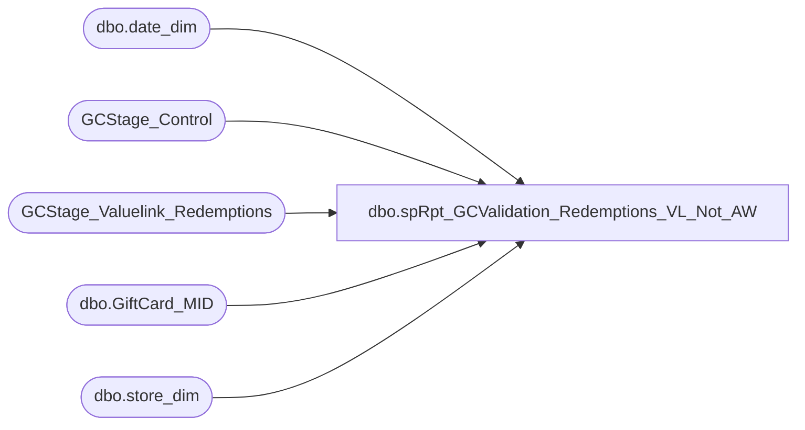

# dbo.spRpt_GCValidation_Redemptions_VL_Not_AW

**Database:** DWStaging  
**Server:** papamart  

## Architecture Diagram



## Table Dependencies

| Referenced Table |
|---|
| dbo.date_dim |
| GCStage_Control |
| GCStage_Valuelink_Redemptions |
| dbo.GiftCard_MID |
| dbo.store_dim |

## Stored Procedure Code

```sql
CREATE PROCEDURE [dbo].[spRpt_GCValidation_Redemptions_VL_Not_AW]
-- =============================================================================================================
-- Name: spRpt_GCValidation_Redemptions_VL_Not_AW
--
-- Description:	
--	Generate the recordset to print the Giftcards Redeemed in Valuelink, but not found in Auditworks
--
-- Input:		
--
-- Output: 
--
-- Dependencies: 
--
-- Revision History
--		Name:			Date:			Comments:
--		Gary Murrish	4/17/2013		Created

-- =============================================================================================================
AS

	SET NOCOUNT ON

	DECLARE @minReviewDateKey int
	DECLARE @maxReviewDateKey int
	SELECT
		@maxReviewDateKey = gc.maxDateKey,
		@minReviewDateKey = gc.minAnalysisDateKey
	FROM
		GCStage_Control gc WITH (NOLOCK)

	SELECT
		ISNULL(CAST(sd.store_id AS varchar(255)), 'K:' + CAST(svr.store_key AS varchar)) AS store,
		dd.actual_date,
		svr.account_number AS giftcard_no,
		svr.terminal_id AS register_no,
		svr.terminal_transaction_number AS transaction_no,
		svr.transaction_amount * -1 AS redemption_amount,
		svr.merchant_id,
		ISNULL(gcm.description, '?') AS description
	FROM
		GCStage_Valuelink_Redemptions svr WITH (NOLOCK)
		LEFT JOIN dw.dbo.store_dim sd WITH (NOLOCK)
			ON svr.store_key = sd.store_key
		LEFT JOIN dw.dbo.date_dim dd WITH (NOLOCK)
			ON svr.date_key = dd.date_key
		LEFT JOIN dw.dbo.GiftCard_MID gcm WITH (NOLOCK)
			ON svr.merchant_id = gcm.MID
	WHERE
		svr.postedPhase = 0
		AND svr.transaction_amount <> 0
		AND svr.date_key BETWEEN @minReviewDateKey AND @maxReviewDateKey
```

