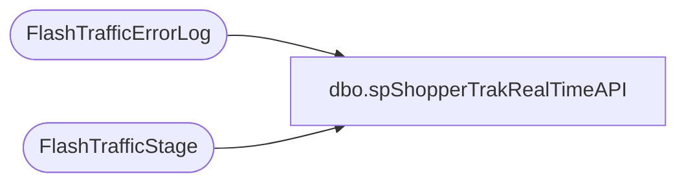

# dbo.spShopperTrakRealTimeAPI

**Database:** DWStaging  
**Server:** papamart  

## Architecture Diagram



## Table Dependencies

| Referenced Table |
|---|
| FlashTrafficErrorLog |
| FlashTrafficStage |

## Stored Procedure Code

```sql
CREATE proc [dbo].[spShopperTrakRealTimeAPI]
@HTTPString varchar(1000), @LocationCode varchar(4), @U varchar(20), @P varchar(10)

as

-- =====================================================================================================
-- Name: spShopperTrakRealTimeAPI
--
--Description: Connects to ShopperTrak RealTime Traffic API, downloads XML, extracts data into columns, inserts into dwstaging..FlashTrafficStage
--				
-- Revision History
--		Name:			Date:			Comments:
--		Dan Tweedie		2016-02-10		Created proc
-- =====================================================================================================


BEGIN
	Declare 
		@Object Int,
		@ResponseText Varchar(8000)
	
	Exec sp_OACreate 'MSXML2.XMLHTTP', @Object OUT; 
	Exec sp_OAMethod 
		@Object, 
		'open', 
		NULL, 
		'get',
		@HTTPString,
		'false', 
		@U,
		@P

	Exec sp_OAMethod @Object, 'send'
	Exec sp_OAMethod @Object, 'responseText', @ResponseText OUTPUT
	Exec sp_OADestroy @Object 
END

-------------------------------------------------------------------------------------
-------------------------------------------------------------------------------------
if (select @ResponseText) NOT like '%error%'

BEGIN
	DECLARE 
		@XML AS XML, 
		@hDoc AS INT, 
		@SQL NVARCHAR (MAX)

	SELECT @XML = convert(XML, @ResponseText)

	EXEC sp_xml_preparedocument @hDoc OUTPUT, @XML

	;
	with STORE as
		(
			SELECT storeID
			FROM OPENXML(@hDoc, 'sites/site')
			WITH 
			(
			storeID varchar(4) '@storeID'
			)
		)
	insert FlashTrafficStage
	SELECT s.storeID, exits, enters, startTime, getdate(), @HTTPString
	FROM OPENXML(@hDoc, 'sites/site/traffic')
	WITH 
	(
	exits int '@exits',
	enters int '@enters',
	startTime varchar(12) '@startTime'
	)
	cross join STORE s

	EXEC sp_xml_removedocument @hDoc
END
-------------------------------------------------------------------------------------
-------------------------------------------------------------------------------------

if (select @ResponseText) like '%error%'
BEGIN
	insert FlashTrafficErrorLog
	select @LocationCode, getdate(), @HTTPString, @ResponseText
END

--------------------------------------------------------------------------------------------
--------------------------------------------------------------------------------------------
/* 
--INDIVIDUAL STORES
--https://stws-dz01.shoppertrak.com/EnterpriseFlash/v1.0/service/site/?start_time=201702101315&end_time=201702101330 --DEV
--https://stws.shoppertrak.com/EnterpriseFlash/v1.0/service/site/?start_time=201702101315&end_time=201702101330 --PROD

--ALL STORES
--https://stws-dz01.shoppertrak.com/EnterpriseFlash/v1.0/service/allsites?start_time=201702101315&end_time=201702101330&detail=store --dev
--https://stws.shoppertrak.com/EnterpriseFlash/v1.0/service/allsites?start_time=201702101315&end_time=201702101330&detail=store --prod
*/
```

