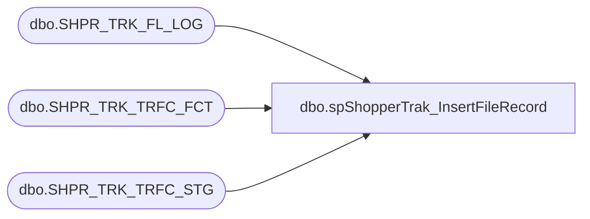

# dbo.spShopperTrak_InsertFileRecord

**Database:** DWStaging  
**Server:** papamart  

## Architecture Diagram



## Table Dependencies

| Referenced Table |
|---|
| dbo.SHPR_TRK_FL_LOG |
| dbo.SHPR_TRK_TRFC_FCT |
| dbo.SHPR_TRK_TRFC_STG |

## Stored Procedure Code

```sql
-- =============================================================================================================
-- Name: spShopperTrak_InsertFileRecord
--
-- Description: 
-- Insers a record in SHPR_TRK_FL_LOG to indicate that the file is being imported
--
--
-- 
--
-- Input:
--  @fl_nm   varchar(255) 
--
-- Output: 
--  @fl_id   int
--
-- Dependencies: 
--
-- EXAMPLE:
--  exec dwstaging.dbo.spShopperTrak_InsertFileRecord 'testfile.csv'
--
-- Revision History
--  Name:   Date:      Comments:
--  Rick Caminiti 04/23/2012  created
-- =============================================================================================================

CREATE PROCEDURE [dbo].[spShopperTrak_InsertFileRecord]
(
    @fl_nm varchar(255)
)
AS
BEGIN
SET NOCOUNT ON;

DECLARE @STAT_ID int,
    @ROW_CNT int,
    @CUR_DT datetime,
    @INS_CNT int,
    @DEL_CNT int;


/*Status of 10 means "Loading".  */
/*Ins and Del counts are for auditing purposes in SSISTemplates logs*/
SELECT  @STAT_ID = 10,
    @ROW_CNT = 0,
    @INS_CNT = 0,
    @DEL_CNT = 0,
    @CUR_DT = getdate();


/*Delete all rows related to this file (in case of reload) in the fact table*/
DELETE 
  FROM [dw].[dbo].[SHPR_TRK_TRFC_FCT] 
 WHERE [SHPR_TRK_FL_LOG_ID] IN (
    SELECT [SHPR_TRK_FL_LOG_ID]
      FROM [dbo].[SHPR_TRK_FL_LOG]
 WHERE [FL_NM] = @fl_nm)

SET @DEL_CNT = @DEL_CNT + @@ROWCOUNT

/*Delete all rows related to this file (in case of reload) in the staging table*/
DELETE
  FROM [dbo].[SHPR_TRK_TRFC_STG]
 WHERE [SHPR_TRK_FL_LOG_ID] IN (
    SELECT [SHPR_TRK_FL_LOG_ID]
      FROM [dbo].[SHPR_TRK_FL_LOG]
 WHERE [FL_NM] = @fl_nm)
 
SET @DEL_CNT = @DEL_CNT + @@ROWCOUNT
 
/*Delete all rows related to this file (in case of reload) in the file log table*/
DELETE 
  FROM [dbo].[SHPR_TRK_FL_LOG]
 WHERE [FL_NM] = @fl_nm

SET @DEL_CNT = @DEL_CNT + @@ROWCOUNT

/*Insert new record into file log table with default values*/
INSERT INTO [dbo].[SHPR_TRK_FL_LOG]
           ([FL_NM]
           ,[STAT_ID]
           ,[ROW_CNT]
           ,[INS_DT]
           ,[UPD_DT])
     VALUES
           (@FL_NM
           ,@STAT_ID
           ,@ROW_CNT
           ,@CUR_DT
           ,@CUR_DT);

SET @INS_CNT = @INS_CNT + @@ROWCOUNT

/*return newly created file id and autit values*/
SELECT cast(SCOPE_IDENTITY() as int) FL_ID, @INS_CNT INS_CNT, @DEL_CNT DEL_CNT

END
```

