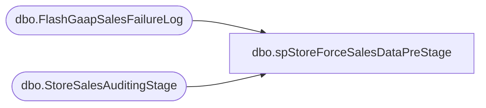

# dbo.spStoreForceSalesDataPreStage

**Database:** DWStaging  
**Server:** papamart  

## Architecture Diagram



## Table Dependencies

| Referenced Table |
|---|
| dbo.FlashGaapSalesFailureLog |
| dbo.StoreSalesAuditingStage |

## Stored Procedure Code

```sql
CREATE proc [dbo].[spStoreForceSalesDataPreStage]
@StoreID int,
@StoreKey int,
@IP varchar(15),
@UName varchar(2),
@PWord varchar(10)

as

set nocount on

Declare
	@StoreQuery nvarchar(max),
	@StoreShifts nvarchar(max)

Select @StoreQuery = 
						'select 
							a.StoreNo,
							a.RTL_TRN_ID,
							a.TRANS_COUNT,
							a.NET_UNITS,
							a.NET_SALES,
							a.END_DATETIME,
							a.REDEEMED_AMOUNT,
							a.Excluded_Items,
							a.Tran_Units,
							a.ITEM_NO,
							a.SkuDescription,
							a.line_item_no,
							a.RETURN_FLG
						from openrowset
						(''SQLNCLI'', ''' + @IP + '''; ''' + @Uname + '''; ''' + @PWord + ''',
						''set nocount on
 
						IF (Object_ID(''''USICOAL..AuditDataStage'''') IS NOT NULL) DROP TABLE USICOAL.dbo.AuditDataStage
						create table USICOAL.dbo.AuditDataStage
							(RTL_TRN_ID int,
							TRANS_COUNT int,
							NET_UNITS decimal(18,4),
							NET_SALES money,
							END_DATETIME datetime,
							REDEEMED_AMOUNT money,
							Excluded_Items int,
							Tran_Units int,
							ITEM_NO varchar(20),
							SkuDescription varchar(100),
							line_item_no int,
							RETURN_FLG int)

						declare @Range as varchar(50), @sql varchar(1000)

						set @Range = Char(34) + (select cast(convert(varchar, getdate()-3,121)as varchar(10)))+  Char(34)  + '''','''' +  Char(34)  +(select cast(convert(varchar, getdate(),121)as varchar(10))) +  Char(34) 
			
						set @sql = ''''insert into USICOAL.dbo.AuditDataStage exec USICOAL.dbo.spDWStoreSalesAuditingQuery'''' + @Range

						exec (@sql)


						select	
							rt.store_no as StoreNo,
							g.RTL_TRN_ID,
							g.TRANS_COUNT,
							g.NET_UNITS,
							g.NET_SALES,
							g.END_DATETIME,
							g.REDEEMED_AMOUNT,
							g.Excluded_Items,
							g.Tran_Units,
							g.ITEM_NO,
							g.SkuDescription,
							g.line_item_no,
							g.RETURN_FLG
						from USICOAL.dbo.AuditDataStage G
						INNER JOIN USICOAL.dbo.RETAIL_TRANSACTION RT ON G.RTL_TRN_ID = RT.RTL_TRN_ID'') as a'

	begin try
		insert dwstaging.dbo.StoreSalesAuditingStage
		exec(@StoreQuery)
	end try

	begin catch
		insert dwstaging.dbo.FlashGaapSalesFailureLog
		select @StoreID, @StoreKey, @IP, getdate(), 'UK Audit - ' + error_message()
	end catch
```

