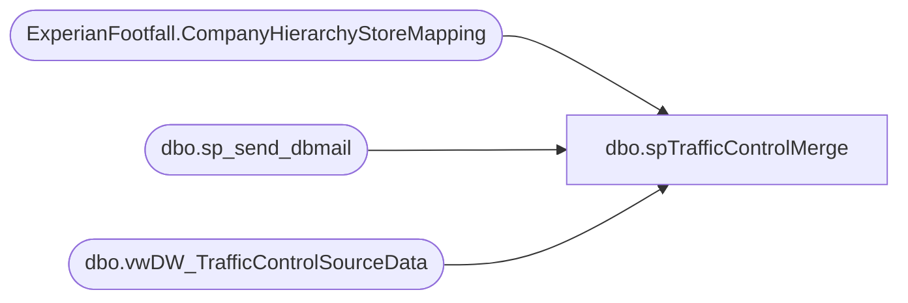

# dbo.spTrafficControlMerge

**Database:** DWStaging  
**Server:** papamart  

## Architecture Diagram



## Table Dependencies

| Referenced Table |
|---|
| ExperianFootfall.CompanyHierarchyStoreMapping |
| dbo.sp_send_dbmail |
| dbo.vwDW_TrafficControlSourceData |

## Stored Procedure Code

```sql
CREATE proc [dbo].[spTrafficControlMerge] as

set nocount on


if object_id('tempdb..#source') is not null drop table #source 
select
	store_key,
	SiteIdentity,
	IsShopperTrak,
	IsFootFall,
	IsCurrentlyOffline,
	CompanyID,
	HierarchyID,
	NodeName,
	CurrencyCode
into #source
from DWStaging.dbo.vwDW_TrafficControlSourceData

;
with
OutOfSync as
	(
		select count(*) countAll
		from #source s
		join DWStaging.ExperianFootfall.CompanyHierarchyStoreMapping m 
			on s.SiteIdentity = m.SiteIdentity
			and s.CompanyID = m.CompanyID
			and s.HierarchyID = m.HierarchyID
		where s.IsShopperTrak <> m.IsShopperTrak
		UNION ALL
		select count(*) countAll
		from #source s
		left join DWStaging.ExperianFootfall.CompanyHierarchyStoreMapping m 
			on s.SiteIdentity = m.SiteIdentity
			and s.CompanyID = m.CompanyID
			and s.HierarchyID = m.HierarchyID
		where m.SiteIdentity is NULL
	)
select sum(countAll) OutOfSync
into #X
from OutOfSync
having sum(countAll) > 0 

-----THESE TWO QUERIES SHOULD TELL US WHAT TO EXPECT WHEN THE MERGE RUNS
---------MATCHED, BUT KEYS NOT THE SAME -- WILL PERFORM UPDATE
--select s.*
--from #source s
--join DWStaging.ExperianFootfall.CompanyHierarchyStoreMapping m 
--	on s.SiteIdentity = m.SiteIdentity
--	and s.CompanyID = m.CompanyID
--	and s.HierarchyID = m.HierarchyID
--where s.IsShopperTrak <> m.IsShopperTrak


------NOT MATCHED -- WILL DO INSERT
--select s.* --10
--from #source s
--left join DWStaging.ExperianFootfall.CompanyHierarchyStoreMapping m 
--	on s.SiteIdentity = m.SiteIdentity
--	and s.CompanyID = m.CompanyID
--	and s.HierarchyID = m.HierarchyID
--where m.SiteIdentity is NULL

---------------------------------------------------------------------------------------------

if (select count(*) from #X) > 0

BEGIN

			declare @Output table
				(
					Action varchar(10),
					SiteIdentity1 int,
					SiteIdentity2 int
				)

			MERGE into DWStaging.ExperianFootfall.CompanyHierarchyStoreMapping as target

				using
					(
						select 
							store_key,
							SiteIdentity,
							IsShopperTrak,
							IsFootFall,
							IsCurrentlyOffline,
							CompanyID,
							HierarchyID,
							NodeName,
							CurrencyCode
						from #source
					) as source
				on 
					(
						target.SiteIdentity = source.SiteIdentity
						and
						target.CompanyID = source.CompanyID
						and
						target.HierarchyID = source.HierarchyID
					)
				when matched
					and
						(
							target.IsShopperTrak <> source.IsShopperTrak OR
							target.IsFootFall <> source.IsFootFall
						)
					then UPDATE
						set 
							target.IsShopperTrak = source.IsShopperTrak,
							target.IsFootFall = source.IsFootFall,
							target.Updt_Dt = getdate()
				When Not Matched By Target 
						Then 
							Insert
								(
									store_key,
									SiteIdentity,
									IsShopperTrak,
									IsFootFall,
									IsCurrentlyOffline,
									CompanyID,
									HierarchyID,
									NodeName,
									CurrencyCode,
									Updt_Dt
								)
							values
								(
									source.store_key,
									source.SiteIdentity,
									source.IsShopperTrak,
									source.IsFootFall,
									source.IsCurrentlyOffline,
									source.CompanyID,
									source.HierarchyID,
									source.NodeName,
									source.CurrencyCode,
									getdate()
								)

				OUTPUT 
					$action, 
					inserted.SiteIdentity, 
					deleted.SiteIdentity
					into @Output

				; --A MERGE statement must be terminated by a semi-colon (;).	

			with MergeOutput as
						(
							select 
								InsertedRows = (select count(*) from @Output where Action = 'INSERT'), 
								UpdatedRows = 0
							UNION 
							select 
								InsertedRows = 0, 
								UpdatedRows = (select count(*) from @Output where Action = 'UPDATE')
						),
					OutOfSync as
						(
							select count(*) countAll
							from #source s
							join DWStaging.ExperianFootfall.CompanyHierarchyStoreMapping m 
								on s.SiteIdentity = m.SiteIdentity
								and s.CompanyID = m.CompanyID
								and s.HierarchyID = m.HierarchyID
							where s.IsShopperTrak <> m.IsShopperTrak
							UNION ALL
							select count(*) countAll
							from #source s
							left join DWStaging.ExperianFootfall.CompanyHierarchyStoreMapping m 
								on s.SiteIdentity = m.SiteIdentity
								and s.CompanyID = m.CompanyID
								and s.HierarchyID = m.HierarchyID
							where m.SiteIdentity is NULL
						),
					ValidationStatus as
						(
							select case when sum(countAll) = 0 then 1 else 0 end as ValidationStatus 
							from OutOfSync
						)
					select 
						sum(m.InsertedRows) as InsertedRows,
						sum(m.UpdatedRows) as UpdatedRows,
						v.ValidationStatus
					into #summary
					from
						MergeOutput	m
						cross join ValidationStatus v	
					group by v.ValidationStatus		


					if 
						(
							select count(*) 
							from #summary
							where
								UpdatedRows <> 0
								or
								InsertedRows <> 0
								or 
								ValidationStatus <> 1
						) > 0

						begin
							declare 
								@text nvarchar(max),
								@Status varchar(4),
								@Subj varchar(100)

							select 
								@Status = case when ValidationStatus = 1 then 'Pass' else 'Fail' end from #summary

							select 
								@Subj = 'Traffic Control Table Merge Status: ' + @Status,
								@text = '<H1><font face =arial size = 3> Traffic Control Table Merge Status: ' + @Status + ' </font> </H1>' +
										'<br>' +
										'<table border="1">' +
										'<font face =arial size = 2>' + 
										'<tr><th>Inserted Rows</th><th>Updated Rows</th><th>Validation Status</th></tr>' +
										CAST ( ( SELECT 
														td = InsertedRows,'',
														td = UpdatedRows, '',
														td = case when ValidationStatus = 1 then 'Pass' else 'Fail' end, ''
												  from #summary
												  FOR XML PATH('tr'), TYPE 
										) AS NVARCHAR(MAX) ) +
										'</font></table>
										<br>
										<br>
										<font face =arial size = 2>This report was generated by dwstaging.dbo.spTrafficControlMerge, which was executed from Babwscore01 SQL Agent: ShopperTrak Traffic DailyImport.
										<br>
										<br>
										<b>Source:</b> Papamart.DWStaging.dbo.vwDW_TrafficControlSourceData <br>
										<b>Destination:</b> Papamart.DWStaging.ExperianFootfall.CompanyHierarchyStoreMapping	
										</font>
										<br>'

							exec msdb.dbo.sp_send_dbmail
								@profile_name = 'biadmin',
								@recipients = 'biadmin@buildabear.com',
								@body = @text,
								@subject = @Subj,
								@body_format = 'HTML'

						end

END
```

