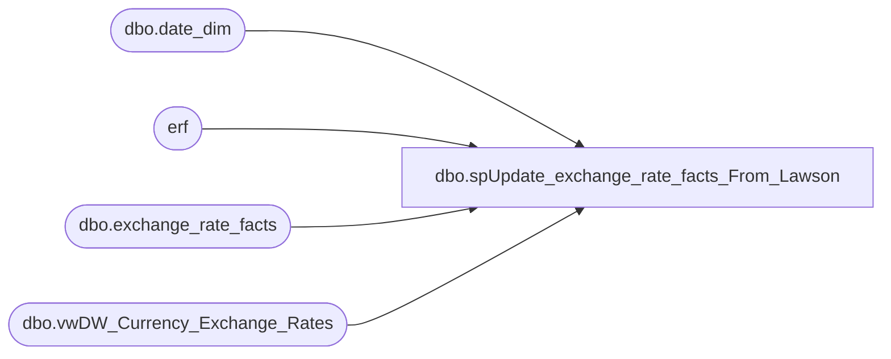

# dbo.spUpdate_exchange_rate_facts_From_Lawson

**Database:** DWStaging  
**Server:** papamart  

## Architecture Diagram



## Table Dependencies

| Referenced Table |
|---|
| dbo.date_dim |
| erf |
| dbo.exchange_rate_facts |
| dbo.vwDW_Currency_Exchange_Rates |

## Stored Procedure Code

```sql
CREATE PROCEDURE [dbo].[spUpdate_exchange_rate_facts_From_Lawson]
AS

	--/******************************************************************************
	--**
	--**	Name:		spUpdate_exchange_rate_facts_From_Lawson
	--**
	--**	Description: 	Updates dbo.exchange_rate_facts with the exchange rate from the Lawson Month_End Average rates
	--**
	--**
	--**	Parameters:	none
	--**
	--** 	Returns:	result set
	--**
	--**	Examples:	spUpdate_exchange_rate_facts_From_Lawson
	--**			
	--**
	--**	History:	
	--**  Date 			Author 				Purpose
	--**  12/26/2013	Gary Murrish		Created
	--******************************************************************************/

	SET NOCOUNT ON

	-- Set the Average Monthly Rate to be the same as the bbw_Rate
	UPDATE dw.dbo.exchange_rate_facts
		SET fiscal_month_ave_rate = bbw_rate
	WHERE fiscal_month_ave_rate <> bbw_rate


	-- Get the rates from Lawon
	IF OBJECT_ID('tempdb..#tmpData') IS NOT NULL
	BEGIN
		DROP TABLE #tmpData
	END

	SELECT
		dcer.FR_CURR_CODE,
		dcer.TO_CURR_CODE,
		dcer.fiscal_year,
		dcer.RATE_VALUE_01,
		dcer.RATE_VALUE_02,
		dcer.RATE_VALUE_03,
		dcer.RATE_VALUE_04,
		dcer.RATE_VALUE_05,
		dcer.RATE_VALUE_06,
		dcer.RATE_VALUE_07,
		dcer.RATE_VALUE_08,
		dcer.RATE_VALUE_09,
		dcer.RATE_VALUE_10,
		dcer.RATE_VALUE_11,
		dcer.RATE_VALUE_12,
		dcer.RATE_VALUE_13,
		dcer.MULT_DIV
	INTO #tmpData
	FROM
		LAWSONSQLCLSTR1.PROD90.dbo.vwDW_Currency_Exchange_Rates dcer WITH (NOLOCK)

	-- Unpivot the data
	IF OBJECT_ID('tempdb..#tmpPeriodRate') IS NOT NULL
	BEGIN
		DROP TABLE #tmpPeriodRate
	END

	SELECT
		FR_CURR_CODE COLLATE database_default AS FR_CURR_CODE,
		TO_CURR_CODE COLLATE database_default AS TO_CURR_CODE,
		fiscal_year,
		CAST(RIGHT(wPeriod, 2) AS int) AS FISCAL_PERIOD,
		CASE
			WHEN MULT_DIV = 'D' THEN 1 / RATE
			ELSE RATE
		END AS RATE
	INTO #tmpPeriodRate
	FROM
		(SELECT
				*
			FROM
				#tmpData) src
		UNPIVOT
		(RATE FOR wPeriod IN (RATE_VALUE_01,
		RATE_VALUE_02,
		RATE_VALUE_03,
		RATE_VALUE_04,
		RATE_VALUE_05,
		RATE_VALUE_06,
		RATE_VALUE_07,
		RATE_VALUE_08,
		RATE_VALUE_09,
		RATE_VALUE_10,
		RATE_VALUE_11,
		RATE_VALUE_12,
		RATE_VALUE_13)) AS unpvt
	WHERE
		unpvt.RATE <> 0


	-- Build the reference for the given data
	IF OBJECT_ID('tempdb..#tmpDailyRates') IS NOT NULL
	BEGIN
		DROP TABLE #tmpDailyRates
	END

	SELECT
		dd.date_key,
		pr.FR_CURR_CODE,
		pr.TO_CURR_CODE,
		pr.Rate
	INTO #tmpDailyRates
	FROM
		#tmpPeriodRate pr WITH (NOLOCK)
		INNER JOIN dw.dbo.date_dim dd WITH (NOLOCK)
			ON dd.fiscal_year = pr.fiscal_year
			AND dd.fiscal_period = pr.fiscal_period

	-- Update the records directly
	UPDATE erf
		SET fiscal_month_ave_rate = dr.Rate
	FROM
		dw.dbo.exchange_rate_facts erf
		INNER JOIN #tmpDailyRates dr WITH (NOLOCK)
			ON erf.date_key = dr.date_key
			AND erf.from_currency_code = dr.FR_CURR_CODE
			AND erf.to_currency_code = dr.TO_CURR_CODE

	-- Update the inverse of the records
	UPDATE erf
		SET fiscal_month_ave_rate = 1 / dr.Rate
	FROM
		dw.dbo.exchange_rate_facts erf
		INNER JOIN #tmpDailyRates dr WITH (NOLOCK)
			ON erf.date_key = dr.date_key
			AND erf.from_currency_code = dr.TO_CURR_CODE
			AND erf.to_currency_code = dr.FR_CURR_CODE

	-- Get the min and max Date keys provided from Lawson for each Currency Pair
	IF OBJECT_ID('tempdb..#tmpRatesMinMaxDates') IS NOT NULL
	BEGIN
		DROP TABLE #tmpRatesMinMaxDates
	END

	SELECT
		dr.FR_CURR_CODE,
		dr.TO_CURR_CODE,
		MIN(dr.date_key) AS minDate_Key,
		MAX(dr.date_key) AS maxDate_Key
	INTO #tmpRatesMinMaxDates
	FROM
		#tmpDailyRates dr WITH (NOLOCK)
	GROUP BY	dr.FR_CURR_CODE,
				dr.TO_CURR_CODE


	-- Update the rates prior to the first Lawson date with the Lawson information (Matches)
	UPDATE erf
		SET fiscal_month_ave_rate = tr.Rate
	FROM
		dw.dbo.exchange_rate_facts erf
		INNER JOIN (SELECT
				rmmd.FR_CURR_CODE,
				rmmd.TO_CURR_CODE,
				rmmd.minDate_Key,
				dr.Rate
			FROM
				#tmpRatesMinMaxDates rmmd WITH (NOLOCK)
				INNER JOIN #tmpDailyRates dr WITH (NOLOCK)
					ON rmmd.FR_CURR_CODE = dr.FR_CURR_CODE
					AND rmmd.TO_CURR_CODE = dr.TO_CURR_CODE
					AND rmmd.minDate_Key = dr.date_key) tr
			ON erf.from_currency_code = tr.FR_CURR_CODE
			AND erf.to_currency_code = tr.TO_CURR_CODE
			AND erf.date_key < tr.minDate_Key

	-- Update the rates prior to the first Lawson date with the Lawson information (Inverses)
	UPDATE erf
		SET fiscal_month_ave_rate = 1 / tr.Rate
	FROM
		dw.dbo.exchange_rate_facts erf
		INNER JOIN (SELECT
				rmmd.FR_CURR_CODE,
				rmmd.TO_CURR_CODE,
				rmmd.minDate_Key,
				dr.Rate
			FROM
				#tmpRatesMinMaxDates rmmd WITH (NOLOCK)
				INNER JOIN #tmpDailyRates dr WITH (NOLOCK)
					ON rmmd.FR_CURR_CODE = dr.FR_CURR_CODE
					AND rmmd.TO_CURR_CODE = dr.TO_CURR_CODE
					AND rmmd.minDate_Key = dr.date_key) tr
			ON erf.from_currency_code = tr.TO_CURR_CODE
			AND erf.to_currency_code = tr.FR_CURR_CODE
			AND erf.date_key < tr.minDate_Key


	-- Update the rates after the last Lawson date with the Lawson information (Matches)
	UPDATE erf
		SET fiscal_month_ave_rate = tr.Rate
	FROM
		dw.dbo.exchange_rate_facts erf
		INNER JOIN (SELECT
				rmmd.FR_CURR_CODE,
				rmmd.TO_CURR_CODE,
				rmmd.maxDate_Key,
				dr.Rate
			FROM
				#tmpRatesMinMaxDates rmmd WITH (NOLOCK)
				INNER JOIN #tmpDailyRates dr WITH (NOLOCK)
					ON rmmd.FR_CURR_CODE = dr.FR_CURR_CODE
					AND rmmd.TO_CURR_CODE = dr.TO_CURR_CODE
					AND rmmd.maxDate_Key = dr.date_key) tr
			ON erf.from_currency_code = tr.FR_CURR_CODE
			AND erf.to_currency_code = tr.TO_CURR_CODE
			AND erf.date_key > tr.maxDate_Key

	-- Update the rates after the last Lawson date with the Lawson information (Inverses)
	UPDATE erf
		SET fiscal_month_ave_rate = 1 / tr.Rate
	FROM
		dw.dbo.exchange_rate_facts erf
		INNER JOIN (SELECT
				rmmd.FR_CURR_CODE,
				rmmd.TO_CURR_CODE,
				rmmd.maxDate_Key,
				dr.Rate
			FROM
				#tmpRatesMinMaxDates rmmd WITH (NOLOCK)
				INNER JOIN #tmpDailyRates dr WITH (NOLOCK)
					ON rmmd.FR_CURR_CODE = dr.FR_CURR_CODE
					AND rmmd.TO_CURR_CODE = dr.TO_CURR_CODE
					AND rmmd.maxDate_Key = dr.date_key) tr
			ON erf.from_currency_code = tr.TO_CURR_CODE
			AND erf.to_currency_code = tr.FR_CURR_CODE
			AND erf.date_key > tr.maxDate_Key
```

