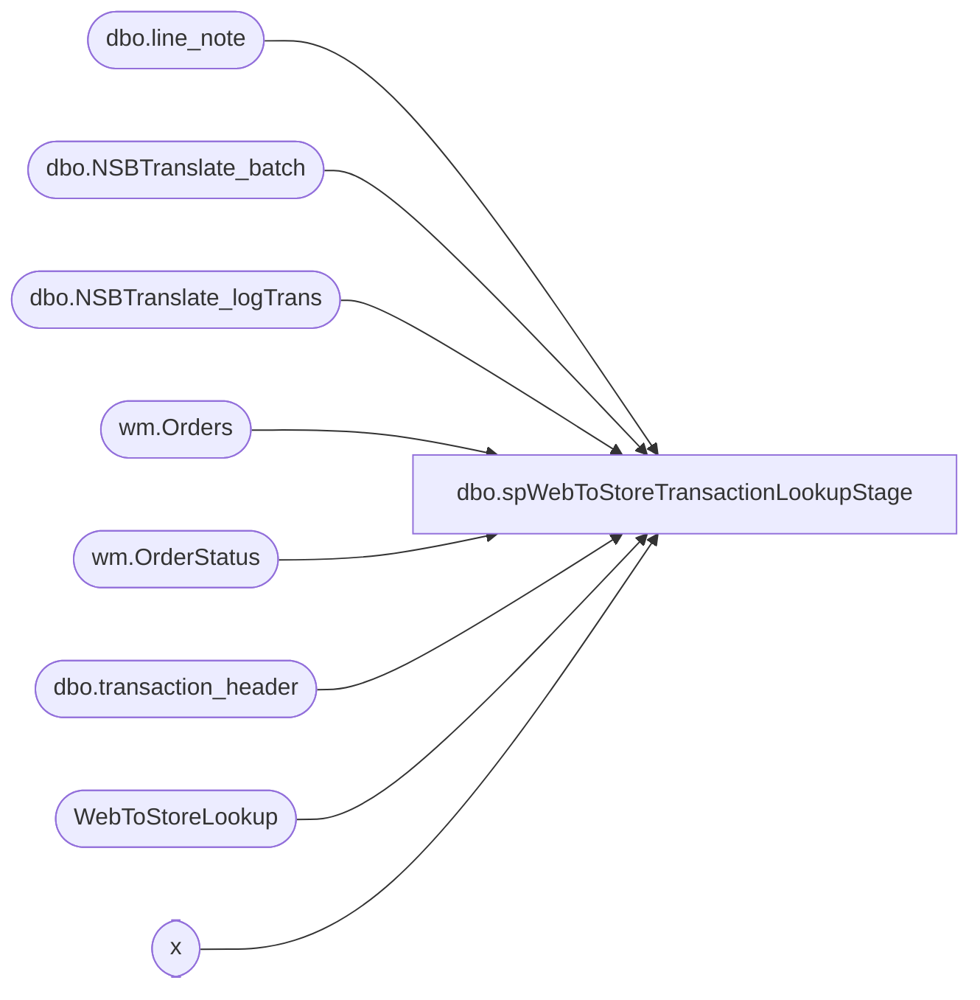

# dbo.spWebToStoreTransactionLookupStage

**Database:** DWStaging  
**Server:** papamart  

## Architecture Diagram



## Table Dependencies

| Referenced Table |
|---|
| dbo.line_note |
| dbo.NSBTranslate_batch |
| dbo.NSBTranslate_logTrans |
| wm.Orders |
| wm.OrderStatus |
| dbo.transaction_header |
| WebToStoreLookup |
| x |

## Stored Procedure Code

```sql
CREATE proc [dbo].[spWebToStoreTransactionLookupStage]

as 


set nocount on


IF (Object_ID('tempdb..#ShippedOrders') IS NOT NULL) DROP TABLE #ShippedOrders;
select 
	t.sOrderNumber SettledOrderNumber
into #ShippedOrders
from [bearcluster01.sql.buildabear.com].BABWeCommerce.dbo.NSBTranslate_logTrans t
	join [bearcluster01.sql.buildabear.com].BABWeCommerce.dbo.NSBTranslate_batch b on t.sBatchID=b.sBatchID
where b.bSentToAW = 1 
	and t.sStore not in (13,2013)
	and datediff(dd, t.dTimeStamp, getdate())<= 45
group by 
	t.sOrderNumber

IF (Object_ID('tempdb..#Orders') IS NOT NULL) DROP TABLE #Orders;
select distinct 
	o.OrderNumber,
	o.OrderNum,
	--o.PickupStore FulfillmentLocation,
	case when o.ShippingMethod = 'InStore' then 1 else 0 end as isPickupFromStore, 
	case when o.ShippingMethod = 'curbSide' then 1 else 0 end as isCurbside,
	case when o.ShippingMethod not in ('InStore', 'curbSide', 'sameDay') then 1 else 0 end as isShipFromStore,
	case when o.ShippingMethod = 'sameDay' then 1 else 0 end as isSameDay
	--cast(os.StatusDate as date) as ShipDate
into #Orders
from  [bearcluster01.sql.buildabear.com].WebOrderProcessing.wm.Orders o with (nolock) 
join  [bearcluster01.sql.buildabear.com].WebOrderProcessing.wm.OrderStatus os with (nolock)
	on o.OrderID=os.OrderID
	and os.CurrentStatus=1
where 1=1
and datediff(dd, os.StatusDate, getdate()) <= 45
and isnull(o.PickupStore,'') not in ('', '0013', '2013')
-- Replaced the Conditions below on 10/11/2023
-- This is due to some web orders not inserting in the NSBTranslate_logTrans when they post to Sales Audit
/*
--and os.Status in ('Shipped','Complete') -- This was remarked out prior to 10/11/2023 
and o.OrderNum in (select SettledOrderNumber from #ShippedOrders)
*/
-- Conditions as of 10/11/2023
and 
(
	exists (select s.SettledOrderNumber from #ShippedOrders s where s.SettledOrderNumber=o.OrderNum)
		or 
	os.Status in ('Shipped','Complete')
) 


IF (Object_ID('tempdb..#PreStage') IS NOT NULL) DROP TABLE #PreStage;
select  
	ln.transaction_id,
	o.OrderNum,
	o.isPickupFromStore,
	o.isCurbside,
	o.isShipFromStore,
	o.isSameDay,
	cast(substring (ln.line_note, 12,32) as varchar(10))  LineNote
into #PreStage
from bedrockdb01.auditworks.dbo.line_note ln (nolock) 
join #Orders o on o.OrderNumber COLLATE SQL_Latin1_General_CP1_CI_AS =cast(substring (ln.line_note, 12,30) as varchar(8)) 
where not exists (select th.transaction_id from bedrockdb01.auditworks.dbo.transaction_header th (nolock) where th.transaction_id=ln.transaction_id and th.store_no in ('13', '2013'))
and ln.line_note like 'Web Order%'
and o.OrderNum like '%[_]%'
group by 
	ln.transaction_id,
	o.OrderNum,
	o.isPickupFromStore,
	o.isCurbside,
	o.isShipFromStore,
	o.isSameDay,
	cast(substring (ln.line_note, 12,32) as varchar(10)) 
--union 
--select  
--	ln.av_transaction_id,
--	o.OrderNum,
--	o.isPickupFromStore,
--	o.isCurbside,
--	o.isShipFromStore,
--	o.isSameDay,
--	cast(substring (ln.line_note, 12,32) as varchar(10))  LineNote
--from bedrockdb01.auditworks.dbo.av_line_note ln (nolock) 
--join #Orders o on o.OrderNumber COLLATE SQL_Latin1_General_CP1_CI_AS =cast(substring (ln.line_note, 12,30) as varchar(8)) 
--where not exists (select th.av_transaction_id from bedrockdb01.auditworks.dbo.av_transaction_header th (nolock) where th.av_transaction_id=ln.av_transaction_id and th.store_no in ('13', '2013'))
--and ln.line_note like 'Web Order%'
--and o.OrderNum like '%[_]%'
--group by 
--	ln.av_transaction_id,
--	o.OrderNum,
--	o.isPickupFromStore,
--	o.isCurbside,
--	o.isShipFromStore,
--	o.isSameDay,
--	cast(substring (ln.line_note, 12,32) as varchar(10)) 
	


IF (Object_ID('tempdb..#Multi') IS NOT NULL) DROP TABLE #Multi;
select transaction_id
into #Multi
from #PreStage
group by transaction_id
having count(*) > 1

IF (Object_ID('tempdb..#MultiMatch') IS NOT NULL) DROP TABLE #MultiMatch;
select 
	transaction_id,
	OrderNum,
	isPickupFromStore,	
	isCurbside,	
	isShipFromStore,	
	isSameDay,	
	LineNote
into #MultiMatch
from #PreStage
where transaction_id in (select transaction_id from #multi)
and OrderNum COLLATE SQL_Latin1_General_CP1_CI_AS = LineNote

IF (Object_ID('tempdb..#MultiNoMatch') IS NOT NULL) DROP TABLE #MultiNoMatch;
select 
	transaction_id,
	min(OrderNum) OrderNum,
	isPickupFromStore,	
	isCurbside,	
	isShipFromStore,	
	isSameDay,	
	LineNote
into #MultiNoMatch
from #PreStage
where transaction_id in (select transaction_id from #multi)
and OrderNum COLLATE SQL_Latin1_General_CP1_CI_AS != LineNote
and transaction_id not in (select transaction_id from #MultiMatch)
group by 
	transaction_id,
	isPickupFromStore,	
	isCurbside,	
	isShipFromStore,	
	isSameDay,	
	LineNote

IF (Object_ID('tempdb..#WebToStoreLookup') IS NOT NULL) DROP TABLE #WebToStoreLookup;

select 
	transaction_id,
	OrderNum,
	isPickupFromStore,	
	isCurbside,	
	isShipFromStore,	
	isSameDay,	
	LineNote
into #WebToStoreLookup
from #PreStage
where transaction_id not in (select transaction_id from #multi)
UNION
select 
	transaction_id,
	OrderNum,
	isPickupFromStore,	
	isCurbside,	
	isShipFromStore,	
	isSameDay,	
	LineNote
from #MultiMatch
UNION
select 
	transaction_id,
	OrderNum,
	isPickupFromStore,	
	isCurbside,	
	isShipFromStore,	
	isSameDay,	
	LineNote
from #MultiNoMatch

;
merge into WebToStoreLookup as target
using #WebToStoreLookup as source
on 
	target.transaction_id=source.transaction_id
when not matched by target
then insert
	(
		transaction_id,
		OrderNum,
		isPickupFromStore,	
		isCurbside,	
		isShipFromStore,	
		isSameDay,	
		LineNote
	)
values
		(
			source.transaction_id,
			source.OrderNum,
			source.isPickupFromStore,	
			source.isCurbside,	
			source.isShipFromStore,	
			source.isSameDay,	
			source.LineNote
		)
when matched 
	then update 
	set
		target.OrderNum=source.OrderNum,
		target.isPickupFromStore=source.isPickupFromStore,	
		target.isCurbside=source.isCurbside,	
		target.isShipFromStore=source.isShipFromStore,	
		target.isSameDay=source.isSameDay,	
		target.LineNote=source.LineNote
;

select transaction_id
into #dupes
from WebToStoreLookup 
group by transaction_id
having count(*) >1

if (select count(*) from #dupes) >0
begin
	delete x 
	from WebToStoreLookup x
	join #dupes d on x.transaction_id=d.transaction_id 
end
```

