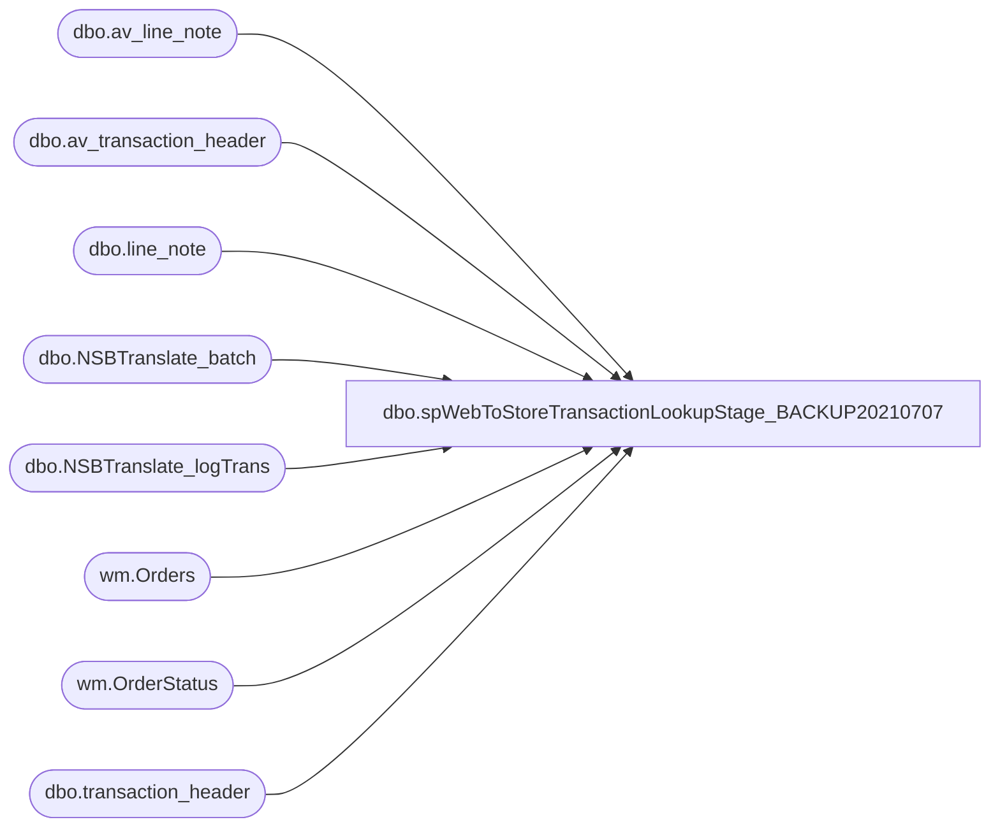

# dbo.spWebToStoreTransactionLookupStage_BACKUP20210707

**Database:** DWStaging  
**Server:** papamart  

## Architecture Diagram



## Table Dependencies

| Referenced Table |
|---|
| dbo.av_line_note |
| dbo.av_transaction_header |
| dbo.line_note |
| dbo.NSBTranslate_batch |
| dbo.NSBTranslate_logTrans |
| wm.Orders |
| wm.OrderStatus |
| dbo.transaction_header |

## Stored Procedure Code

```sql
CREATE proc [dbo].[spWebToStoreTransactionLookupStage_BACKUP20210707]

as 


set nocount on

IF (Object_ID('tempdb..#PreStage') IS NOT NULL) DROP TABLE #PreStage;

with
ShippedOrders as
	(
			select 
				t.sOrderNumber SettledOrderNumber
			 from [bearcluster01.sql.buildabear.com].BABWeCommerce.dbo.NSBTranslate_logTrans t
				join [bearcluster01.sql.buildabear.com].BABWeCommerce.dbo.NSBTranslate_batch b on t.sBatchID=b.sBatchID
			where b.bSentToAW = 1 
				and t.sStore not in (13,2013)
				and datediff(dd, t.dTimeStamp, getdate())<= 200
			group by 
				t.sOrderNumber
	),
Orders as
	(
		select distinct 
			o.OrderNumber,
			o.OrderNum,
			--o.PickupStore FulfillmentLocation,
			case when o.ShippingMethod = 'InStore' then 1 else 0 end as isPickupFromStore, 
			case when o.ShippingMethod = 'curbSide' then 1 else 0 end as isCurbside,
			case when o.ShippingMethod not in ('InStore', 'curbSide', 'sameDay') then 1 else 0 end as isShipFromStore,
			case when o.ShippingMethod = 'sameDay' then 1 else 0 end as isSameDay
			--cast(os.StatusDate as date) as ShipDate
		from  [bearcluster01.sql.buildabear.com].WebOrderProcessing.wm.Orders o with (nolock) 
		join  [bearcluster01.sql.buildabear.com].WebOrderProcessing.wm.OrderStatus os with (nolock)
			on o.OrderID=os.OrderID
			and os.CurrentStatus=1
		where 1=1
		and datediff(dd, os.StatusDate, getdate()) <= 200
		and isnull(o.PickupStore,'') not in ('', '0013', '2013')
		--and os.Status in ('Shipped','Complete')
		and o.OrderNum in (select SettledOrderNumber from ShippedOrders)
	)
select  
	th.transaction_id,
	o.OrderNum,
	o.isPickupFromStore,
	o.isCurbside,
	o.isShipFromStore,
	o.isSameDay,
	cast(substring (ln.line_note, 12,32) as varchar(10))  LineNote
into #PreStage
from bedrockdb01.auditworks.dbo.transaction_header th (nolock)
join bedrockdb01.auditworks.dbo.line_note ln (nolock) on th.transaction_id = ln.transaction_id
join Orders o on o.OrderNumber COLLATE SQL_Latin1_General_CP1_CI_AS =cast(substring (ln.line_note, 12,30) as varchar(8)) 
where th.store_no not in ('13', '2013')
and ln.line_note like 'Web Order%'
and o.OrderNum like '%[_]%'
group by 
	th.transaction_id,
	o.OrderNum,
	o.isPickupFromStore,
	o.isCurbside,
	o.isShipFromStore,
	o.isSameDay,
	cast(substring (ln.line_note, 12,32) as varchar(10)) 
union 
select  
	th.av_transaction_id,
	o.OrderNum,
	o.isPickupFromStore,
	o.isCurbside,
	o.isShipFromStore,
	o.isSameDay,
	cast(substring (ln.line_note, 12,32) as varchar(10))  LineNote
from bedrockdb01.auditworks.dbo.av_transaction_header th (nolock)
join bedrockdb01.auditworks.dbo.av_line_note ln (nolock) on th.av_transaction_id = ln.av_transaction_id
join Orders o on o.OrderNumber COLLATE SQL_Latin1_General_CP1_CI_AS =cast(substring (ln.line_note, 12,30) as varchar(8)) 
where th.store_no not in ('13', '2013')
and ln.line_note like 'Web Order%'
and o.OrderNum like '%[_]%'
group by 
	th.av_transaction_id,
	o.OrderNum,
	o.isPickupFromStore,
	o.isCurbside,
	o.isShipFromStore,
	o.isSameDay,
	cast(substring (ln.line_note, 12,32) as varchar(10)) 
	


IF (Object_ID('tempdb..#Multi') IS NOT NULL) DROP TABLE #Multi;
select transaction_id
into #Multi
from #PreStage
group by transaction_id
having count(*) > 1

IF (Object_ID('tempdb..#MultiMatch') IS NOT NULL) DROP TABLE #MultiMatch;
select 
	transaction_id,
	OrderNum,
	isPickupFromStore,	
	isCurbside,	
	isShipFromStore,	
	isSameDay,	
	LineNote
into #MultiMatch
from #PreStage
where transaction_id in (select transaction_id from #multi)
and OrderNum COLLATE SQL_Latin1_General_CP1_CI_AS = LineNote

IF (Object_ID('tempdb..#MultiNoMatch') IS NOT NULL) DROP TABLE #MultiNoMatch;
select 
	transaction_id,
	min(OrderNum) OrderNum,
	isPickupFromStore,	
	isCurbside,	
	isShipFromStore,	
	isSameDay,	
	LineNote
into #MultiNoMatch
from #PreStage
where transaction_id in (select transaction_id from #multi)
and OrderNum COLLATE SQL_Latin1_General_CP1_CI_AS != LineNote
and transaction_id not in (select transaction_id from #MultiMatch)
group by 
	transaction_id,
	isPickupFromStore,	
	isCurbside,	
	isShipFromStore,	
	isSameDay,	
	LineNote

IF (Object_ID('dwstaging..WebToStoreLookup') IS NOT NULL) DROP TABLE WebToStoreLookup;

select 
	transaction_id,
	OrderNum,
	isPickupFromStore,	
	isCurbside,	
	isShipFromStore,	
	isSameDay,	
	LineNote
into WebToStoreLookup
from #PreStage
where transaction_id not in (select transaction_id from #multi)
UNION
select 
	transaction_id,
	OrderNum,
	isPickupFromStore,	
	isCurbside,	
	isShipFromStore,	
	isSameDay,	
	LineNote
from #MultiMatch
UNION
select 
	transaction_id,
	OrderNum,
	isPickupFromStore,	
	isCurbside,	
	isShipFromStore,	
	isSameDay,	
	LineNote
from #MultiNoMatch
```

