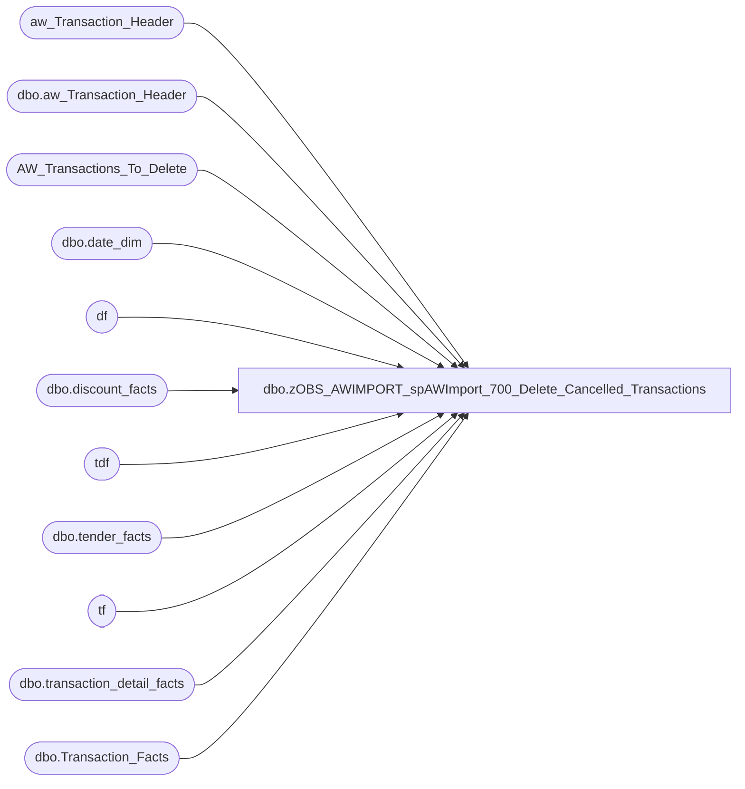

# dbo.zOBS_AWIMPORT_spAWImport_700_Delete_Cancelled_Transactions

**Database:** DWStaging  
**Server:** papamart  

## Architecture Diagram



## Table Dependencies

| Referenced Table |
|---|
| aw_Transaction_Header |
| dbo.aw_Transaction_Header |
| AW_Transactions_To_Delete |
| dbo.date_dim |
| df |
| dbo.discount_facts |
| tdf |
| dbo.tender_facts |
| tf |
| dbo.transaction_detail_facts |
| dbo.Transaction_Facts |

## Stored Procedure Code

```sql
CREATE PROCEDURE [dbo].[spAWImport_700_Delete_Cancelled_Transactions]
-- =============================================================================================================
-- Name: spAWImport_700_Delete_Cancelled_Transactions
--
-- Description:	
--	Remove the records from the data warehouse which have been deleted in Auditworks
--
--
-- Input:		
--
-- Output: 
--
-- Dependencies: 
--
-- Revision History
--		Name:			Date:			Comments:
--		Gary Murrish	4/17/2013		Created

-- =============================================================================================================
AS

	SET NOCOUNT ON

	DECLARE @minActualDate datetime
	DECLARE @maxActualDate datetime
	DECLARE @minDateKey int
	DECLARE @maxDateKey int

	SELECT
		@minActualDate = MIN(ath.transaction_date),
		@maxActualDate = MAX(ath.transaction_date)
	FROM
		aw_Transaction_Header ath WITH (NOLOCK)

	SELECT
		@minDateKey = date_key
	FROM
		dw.dbo.date_dim dd WITH (NOLOCK)
	WHERE
		dd.actual_date = @minActualDate

	SELECT
		@maxDateKey = date_key
	FROM
		dw.dbo.date_dim dd WITH (NOLOCK)
	WHERE
		dd.actual_date = @maxActualDate

	TRUNCATE TABLE AW_Transactions_To_Delete

	INSERT INTO AW_Transactions_To_Delete
		(	transaction_id,
			store_key,
			date_key)
		SELECT
			tf.transaction_id,
			tf.store_key,
			tf.date_key
		FROM
			dw.dbo.Transaction_Facts tf WITH (NOLOCK)
			LEFT JOIN DWStaging.dbo.aw_Transaction_Header ath WITH (NOLOCK)
				ON tf.transaction_id = ath.transaction_id
		WHERE
			tf.date_key BETWEEN @minDateKey AND @maxDateKey
			AND ath.transaction_id IS NULL

	-- Now Delete the records for the missing transactions
	DELETE tf
		FROM dw.dbo.tender_facts tf WITH (NOLOCK)
		INNER JOIN AW_Transactions_To_Delete mt WITH (NOLOCK)
			ON tf.transaction_id = mt.transaction_id


	DELETE df
		FROM dw.dbo.discount_facts df WITH (NOLOCK)
		INNER JOIN AW_Transactions_To_Delete mt WITH (NOLOCK)
			ON df.transaction_id = mt.transaction_id


	DELETE tdf
		FROM dw.dbo.transaction_detail_facts tdf WITH (NOLOCK)
		INNER JOIN AW_Transactions_To_Delete mt WITH (NOLOCK)
			ON tdf.transaction_id = mt.transaction_id


	DELETE tf
		FROM dw.dbo.Transaction_Facts tf WITH (NOLOCK)
		INNER JOIN AW_Transactions_To_Delete mt WITH (NOLOCK)
			ON tf.transaction_id = mt.transaction_id
```

