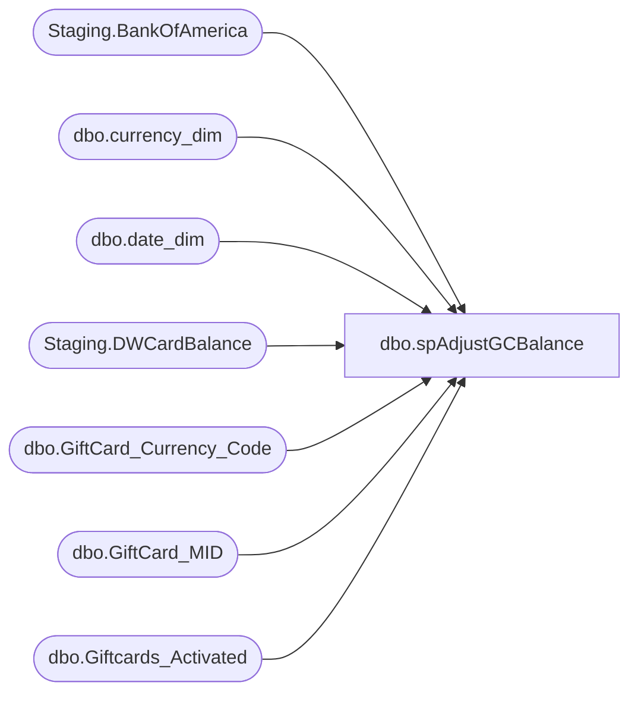

# dbo.spAdjustGCBalance

**Database:** SOX  
**Server:** papamart  

## Architecture Diagram



## Table Dependencies

| Referenced Table |
|---|
| Staging.BankOfAmerica |
| dbo.currency_dim |
| dbo.date_dim |
| Staging.DWCardBalance |
| dbo.GiftCard_Currency_Code |
| dbo.GiftCard_MID |
| dbo.Giftcards_Activated |

## Stored Procedure Code

```sql
-- =============================================================================================================
-- Name: [spAdjustGCBalance]
--
-- Description:	
--		Adjust Balance on Existing Gift Cards 

--
-- Revision History
--		Name:			Date:			Comments:
--		Brian Byas		8/17/2016		created
-- =============================================================================================================

CREATE PROCEDURE [dbo].[spAdjustGCBalance]
@asOfDateKey int
AS

DECLARE @Source AS varchar(10);
SET @Source = 'VLA' + CAST(@asOfDateKey AS varchar);
--SET @Source = 'VLA' + CAST(@asOfDateKey AS varchar)+'-1';  -- Used This On 4/6/2023 because we had to reprocess Fiscal Year 2022 due to FiServ Incomplete Data


INSERT INTO dw.dbo.Giftcards_Activated
	(	store_key,
		transaction_id,
		date_key,
		activated_amount,
		discount_amount,
		giftcard_no,
		currency_key,
		MID,
		source)
	SELECT
		-1 AS StoreKey,
		-1 AS TransactionID,
		dd.date_key AS DateKey,
		(gb.OutstandingBalance) - (b.Balance) AS ActivatedAmount,
		0 DiscountAmount,
		b.GiftCardNumber AS GiftCardNumber,
		ISNULL(cd.currency_key, -1) AS CurrencyKey,
		gb.ActivationMid AS MID,
		@Source AS Source
	FROM
		Staging.DWCardBalance b WITH (NOLOCK)
		INNER JOIN Staging.BankOfAmerica gb WITH (NOLOCK)
			ON b.GiftCardNumber = gb.CardNumber 
		INNER JOIN dw.dbo.date_dim dd WITH (NOLOCK)
			ON dd.actual_date = gb.ActivationDate
		LEFT JOIN dw.dbo.GiftCard_MID gcm WITH (NOLOCK)
			ON gb.ActivationMid = gcm.MID
		LEFT JOIN dw.dbo.GiftCard_Currency_Code gccc WITH (NOLOCK)
			ON gcm.localCurrencyCode = gccc.currency_code
		LEFT JOIN dw.dbo.currency_dim cd WITH (NOLOCK)
			ON gccc.[Description] = cd.currency_code
	WHERE
		b.balance <> gb.OutstandingBalance
```

