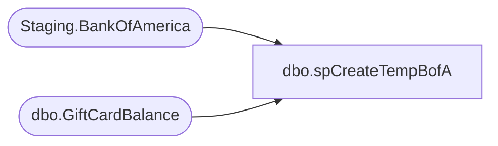

# dbo.spCreateTempBofA

**Database:** SOX  
**Server:** papamart  

## Architecture Diagram



## Table Dependencies

| Referenced Table |
|---|
| Staging.BankOfAmerica |
| dbo.GiftCardBalance |

## Stored Procedure Code

```sql
-- =============================================================================================================
-- Name: [spCreateTempBofA]
--
-- Description:	
--		Sets of Global Temp table for remaining Balancing Process 

--
-- Revision History
--		Name:			Date:			Comments:
--		Brian Byas		8/17/2016		created
-- =============================================================================================================

CREATE PROCEDURE [dbo].[spCreateTempBofA]
    @AuditQuarterKey int
AS


TRUNCATE TABLE Staging.BankOfAmerica

INSERT INTO Staging.BankOfAmerica 
SELECT [AuditQuarterKey]
      ,[CardNumber]
      ,[ActivationMid]
      ,[ActivationStore]
      ,[ActivationAmount]
      ,[RedemptionAmount]
      ,[ReloadAmount]
      ,[AdjustedAmount]
      ,[ServiceFeeAmount]
      ,[OutstandingBalance]
      ,[ActivationDate]
FROM SOX.[dbo].[GiftCardBalance]
WHERE AuditQuarterKey=@AuditQuarterKey
```

