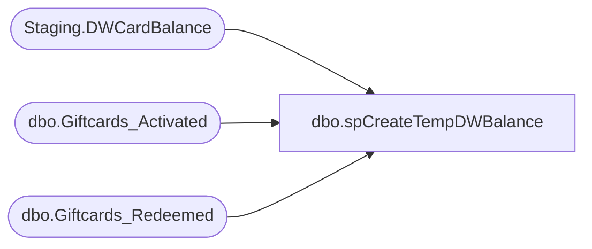

# dbo.spCreateTempDWBalance

**Database:** SOX  
**Server:** papamart  

## Architecture Diagram



## Table Dependencies

| Referenced Table |
|---|
| Staging.DWCardBalance |
| dbo.Giftcards_Activated |
| dbo.Giftcards_Redeemed |

## Stored Procedure Code

```sql
-- =============================================================================================================
-- Name: [spCreateTempDWBalance]
--
-- Description:	
--		Sets up Global Temp table for remaining Balancing Process 

--
-- Revision History
--		Name:			Date:			Comments:
--		Brian Byas		8/17/2016		created
-- =============================================================================================================

CREATE PROCEDURE [dbo].[spCreateTempDWBalance]
	@AuditQuarterKey int,
	@asOfDateKey int

AS


TRUNCATE TABLE Staging.DWCardBalance

INSERT INTO Staging.DWCardBalance
SELECT
	bal.giftcard_no AS GiftCardNumber,
	SUM(bal.balance) AS Balance,
	SUM(bal.Activation_Amount) AS ActivationAmount,
	SUM(bal.Redemption_Amount) AS Redemptionamount,
	MAX(ISNULL(bal.MID, '')) AS MID,
	MAX(ISNULL(bal.Currency_Key, -1)) AS CurrencyKey,
	MIN(bal.Date_key) AS Date_key,
	SUM(bal.Activation_Discount_Amount) AS ActivationDiscountAmount
FROM
	(SELECT
			ga.giftcard_no,
			CAST(SUM(ga.activated_amount) AS money) AS balance,
			CAST(SUM(ga.activated_amount) AS money) AS Activation_Amount,
			CAST(0 AS money) AS redemption_amount,
			MAX(ISNULL(ga.MID, '')) AS MID,
			MAX(ISNULL(ga.currency_key, -1)) AS currency_key,
			MIN(ga.Date_key) AS Date_key,
			CAST(SUM(ga.discount_amount) AS money) AS activation_discount_amount
		FROM
			dw.dbo.Giftcards_Activated ga WITH (NOLOCK)
		WHERE
			ga.Date_key <= @asOfDateKey                                     
		GROUP BY ga.giftcard_no
		UNION ALL
		SELECT
			gr.giftcard_no,
			SUM(gr.redemption_amount * -1) AS balance,
			CAST(0 AS money) AS Activation_Amount,
			SUM(gr.redemption_amount * -1) AS redemption_amount,
			MAX(ISNULL(gr.MID, '')) AS MID,
			MAX(ISNULL(gr.currency_key, -1)) AS currency_key,
			MAX(gr.Date_key) AS Date_key,
			SUM(gr.activation_discount_amount * -1) AS activation_discount_amount
		FROM
			dw.dbo.Giftcards_Redeemed gr WITH (NOLOCK)
		WHERE
			gr.Date_key <= @asOfDateKey 
		GROUP BY gr.giftcard_no) bal
GROUP BY bal.giftcard_no
HAVING SUM(bal.balance) <> 0
```

