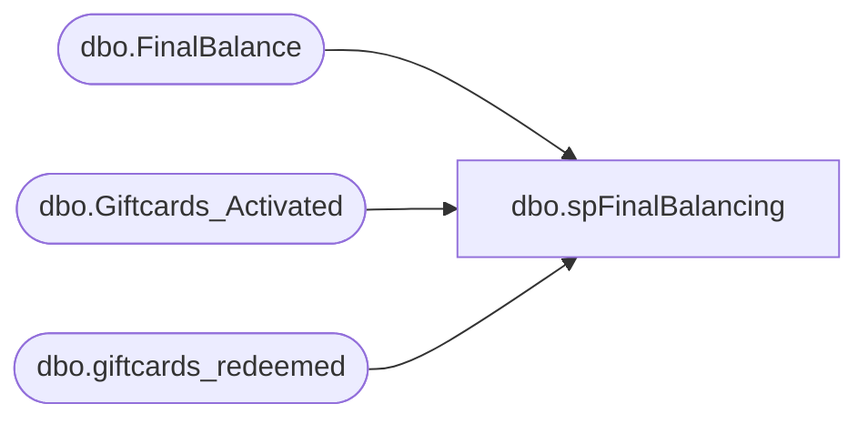

# dbo.spFinalBalancing

**Database:** SOX  
**Server:** papamart  

## Architecture Diagram



## Table Dependencies

| Referenced Table |
|---|
| dbo.FinalBalance |
| dbo.Giftcards_Activated |
| dbo.giftcards_redeemed |

## Stored Procedure Code

```sql
-- =============================================================================================================
-- Name: [spFinalBalancing]
--
-- Description:	
--		Final Stage of Balancing  

--
-- Revision History
--		Name:			Date:			Comments:
--		Brian Byas		9/1/2016		created
--		Dan Tweedie		01/06/2017		Added Truncate Table statement, as the table needs to show current balance only
-- =============================================================================================================

CREATE PROCEDURE [dbo].[spFinalBalancing]
@asOfDateKey int

AS

TRUNCATE TABLE dbo.FinalBalance

INSERT INTO dbo.FinalBalance([giftcard_no]
      ,[Balance]
      ,[activation_amount]
      ,[redemption_amount]
      ,[MID]
      ,[currency_key]
      ,[date_key]
      ,[activation_discount_amount]
      ,[activation_discount_redeemed]
      ,[activation_discount_balance])
SELECT			
	bal.giftcard_no,		
	SUM(bal.balance) AS balance,		
	SUM(bal.activation_amount) AS activation_amount,		
	SUM(bal.redemption_amount) AS redemption_amount,		
	MAX(ISNULL(bal.MID, '')) AS MID,		
	MAX(ISNULL(bal.currency_key, -1)) AS currency_key,		
	MIN(bal.date_key) AS date_key,		
	SUM(bal.activation_discount_amount) AS activation_discount_amount,		
	SUM(bal.activation_discount_redeemed) AS activation_discount_redeemed,		
	SUM(bal.activation_discount_amount) - SUM(bal.activation_discount_redeemed) AS activation_discount_balance				
FROM			
	(SELECT		
			ga.giftcard_no,
			CAST(SUM(ga.activated_amount) AS money) AS balance,
			CAST(SUM(ga.activated_amount) AS money) AS activation_amount,
			CAST(0 AS money) AS redemption_amount,
			MAX(ISNULL(ga.MID, '')) AS MID,
			MAX(ISNULL(ga.currency_key, -1)) AS currency_key,
			MIN(ga.date_key) AS date_key,
			CAST(SUM(ga.discount_amount) AS money) AS activation_discount_amount,
			CAST(0 AS money) AS activation_discount_redeemed
		FROM	
			dw.dbo.Giftcards_Activated ga WITH (NOLOCK)
		WHERE	
			ga.date_key <= @asOfDateKey
		GROUP BY ga.giftcard_no	
		UNION ALL	
		SELECT	
			gr.giftcard_no,
			SUM(gr.redemption_amount * -1) AS balance,
			CAST(0 AS money) AS activation_amount,
			SUM(gr.redemption_amount * -1) AS redemption_amount,
			'' AS MID,
			MAX(ISNULL(gr.currency_key, -1)) AS currency_key,
			MAX(gr.date_key) AS date_key,
			CAST(0 AS money) AS activation_discount_amount,
			SUM(gr.activation_discount_amount) AS activation_discount_redeemed
		FROM	
			dw.dbo.giftcards_redeemed gr WITH (NOLOCK)
		WHERE	
			gr.date_key <= @asOfDateKey
		GROUP BY gr.giftcard_no) bal	
GROUP BY bal.giftcard_no			
HAVING SUM(bal.balance) <> 0
```

